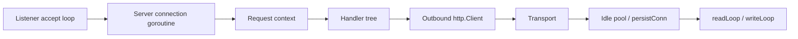

# net/http 서버와 Transport 내부

`net/http`는 많은 Go 서비스가 동시성 예산의 대부분을 쓰는 곳입니다.

이 패키지가 잘 동작하는 이유는, 런타임이 blocking network I/O를 direct style로 표현할 수 있을 만큼 싸게 만들어 주고, 패키지 자체는 connection ownership, keep-alive reuse, request lifetime을 관리하기 때문입니다.

## 왜 이 패키지가 중요한가

Go 서비스를 운영한다면 거의 항상 다음에 의존합니다.

- inbound request마다 하나의 goroutine tree,
- outbound dependency마다 하나의 transport pool,
- request-scoped context cancellation,
- 요청마다 TCP를 새로 여는 대신 connection reuse.

이 경계를 잘못 이해하면 시스템은 부하에서 느려지고, leak되고, 예측하기 어려워집니다.

## 전체 mental model



서버 쪽에서 `net/http`는 socket을 handler 실행으로 바꾸고,

클라이언트 쪽에서 `Transport`는 요청을 pooled reusable connection으로 바꿉니다.

둘 다 결국 lifetime 문제의 양쪽 절반입니다.

## 실전 코드 스케치

```go
srv := &http.Server{
	Addr:              ":8080",
	Handler:           mux,
	ReadHeaderTimeout: 2 * time.Second,
	WriteTimeout:      10 * time.Second,
	IdleTimeout:       60 * time.Second,
	BaseContext: func(net.Listener) context.Context {
		return appCtx
	},
}

transport := &http.Transport{
	MaxIdleConns:          256,
	MaxIdleConnsPerHost:   64,
	MaxConnsPerHost:       128,
	IdleConnTimeout:       90 * time.Second,
	ResponseHeaderTimeout: 2 * time.Second,
}

client := &http.Client{
	Transport: transport,
	Timeout:   3 * time.Second,
}
```

여기서 중요한 건 필드 수가 아닙니다. lifetime과 budget을 코드에 명시했다는 점입니다.

## 서버 쪽 mental model

서버는 “전역 handler goroutine 하나”가 아닙니다.

대략 이런 흐름입니다.

1. connection accept,
2. server/connection context 부착,
3. request 읽기,
4. handler 실행,
5. keep-alive 여부 판단,
6. 반복 또는 종료.

HTTP/1.x에서는 connection 재사용이 직렬적으로 더 잘 드러나고, HTTP/2에서는 multiplexing 때문에 모양이 달라지지만 lifetime과 deadline 문제는 그대로 남습니다.

## 단순화한 내부 코드 예시

```go
type Server struct {
	Handler           Handler
	ReadHeaderTimeout time.Duration
	WriteTimeout      time.Duration
	IdleTimeout       time.Duration
	BaseContext       func(net.Listener) context.Context
	ConnContext       func(context.Context, net.Conn) context.Context
}

type Transport struct {
	idleMu           sync.Mutex
	idleConn         map[connectMethodKey][]*persistConn
	reqCanceler      map[*Request]context.CancelCauseFunc
	connsPerHost     map[connectMethodKey]int
	connsPerHostWait map[connectMethodKey]wantConnQueue
}

type persistConn struct {
	conn net.Conn
	// 한 goroutine은 응답을 읽고
	// 한 goroutine은 요청을 쓴다
}
```

실제 구현은 더 복잡하지만 설계 압력은 이미 드러납니다.

- 서버 필드는 timeout과 ownership boundary를 정의하고,
- transport 필드는 pooling과 cancellation boundary를 정의하며,
- `persistConn`은 실제 요청이 흐르는 reusable connection 객체입니다.

## 소스 코드에서 봐야 할 지점

### 서버 쪽

`Server` 타입에는 다음이 들어 있습니다.

- `ReadHeaderTimeout`, `ReadTimeout`, `WriteTimeout`, `IdleTimeout`
- `BaseContext`, `ConnContext`
- shutdown과 active connection bookkeeping

이건 장식 옵션이 아니라 inbound traffic의 운영 계약입니다.

읽을 만한 진입점:

- [`server.go` `Server`](https://github.com/golang/go/blob/go1.26.0/src/net/http/server.go#L2964)
- [`server.go` `Serve`](https://github.com/golang/go/blob/go1.26.0/src/net/http/server.go#L3444)

### 클라이언트 쪽

`http.Client`는 얇은 래퍼이고, 실제 동시성 동작은 대부분 `Transport`에 있습니다.

- idle connection map
- per-host connection limit
- request cancellation bookkeeping
- dial/handshake timeout
- `persistConn` read/write loop

읽을 만한 진입점:

- [`transport.go` `Transport`](https://github.com/golang/go/blob/go1.26.0/src/net/http/transport.go#L97)
- [`transport.go` `roundTrip`](https://github.com/golang/go/blob/go1.26.0/src/net/http/transport.go#L590)
- [`transport.go` `persistConn`](https://github.com/golang/go/blob/go1.26.0/src/net/http/transport.go#L2115)
- [`transport.go` `readLoop`](https://github.com/golang/go/blob/go1.26.0/src/net/http/transport.go#L2291)
- [`transport.go` `writeLoop`](https://github.com/golang/go/blob/go1.26.0/src/net/http/transport.go#L2649)

## Response body ownership도 동시성 문제다

아주 흔한 실수입니다.

```go
resp, err := client.Do(req)
if err != nil {
	return err
}
defer resp.Body.Close()
```

body를 닫는 건 단순 cleanup 예절이 아닙니다.

transport가 connection을 안전하게 재사용할 수 있는지 판단하는 핵심 신호입니다. 여기서 실수하면 pool이 connection을 재활용하지 못하고 계속 churn합니다.

## 실패 패턴

### 프로덕션 hot path에서 `http.Get` 사용

```go
resp, err := http.Get(url)
```

이 코드는 transport 설정, timeout 정책, per-host limit, proxy 동작, connection budget을 읽는 사람에게 숨깁니다. 스크립트에는 괜찮아도 서비스 경계에는 부족합니다.

### response body를 닫지 않음

```go
resp, err := client.Do(req)
if err != nil {
	return err
}
return decode(resp.Body) // leak: body를 닫지 않음
```

이러면 connection reuse가 깨지고 socket/file descriptor가 고갈될 수 있습니다.

### timeout knob 하나로 충분하다고 생각

`Client.Timeout`, transport header timeout, request context deadline, server-side read/write timeout은 서로 다른 경계를 다룹니다.

보통은 하나의 거대한 timeout보다, 의도된 조합이 필요합니다.

### `TimeoutHandler`를 전체 제어 수단으로 착각

`TimeoutHandler`는 거친 래퍼입니다. 응답 시간을 제한하는 데 도움이 되지만, handler 내부의 context discipline, outbound deadline, shutdown 설계를 대체하진 못합니다.

### 요청마다 새 transport 생성

pooling을 버리고 dial churn을 늘려서, 대개 latency와 자원 사용을 모두 악화시킵니다.

## 프로덕션에서의 의미

- request마다가 아니라 policy boundary마다 하나의 long-lived `Transport`를 둡니다.
- hot code에서 ad hoc client를 만들지 말고, transport policy마다 `http.Client`를 재사용합니다.
- 서버, request, transport 레이어 각각에 timeout을 명시합니다.
- handler와 outbound call에서 request context cancellation을 first-class signal로 취급합니다.
- code review에서 body close discipline을 mutex ownership만큼 진지하게 봐야 합니다.

## 어떻게 테스트/관측할까

- `httptest.Server`와 느린 handler를 이용해 client timeout을 검증합니다.
- `Server.Shutdown`과 in-flight request로 graceful shutdown을 검증합니다.
- reuse, dial timing, connection setup이 궁금하면 `httptrace`를 씁니다.
- handler CPU가 아니라 connection churn이 의심되면 runtime trace나 socket-level metric을 봅니다.

## 공식 자료

- [`net/http` 패키지 문서](https://pkg.go.dev/net/http)
- [`net/http/httptrace` 패키지 문서](https://pkg.go.dev/net/http/httptrace)
- [Go 1.26 `net/http` server 소스](https://github.com/golang/go/blob/go1.26.0/src/net/http/server.go)
- [Go 1.26 `net/http` transport 소스](https://github.com/golang/go/blob/go1.26.0/src/net/http/transport.go)

## Practical takeaway

`net/http`는 단순한 편의 API가 아닙니다. Go 런타임, deadline, connection reuse 정책이 실제 프로덕션 동작으로 드러나는 핵심 경계입니다.
