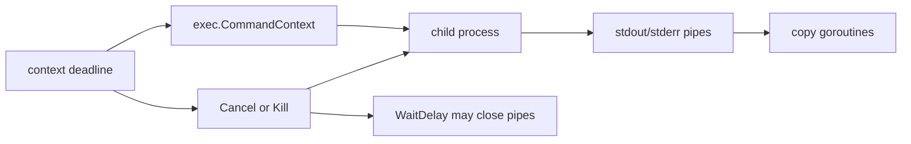

# os/exec와 subprocess lifecycle

`os/exec`는 shell wrapper가 아닙니다.

이 패키지는 다음에 대한 명시적인 ownership rule을 가진 process-launching API입니다.

- command lookup
- environment
- pipe
- cancellation
- exit status
- I/O를 옮기기 위해 생성되는 goroutine

## 왜 이 패키지가 중요한가

Go에서 subprocess bug는 대개 lifecycle mistake에서 옵니다.

- command lookup surprise
- context cancellation을 호출자가 잘못 이해
- child process가 pipe를 계속 잡고 있음
- `Wait`가 copy goroutine 때문에 block
- quoting/glob expansion에 대한 shell 기대

같은 문제들입니다.

## 예제 시나리오

`examples/processsupervisor` 패키지는 `exec.CommandContext`로 subprocess를 실행하고 stdout/stderr를 캡처하며, timeout 기반 cancellation이 long-running helper process를 멈추는지 검증합니다.



## 실전 코드 스케치

```go
cmd := exec.CommandContext(ctx, "/usr/bin/convert", "in.png", "out.webp")
cmd.Dir = workDir
cmd.Env = append(os.Environ(), "MAGICK_TMPDIR="+tmpDir)
cmd.WaitDelay = 2 * time.Second

var stdout bytes.Buffer
var stderr bytes.Buffer
cmd.Stdout = &stdout
cmd.Stderr = &stderr

if err := cmd.Run(); err != nil {
	return err
}
```

이건 단순 프로세스 실행이 아니라 lifecycle contract입니다.

- 어디서 시작할지
- 어떤 environment를 줄지
- output을 어디로 보낼지
- context가 끝나면 무엇을 할지
- `Wait`가 pipe 때문에 얼마나 오래 지연될 수 있는지

를 모두 포함합니다.

## Mental model

`os/exec`는 세 층으로 보면 편합니다.

| 층 | 주 관심사 |
| --- | --- |
| `Command` / `LookPath` | executable resolution과 argv 구성 |
| `Start` / `Run` / `Wait` | process lifecycle |
| stdio 필드와 pipe | I/O 이동과 goroutine ownership |

특히 중요한 사실 두 가지:

1. `Command`는 shell을 호출하지 않습니다.
2. stdio가 `*os.File`이 아니면 패키지가 pipe와 extra goroutine을 만들 수 있습니다.

## 단순화한 내부 코드 예시

```go
type Cmd struct {
	Path      string
	Args      []string
	Stdout    io.Writer
	Stderr    io.Writer
	ctx       context.Context
	Cancel    func() error
	WaitDelay time.Duration
}

func CommandContext(ctx context.Context, name string, arg ...string) *Cmd {
	cmd := Command(name, arg...)
	cmd.ctx = ctx
	cmd.Cancel = cmd.Process.Kill
	return cmd
}

func (c *Cmd) Start() error {
	startProcess(...)
	startCopyGoroutinesIfNeeded(...)
	startContextWatcherIfNeeded(...)
}
```

핵심은:

- launch가 명시적이고,
- copying이 명시적이며,
- cancellation도 명시적이라는 점입니다.

## `CommandContext`는 시작일 뿐이다

`CommandContext`는 context가 끝나면 process를 kill하는 기본 `Cancel`을 설정합니다.

유용하지만 이게 끝은 아닙니다.

process가 child를 또 만들거나 stdio pipe를 계속 열어두면 `Wait`는 여전히 예상보다 오래 걸릴 수 있습니다. 그래서 `WaitDelay`가 중요합니다. 이 필드는:

- child가 cancellation을 무시하면 kill하고,
- pipe를 닫아 copy goroutine을 깨우고,
- 필요하면 `ErrWaitDelay`를 반환하게 합니다.

## Lookup 보안과 `ErrDot`

Go 1.19부터 `Command`, `LookPath`는 현재 디렉터리의 상대 경로 `PATH` 엔트리를 통해 executable을 찾지 않습니다. 그 경우 `ErrDot`를 반환합니다.

이건 귀찮은 변화가 아니라 보안 기능입니다.

current directory를 원하면 `tool`이 아니라 `./tool`이라고 써야 합니다.

## 런타임/소스 코드 워크

읽을 만한 진입점:

- [`os/exec/exec.go` `Cmd`](https://github.com/golang/go/blob/go1.26.0/src/os/exec/exec.go#L148)
- [`os/exec/exec.go` `CommandContext`](https://github.com/golang/go/blob/go1.26.0/src/os/exec/exec.go#L484)
- [`os/exec/exec.go` `Start`](https://github.com/golang/go/blob/go1.26.0/src/os/exec/exec.go#L641)
- [`os/exec/exec.go` `Wait`](https://github.com/golang/go/blob/go1.26.0/src/os/exec/exec.go#L922)

특히 볼 점:

- stdio가 file이 아니면 pipe와 copy goroutine이 생기고,
- cancellation은 별도 watcher goroutine이 다루며,
- `WaitDelay`는 child를 kill하고 pipe를 닫을 수 있고,
- `Output`, `CombinedOutput`도 같은 lifecycle machinery 위에 올라갑니다.

## 실패 패턴

### `Command`에 shell behavior를 기대

```go
exec.Command("shout", "*.log", "|", "wc")
```

shell expansion도 없고 pipeline도 없고 redirection도 없습니다. 의도된 동작입니다.

### `Start` 후 `Wait`를 호출하지 않음

성공적으로 시작한 프로세스를 기다리지 않으면 리소스와 상태가 남습니다.

### context cancellation이 곧 graceful shutdown이라고 생각

`CommandContext`의 기본 `Cancel`은 polite signal이 아니라 `Kill`입니다.

### pipe-copy goroutine을 잊음

stdout/stderr가 pipe를 거치면 `Wait`는 그 goroutine이 끝날 때까지도 의존합니다.

### `ErrDot`를 이유도 모른 채 무시

대개 command lookup policy가 불분명하다는 신호입니다.

## 프로덕션에서의 의미

- subprocess는 owned resource로 보고 startup/shutdown policy를 명시합니다.
- hung pipe나 stubborn child가 서비스 종료를 해칠 수 있다면 `WaitDelay`를 씁니다.
- command lookup은 명시적이고 안전하게 둡니다.
- stderr는 종종 가장 좋은 디버그 신호이므로 의도적으로 캡처합니다.

## 예제와 테스트

- 예제: `examples/processsupervisor`
- 테스트는 output capture와 context-driven termination을 검증합니다.

## 공식 자료

- [`os/exec` 패키지 문서](https://pkg.go.dev/os/exec)
- [Path security in Go](https://go.dev/blog/path-security)

## Practical takeaway

`os/exec`는 “명령 실행”보다 “process lifecycle 관리”로 이해할 때 가장 안전합니다. lookup, pipe, cancellation, waiting을 전부 ownership 관점으로 다루면 예측 가능한 패키지가 됩니다.
