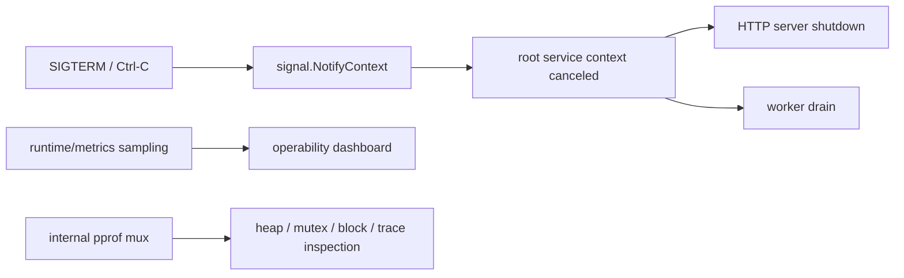

# 프로세스 신호와 런타임 관측

프로덕션 Go 서비스는 마지막 goroutine에서 끝나지 않습니다.

다음도 같이 필요합니다.

- 프로세스 shutdown boundary
- signal-aware cancellation
- 값싼 runtime metrics
- 안전한 profiling hook

이때 `os/signal`, `runtime/metrics`, `net/http/pprof`가 들어옵니다.

## 왜 이 패키지들이 중요한가

서비스가:

- `SIGTERM`에서 예측 가능하게 종료되지 못하고,
- 사용자가 느끼기 전에 runtime pressure를 보여주지 못하고,
- latency나 memory가 무너질 때 profile을 제공하지 못한다면,

애플리케이션 레이어의 동시성 correctness는 절반짜리일 뿐입니다.

## 예제 시나리오



## 실전 코드 스케치

```go
rootCtx, stop := signal.NotifyContext(context.Background(), os.Interrupt, syscall.SIGTERM)
defer stop()

go func() {
	internalMux := http.NewServeMux()
	internalMux.HandleFunc("/debug/pprof/", pprof.Index)
	internalMux.HandleFunc("/debug/pprof/cmdline", pprof.Cmdline)
	internalMux.HandleFunc("/debug/pprof/profile", pprof.Profile)
	internalMux.HandleFunc("/debug/pprof/symbol", pprof.Symbol)
	internalMux.HandleFunc("/debug/pprof/trace", pprof.Trace)

	_ = http.ListenAndServe("127.0.0.1:6060", internalMux)
}()

samples := []metrics.Sample{
	{Name: "/sched/goroutines:goroutines"},
	{Name: "/sync/mutex/wait/total:seconds"},
	{Name: "/memory/classes/heap/objects:bytes"},
}
metrics.Read(samples)
```

핵심은 이 기능들이 random handler 안의 부가 기능이 아니라, 서비스 skeleton의 일부여야 한다는 점입니다.

## Mental model

이 패키지들은 서로 다른 층을 담당합니다.

| 패키지 | 주 역할 |
| --- | --- |
| `os/signal` | 프로세스 signal을 Go 이벤트로 번역 |
| `signal.NotifyContext` | signal 도착을 cancellation flow로 투영 |
| `runtime/metrics` | 안정적인 runtime counter/histogram 노출 |
| `net/http/pprof` | 자세한 runtime profile을 HTTP로 노출 |

즉, 이 조합은 하나의 프로세스가:

- “이제 멈춰야 한다”
- “런타임이 지금 이런 압력을 받고 있다”
- “시간과 메모리가 어디로 가는지 증거는 여기 있다”

를 말할 수 있게 해줍니다.

## 단순화한 내부 코드 예시

```go
ctx, stop := signal.NotifyContext(parent, os.Interrupt, syscall.SIGTERM)
defer stop()

samples := []metrics.Sample{
	{Name: "/sched/goroutines:goroutines"},
	{Name: "/sched/latencies:seconds"},
}
metrics.Read(samples)

internalMux := http.NewServeMux()
internalMux.Handle("/debug/pprof/", http.HandlerFunc(pprof.Index))
```

중요한 점은 이 패키지들이 bridge 역할을 한다는 것입니다.

- signal은 context cancellation로,
- runtime counter는 sampled telemetry로,
- runtime 내부 상태는 inspectable profile로 바뀝니다.

## Signals: 비즈니스 로직이 아니라 process lifetime

`signal.NotifyContext`는 graceful shutdown의 진입점으로 가장 좋은 경우가 많습니다.

이 함수를 쓰면 나머지 프로그램을 signal channel 중심이 아니라 context 중심으로 유지할 수 있습니다.

중요한 디테일 두 가지:

1. 반환된 `stop()`을 호출해서 리소스를 해제하고 적절할 때 기본 signal handling을 복원해야 합니다.
2. 모든 signal이 같은 방식으로 동작하지 않습니다. `SIGKILL`, `SIGSTOP`은 잡을 수 없고, `SIGPIPE`는 stdout/stderr와 일반 socket에서 동작이 다릅니다.

## `runtime/metrics`: 안정적인 runtime telemetry

`runtime/metrics`는 runtime counter와 histogram의 안정적인 표면입니다.

metric 집합은 진화할 수 있지만, `metrics.All()`로 discovery가 가능하고 지원되는 key의 의미는 안정적으로 유지됩니다. 그래서 불안정한 runtime 내부를 scraping하는 것보다 훨씬 나은 기반입니다.

특히 자주 볼 만한 key:

- `/sched/goroutines:goroutines`
- `/sched/latencies:seconds`
- `/sync/mutex/wait/total:seconds`
- `/gc/heap/goal:bytes`
- `/memory/classes/heap/objects:bytes`

ongoing visibility에는 metrics를, incident investigation에는 profile을 씁니다.

## `net/http/pprof`: 깊은 조사 도구이지 public API가 아님

`net/http/pprof`는 다음을 노출하는 표준 방식입니다.

- heap profile
- CPU profile
- goroutine dump
- mutex / block profile
- execution trace

Go 1.22부터 handler는 `GET`를 요구합니다. 오래된 tooling이나 wrapper가 있다면 이 차이를 알아야 합니다.

이 패키지는 보통:

- loopback 전용 listener,
- 내부 전용 포트,
- 또는 인증/네트워크 보호 뒤의 admin path

에만 두는 게 맞습니다.

public application mux에 아무 생각 없이 붙이면 안 됩니다.

## 런타임/패키지 소스 워크

읽을 만한 시작점:

- [`os/signal` 패키지 문서](https://pkg.go.dev/os/signal)
- [`signal.go` 소스](https://github.com/golang/go/blob/go1.26.0/src/os/signal/signal.go)
- [`runtime/metrics` 패키지 문서](https://pkg.go.dev/runtime/metrics)
- [`sample.go` 소스](https://github.com/golang/go/blob/go1.26.0/src/runtime/metrics/sample.go)
- [`net/http/pprof` 패키지 문서](https://pkg.go.dev/net/http/pprof)
- [`pprof.go` 소스](https://github.com/golang/go/blob/go1.26.0/src/net/http/pprof/pprof.go)

이 영역은 로컬 구현만 보는 것보다 패키지 문서를 같이 읽는 게 중요합니다. OS 동작과 metric key semantics가 구현 디테일만큼 중요하기 때문입니다.

## 실패 패턴

### `NotifyContext`의 `stop` 함수를 호출하지 않음

```go
ctx, stop := signal.NotifyContext(parent, os.Interrupt, syscall.SIGTERM)
_ = stop // bug: signal forwarding 리소스를 불필요하게 오래 잡고 있음
```

### signal을 portable business event처럼 다룸

signal 동작은 플랫폼과 signal 종류에 따라 다릅니다. process-control 레이어에만 남겨두는 게 맞습니다.

### runtime metrics를 discovery 없이 하드코딩

모든 runtime version이 같은 key를 낼 거라고 믿으면 brittle합니다. generic tooling이라면 `metrics.All()`을 써야 합니다.

### public listener에 pprof 노출

이건 스타일 문제가 아니라 운영/보안 버그입니다.

### pprof를 상시 application telemetry처럼 사용

profile은 조사 도구이지 값싼 상시 메트릭이 아닙니다. 계속 볼 신호는 먼저 metrics로 가져가야 합니다.

## 프로덕션에서의 의미

- OS shutdown을 Go shutdown으로 연결하는 가장 깔끔한 bridge는 대개 `signal.NotifyContext`입니다.
- runtime metrics는 goroutine pressure, scheduler delay, lock waiting, GC shape를 보여주므로 dashboard와 alerting에 들어가야 합니다.
- `pprof`는 incident 때 쉽게 켤 수 있어야 하지만 public internet에서는 어렵게 닿아야 합니다.
- graceful shutdown 설계는 signal handler가 있다는 이유만으로 믿지 말고 테스트해야 합니다.

## 사이트 내 다른 섹션과의 연결

- 애플리케이션 쪽 drain pattern은 [Graceful Shutdown](/ko/patterns/graceful-shutdown)에서 봅니다.
- metrics가 이상 신호를 보여준 뒤 block/mutex/trace를 파고드는 흐름은 [트레이싱과 경합 관측](/ko/testing/tracing-and-profiling)에서 이어집니다.
- 서비스 운영 규칙은 [대규모 Go 시스템](/ko/production/large-scale-go-systems)과 연결됩니다.

## Practical takeaway

signal은 Go 프로세스가 언제 멈춰야 하는지 정의하고, runtime metrics와 profile은 그 프로세스가 살아 있는 동안 무엇을 하고 있는지 설명합니다. 프로덕션 엔지니어링에는 둘 다 필요합니다.
