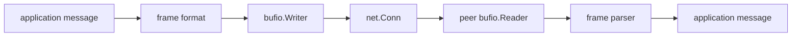

# net.Conn과 bufio로 프로토콜 설계하기

HTTP, gRPC, SQL 바깥으로 나가면 결국 직접 프로토콜 경계를 설계하게 됩니다.

Go에서는 그 출발점이 보통 `net.Conn`, `io.Reader`, `io.Writer`, `bufio`입니다.

여기서 위험한 오해는 이 API들을 message primitive처럼 다루는 것입니다. 실제로는 stream primitive입니다.

## Mental model



프로토콜 레이어가 직접 정해야 하는 것은 다음입니다.

- message boundary
- maximum frame size
- read/write ownership
- flush policy
- deadline
- shutdown behavior

`bufio`는 amortized read/write를 도와줄 뿐, 이 규칙을 대신 정해주지 않습니다.

## 예제 시나리오

이번 트랙에서 추가한 [`examples/tcpprotocol`](https://github.com/jaeyoung0509/golang-handbook/tree/develop/examples/tcpprotocol)은 `net.Conn` 위에 length-prefixed protocol을 구현합니다.

테스트가 실제로 증명하는 것은 네 가지입니다.

- `Write`는 frame 일부만 쓸 수 있다
- `Read`는 조각난 입력으로 도착할 수 있다
- oversized frame은 초기에 거절해야 한다
- deadline은 stalled peer를 오래 붙잡지 않고 빨리 실패시켜야 한다

## 실전 코드 스케치

```go
func readFrame(r *bufio.Reader, max int) ([]byte, error) {
	header := make([]byte, 4)
	if _, err := io.ReadFull(r, header); err != nil {
		return nil, err
	}

	size := int(binary.BigEndian.Uint32(header))
	if size > max {
		return nil, ErrFrameTooLarge
	}

	payload := make([]byte, size)
	if _, err := io.ReadFull(r, payload); err != nil {
		return nil, err
	}
	return payload, nil
}

func writeFrame(w *bufio.Writer, payload []byte) error {
	var header [4]byte
	binary.BigEndian.PutUint32(header[:], uint32(len(payload)))
	if _, err := w.Write(header[:]); err != nil {
		return err
	}
	if _, err := w.Write(payload); err != nil {
		return err
	}
	return w.Flush()
}
```

핵심 규칙은 세 가지입니다.

1. `io.ReadFull`로 stream read를 complete-frame read로 바꾼다
2. 최대 frame 크기로 heap 폭주를 막는다
3. `Flush`를 write contract 일부로 본다

## 프로토콜을 sane하게 유지하는 ownership 규칙

### read owner 한 명, write owner 한 명

여러 goroutine이 같은 connection에서 제각각 `Read`하면 안 됩니다.

같은 buffered writer에 여러 goroutine이 raw bytes를 동시에 쓰게 두는 것도 위험합니다.

깔끔한 구조는 이렇습니다.

- 한 goroutine이 read를 소유하고 dispatch한다
- 한 goroutine 혹은 한 critical section이 write를 소유한다
- 상위 로직은 socket direct write를 공유하지 말고 channel이나 queue로 통신한다

### deadline은 transport edge에 둔다

프로토콜에 budget이 있다면 exchange 전에 connection에 둡니다.

```go
_ = conn.SetDeadline(time.Now().Add(200 * time.Millisecond))
```

상위 wrapper가 context 취소를 실제 connection deadline 혹은 close로 번역해주지 않는 이상, parent context만 믿지 않는 편이 낫습니다.

### frame validation은 admission control이다

length prefix, delimiter rule, version field, maximum payload size는 overload policy 일부입니다.

trusted peer라는 이유로 frame size 제한을 빼면, 결국 큰 payload 하나가 heap과 scheduler를 같이 흔들게 됩니다.

## `bufio`는 유용하지만 마법은 아니다

`bufio.Reader`, `bufio.Writer`가 주는 핵심 이점은 syscall 감소와 parsing helper입니다.

- `ReadByte`
- `ReadSlice`
- `ReadString`
- `Peek`
- 제한된 경우의 `Scanner`

하지만 `bufio`는 state도 만듭니다.

- `Flush` 전까지 write buffer 안에 데이터가 남을 수 있고
- underlying connection이 한가해도 read buffer에는 이미 데이터가 들어와 있을 수 있으며
- coordination 없이 buffered writer를 공유하면 data corruption risk가 생깁니다

## 런타임/표준 라이브러리 소스 포인터

- [`net/net.go` `Conn`](https://github.com/golang/go/blob/go1.26.0/src/net/net.go#L126)
- [`bufio/bufio.go` `Reader`](https://github.com/golang/go/blob/go1.26.0/src/bufio/bufio.go#L32)
- [`bufio/bufio.go` `Writer`](https://github.com/golang/go/blob/go1.26.0/src/bufio/bufio.go#L576)
- [`io/io.go` `ReadFull`](https://github.com/golang/go/blob/go1.26.0/src/io/io.go#L346)

표준 라이브러리는 좋은 stream primitive를 줄 뿐, protocol 자체를 공짜로 주지는 않습니다.

## 실패 패턴

### `Read` 한 번이면 application message 하나라고 생각

```go
buf := make([]byte, 4096)
n, _ := conn.Read(buf)
handleMessage(buf[:n]) // bad: frame 일부일 수 있음
```

### `Flush`를 빼먹음

```go
writer.Write(payload)
return nil // bad: peer가 bytes를 못 볼 수 있음
```

### unbounded frame 허용

```go
size := binary.BigEndian.Uint32(header)
payload := make([]byte, size) // bad: 최대값 제한 없음
```

### buffered writer를 아무렇지 않게 공유

여러 goroutine이 동시에 frame write를 하면 stream이 섞일 수 있습니다.

## 어떻게 관측하고 테스트할까

- 프로토콜 테스트는 `net.Pipe`를 우선 사용합니다.
- stalled peer가 오래 걸리지 않도록 deadline 테스트를 넣습니다.
- 입력 조각남(fragmented input)과 short write를 명시적으로 검증합니다.
- frame 크기와 protocol error count를 business-level failure와 따로 관측합니다.

## 프로덕션에서의 의미

커스텀 Go 프로토콜의 “랜덤한 소켓 버그”는 대개 소켓이 아니라 protocol boundary 문제입니다.

- framing 부재
- limit 부재
- flush 부재
- deadline 부재
- read/write owner 부재

같은 문제입니다.

## Practical takeaway

`net.Conn`은 transport, `bufio`는 효율적인 buffering, 그리고 explicit framing은 message boundary로 역할을 나눠서 생각하십시오.

다음으로는 [HTTP/2, ALPN, 그리고 Stream Multiplexing](/ko/stdlib/http2-alpn-stream-multiplexing)에서 표준 라이브러리가 훨씬 복잡한 프로토콜 스택을 어떻게 구현하는지 볼 수 있습니다.
