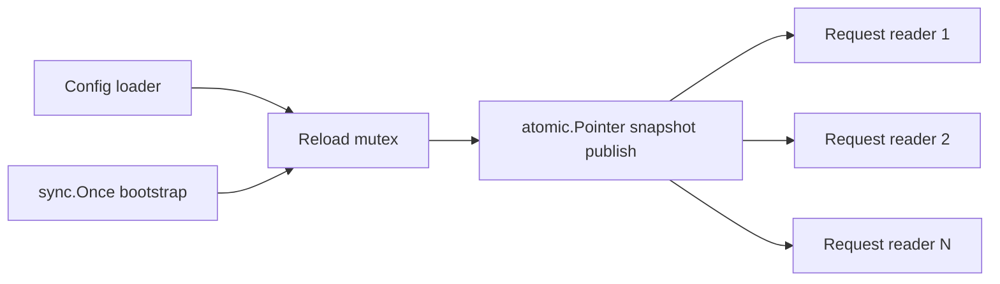

# sync와 atomic 프리미티브

Go는 channels-only 언어가 아닙니다.

대규모 프로덕션 코드베이스는 명시적인 shared-state coordination이 필요하고, 표준 라이브러리는 그 목적에 맞는 여러 도구를 제공합니다. 중요한 건 API를 외우는 게 아니라, 어떤 primitive가 어떤 invariant를 보호하는지 이해하는 것입니다.

## 왜 이 패키지 묶음이 중요한가

코드가 다음 중 하나를 가지는 순간:

- read-mostly shared state,
- one-time initialization,
- 반드시 drain되어야 하는 task group,
- 여러 goroutine이 기다리는 어떤 조건,
- hot counter나 pointer snapshot

이미 synchronization design을 하고 있는 겁니다.

모든 걸 channel로 억지로 밀어 넣는다고 안전해지는 게 아니라, 오히려 선택이 덜 명확해질 수 있습니다.

## 예제 시나리오

`examples/configsnapshot` 패키지는 read-mostly feature config store를 모델링합니다. 한 goroutine이 전체 snapshot을 새로 읽어 publish하고, 많은 goroutine이 동시에 읽습니다.



이 문제는 다음 조합에 잘 맞습니다.

- bootstrap에는 `sync.Once`
- 느린 reload 작업 주위에는 작은 mutex
- 값 읽기에는 `atomic.Pointer`

## 실전 코드 스케치

```go
type Store struct {
	bootstrapOnce sync.Once
	reloadMu      sync.Mutex
	current       atomic.Pointer[Snapshot]
}

func (s *Store) Bootstrap(ctx context.Context) error {
	var err error
	s.bootstrapOnce.Do(func() {
		err = s.Reload(ctx)
	})
	return err
}

func (s *Store) Reload(ctx context.Context) error {
	s.reloadMu.Lock()
	defer s.reloadMu.Unlock()

	next, err := loadSnapshot(ctx)
	if err != nil {
		return err
	}
	s.current.Store(&next)
	return nil
}
```

핵심은 각 primitive가 아주 좁은 concern 하나씩만 맡는다는 점입니다.

## Mental model

실제 invariant에 맞는 가장 좁은 primitive를 고르면 됩니다.

| Primitive | 가장 잘 맞는 용도 |
| --- | --- |
| `RWMutex` | coherent한 multi-field invariant를 가진 shared object, read-heavy access |
| `WaitGroup` | bounded task set이 끝날 때까지 기다리는 owner |
| `Once` | 정확히 한 번만 해야 하는 초기화 |
| `sync.Map` | write-once 또는 disjoint-key 패턴에 특화된 concurrent map |
| `sync.Cond` | lock으로 보호된 조건에 대한 wait/signal |
| `sync/atomic` | flag, counter, pointer snapshot 같은 작은 독립 상태 |

여러 필드가 함께 일관되게 바뀌어야 한다면 atomic은 너무 작고, `sync.Map`은 너무 약하게 타입화되어 있는 경우가 많습니다. 이럴 때는 mutex가 더 명확합니다.

## 단순화한 내부 코드 예시

```go
type Once struct {
	done atomic.Bool
	mu   sync.Mutex
}

type WaitGroup struct {
	state atomic.Uint64 // counter + waiter count
	sema  uint32
}

type RWMutex struct {
	w           Mutex
	writerSem   uint32
	readerSem   uint32
	readerCount atomic.Int32
	readerWait  atomic.Int32
}

type Map struct {
	internal concurrentHashTrie
}
```

공통 패턴은 이렇습니다.

- hot path에는 atomic,
- 완전한 coordination이 필요하면 mutex나 semaphore,
- `first use after copy 금지`를 강하게 전제.

## 주요 primitive가 실제로 하는 일

### `RWMutex`

`RWMutex`는 “읽기 병렬성이 공짜”라는 뜻이 아닙니다.

다음 경우에 가장 잘 맞습니다.

- read가 write보다 훨씬 많고,
- read critical section이 짧고,
- 정말로 하나의 coherent object를 보호해야 할 때.

write가 잦거나, 호출자가 `RLock`에서 `Lock`으로 upgrade를 시도하기 시작하면 오히려 더 느리고 이해하기 어려워집니다. Go 구현은 writer가 기다리기 시작하면 새 reader를 막아서 writer가 결국 진행할 수 있게 합니다.

### `WaitGroup`

`WaitGroup`은 counting semaphore이지, general lifecycle manager가 아닙니다.

Go 1.26 문서는 가능하면 직접 `Add`/`Done` 쌍보다 `WaitGroup.Go`를 선호하라고 설명합니다. misuse는 여전히 같습니다.

- `Add`와 `Wait`의 경합
- 이전 `Wait`가 끝나기 전에 같은 `WaitGroup` 재사용
- `Done`을 호출하지 않는 task leak

### `Once`

`Once`는 반드시 한 번만 해야 하는 initialization에 쓰는 도구입니다.

retry wrapper가 아닙니다. 함수가 실패하거나 panic해도 `Once`는 그 호출을 소비한 것으로 봅니다.

immutable bootstrap에는 좋고, “성공할 때까지 재시도”에는 맞지 않습니다.

### `sync.Map`

`sync.Map`은 특화된 자료구조입니다. 패키지 문서도 이 점을 직접 말합니다.

Go 1.26 기준 구현은 단순 `map + lock`이 아니라 `internal/sync.HashTrieMap` 기반입니다. 특히 다음 경우를 최적화합니다.

- write once, read many
- disjoint key set에 대한 concurrent read/write

타입 안정성이나 compound invariant가 중요한 일반 도메인 저장소의 기본값으로 쓰기엔 맞지 않습니다.

### `sync.Cond`

`Cond`는 queue도 아니고 mailbox도 아닙니다.

lock으로 보호된 어떤 조건에 대한 rendezvous입니다. `Wait`는 항상 loop 안에서 호출해야 합니다. wakeup이 왔다고 해서 lock을 다시 잡았을 때 그 조건이 여전히 참이라는 뜻은 아니기 때문입니다.

### `sync/atomic`

Go의 atomic 연산은 sequentially consistent입니다. 꽤 강한 보장입니다.

하지만 그게 모든 shared-state 문제에 적합하다는 뜻은 아닙니다. atomic은 하나의 값이 독립적으로 의미를 가질 때 가장 좋습니다.

- readiness flag
- request counter
- immutable snapshot에 대한 pointer

여러 필드가 함께 바뀌어야 하는 순간부터는 reasoning이 급격히 어려워집니다.

## 런타임/소스 코드 워크

Go 1.26에서 읽을 만한 진입점:

- [`sync/once.go`](https://github.com/golang/go/blob/go1.26.0/src/sync/once.go)
- [`sync/waitgroup.go`](https://github.com/golang/go/blob/go1.26.0/src/sync/waitgroup.go)
- [`sync/rwmutex.go`](https://github.com/golang/go/blob/go1.26.0/src/sync/rwmutex.go)
- [`sync/cond.go`](https://github.com/golang/go/blob/go1.26.0/src/sync/cond.go)
- [`sync/map.go`](https://github.com/golang/go/blob/go1.26.0/src/sync/map.go)
- [`sync/atomic/type.go`](https://github.com/golang/go/blob/go1.26.0/src/sync/atomic/type.go)

특히 볼 만한 디테일:

- `Once`는 hot-path layout을 위해 `done`을 앞에 두고, slow path에서는 mutex를 써서 다른 호출자가 initialization 종료까지 기다리게 만듭니다.
- `WaitGroup`은 task count와 waiter count를 하나의 atomic word에 패킹하고 runtime semaphore로 waiters를 깨웁니다.
- `RWMutex`는 reader count를 atomic으로 추적하고, fast path가 실패하면 runtime semaphore로 reader/writer를 block합니다.
- `Cond.Wait`는 runtime notify list에 waiter를 등록하고 unlock 후 sleep, 그 다음 re-lock 합니다.
- `sync.Map.Range`는 일관된 snapshot이 아님을 문서가 명확히 말합니다.

## 실패 패턴

### write-heavy state에 `RWMutex` 사용

```go
rw.RLock()
defer rw.RUnlock()
```

write가 잦다면 `RWMutex`는 plain mutex보다 더 느리고 이해하기 어려울 수 있습니다.

### `Wait`가 시작된 뒤 `Add` 호출

```go
go func() {
	wg.Add(1) // misuse
	defer wg.Done()
	work()
}()
wg.Wait()
```

이건 `WaitGroup`이 정확히 막아야 하는 misuse입니다.

### retry 가능한 초기화에 `Once` 사용

```go
once.Do(func() {
	err = connect()
})
```

`connect()`가 한 번 실패하면 같은 `Once`로는 다시 시도되지 않습니다.

### `sync.Map`을 typed domain store의 기본값으로 사용

`sync.Map`은 개별 연산의 concurrency safety를 줄 뿐, 도메인 invariant를 더 쉽게 지켜주지는 않습니다.

### loop 없이 `Cond.Wait` 사용

```go
cond.L.Lock()
cond.Wait()
useSharedState() // bug: 조건이 여전히 참이라는 보장이 없음
cond.L.Unlock()
```

lock이 조건을 보호합니다. signal은 다시 확인하라는 의미일 뿐입니다.

### compound invariant를 atomic 여러 개로 표현

```go
atomic.StoreInt64(&state.balance, nextBalance)
atomic.StoreInt64(&state.version, nextVersion)
```

reader가 두 필드를 함께 일관되게 봐야 한다면, separate atomic store는 coherent multi-field transaction이 아닙니다.

## 프로덕션에서의 의미

- 왜 다른 primitive가 더 나은지 명확히 설명할 수 있을 때까지는 plain mutex를 기본값으로 둡니다.
- read-mostly immutable snapshot에는 `atomic.Pointer`가 종종 가장 깔끔하고 빠릅니다.
- `sync.Map`은 특화된 경우에만 씁니다.
- `WaitGroup`은 local join 도구이지 long-lived service controller가 아닙니다.
- correctness에 중요한 조건이라면 lock과 `Cond`를 state owner 근처에 둡니다.

## 예제와 테스트

- 예제: `examples/configsnapshot`
- 테스트는 one-time bootstrap, whole snapshot의 atomic publication, 실패 시 last known-good snapshot 유지까지 검증합니다.

## 공식 자료

- [`sync` 패키지 문서](https://pkg.go.dev/sync)
- [`sync/atomic` 패키지 문서](https://pkg.go.dev/sync/atomic)
- [Go memory model](https://go.dev/ref/mem)

## Practical takeaway

강한 Go 코드베이스는 “channel 순수주의”로 가지 않습니다. 실제 invariant에 맞는 가장 작은 synchronization primitive를 고르고, 거기서 멈춥니다.
