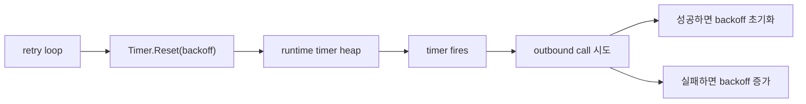

# time, Timers, Tickers

시간 버그는 동시성 버그인데 더 그럴듯하게 숨어 있을 뿐입니다.

retry, deadline, shutdown, backoff, request budget, idle cleanup은 모두 시간 의미론을 정확히 이해해야 안전합니다.

## 왜 이 패키지가 중요한가

`time`은 단순히 포맷팅과 sleep만 담당하지 않습니다.

이 패키지는:

- deadline을 어떻게 재는지,
- timer가 어떻게 작업을 다시 깨우는지,
- 주기 작업을 어떻게 스케줄하는지,
- wall time과 monotonic time이 어떻게 섞이는지

를 정의합니다.

여기서 실수하면 cancellation은 시끄러워지고, retry loop는 드리프트하고, shutdown 로직은 flaky해집니다.

## 예제 시나리오



## 실전 코드 스케치

```go
timer := time.NewTimer(0)
defer timer.Stop()

backoff := 100 * time.Millisecond

for {
	select {
	case <-ctx.Done():
		return ctx.Err()
	case <-timer.C:
		if err := syncOnce(ctx); err != nil {
			backoff = min(backoff*2, 2*time.Second)
		} else {
			backoff = 100 * time.Millisecond
		}
		timer.Reset(backoff)
	}
}
```

loop가 timer lifecycle을 소유하고 명시적으로 reset해야 할 때 선호할 만한 모양입니다.

## Mental model

세 가지가 특히 중요합니다.

1. `time.Time`은 wall-clock 데이터를 들고 있고, 경우에 따라 monotonic reading도 같이 가집니다.
2. `Timer`는 미래의 한 번의 이벤트를 예약합니다.
3. `Ticker`는 반복 이벤트를 예약합니다.

핵심은 wall-clock은 “현재 시각”을 말하는 데 쓰이고, monotonic time은 “경과 시간”을 재는 데 쓰인다는 점입니다.

그래서 `time.Since(start)`가 서로 다른 프로세스에서 직렬화된 timestamp를 빼는 것보다 안전합니다.

## 단순화한 내부 코드 예시

```go
type Time struct {
	wall uint64
	ext  int64
	loc  *Location
}

type Timer struct {
	C <-chan time.Time
}

func After(d time.Duration) <-chan time.Time {
	return NewTimer(d).C
}

func retryLoop(ctx context.Context, timer *time.Timer) error {
	for {
		select {
		case <-ctx.Done():
			return ctx.Err()
		case <-timer.C:
			// 작업 후 timer.Reset(nextDelay)
		}
	}
}
```

저수준 timer machinery는 runtime이 담당하고, `time` 패키지는 일반 Go 코드에 맞는 API 모양으로 감쌉니다.

## 소스 코드에서 봐야 할 지점

Go 1.26 소스에서 중요한 점은 이렇습니다.

- `Time`은 wall-clock과 optional monotonic data를 `wall`, `ext`에 인코딩합니다.
- `NewTimer`와 `AfterFunc`는 둘 다 runtime timer 생성으로 위임합니다.
- Go 1.23부터 timer channel은 synchronous semantics를 가지며, unreferenced timer는 GC가 회수할 수 있습니다.
- `Ticker`는 반복 timer이므로, owner가 끝날 때 여전히 명시적 `Stop`이 필요합니다.

읽을 만한 진입점:

- [`time.go` `Time`](https://github.com/golang/go/blob/go1.26.0/src/time/time.go#L140)
- [`sleep.go` `Timer`](https://github.com/golang/go/blob/go1.26.0/src/time/sleep.go#L89)
- [`sleep.go` `NewTimer`](https://github.com/golang/go/blob/go1.26.0/src/time/sleep.go#L143)
- [`sleep.go` `After`](https://github.com/golang/go/blob/go1.26.0/src/time/sleep.go#L202)
- [`sleep.go` `AfterFunc`](https://github.com/golang/go/blob/go1.26.0/src/time/sleep.go#L210)
- [`tick.go` `Ticker`](https://github.com/golang/go/blob/go1.26.0/src/time/tick.go#L16)

## 현대 Go에서 달라진 점

최근 버전에서 가장 중요한 timer semantic 변화는 Go 1.23입니다.

- unreferenced timer를 GC가 회수할 수 있고,
- timer channel이 synchronous하게 동작하며,
- `Stop` 또는 `Reset` 뒤의 stale timer value 문제가 기본 동작에서 크게 줄었습니다.

즉, 과거의 “항상 drain해야 한다”는 timer folklore는 Go 버전을 고려해서 읽어야 합니다.

## 실패 패턴

### hot loop에서 ownership 없이 `time.After` 사용

```go
for {
	select {
	case <-ctx.Done():
		return
	case <-time.After(100 * time.Millisecond):
		poll()
	}
}
```

짧지만 매 iteration마다 새 timer를 만듭니다. hot loop나 adaptive backoff에는 재사용 가능한 `Timer`가 더 잘 맞는 경우가 많습니다.

### ticker를 멈추지 않음

```go
ticker := time.NewTicker(5 * time.Second)
go func() {
	for range ticker.C {
		refresh()
	}
}()
```

누가 이 ticker의 shutdown을 소유하는지 없으면, goroutine과 periodic wakeup이 기능 lifetime을 넘어 계속 살아남을 수 있습니다.

### `time.Time`을 `==`로 비교

`==`는 instant만 비교하지 않습니다. location과 monotonic metadata까지 비교합니다. “같은 순간”을 의미할 때는 `Equal`을 쓰는 게 맞습니다.

### 직렬화된 시간이 monotonic 데이터를 유지한다고 가정

`MarshalJSON`, `Unix`, `Parse` 등은 monotonic reading을 보존하지 않습니다. 그래서 elapsed-time 계산은 대체로 같은 프로세스 안에서 해야 안전합니다.

### timer ownership 없이 여러 goroutine이 Reset/Stop

여러 goroutine이 같은 timer를 stop, drain, reset하고 있다면 문제는 API 문법보다 ownership 설계입니다.

## 프로덕션에서의 의미

- elapsed-time 추론에는 `Since`, `Until`, context deadline처럼 monotonic time 기반 API를 선호합니다.
- adaptive retry loop에는 owner가 분명한 `Timer` 하나를 재사용합니다.
- `Ticker`는 “작업이 끝난 뒤 다시 기다리기”가 아니라 “고정 주기”가 필요할 때만 씁니다.
- 오래된 timer folklore는 현재 Go 버전과 함께 다시 검토해야 합니다.

## 어떻게 테스트/관측할까

- timeout 로직은 가능한 한 `testing/synctest`로 결정적 virtual time 위에서 검증합니다.
- real sleep에 기대지 말고 backoff progression을 table test로 검증합니다.
- ticker shutdown은 leak test로 확인합니다.
- timer storm나 bursty wakeup이 의심되면 trace를 봅니다.

## 공식 자료

- [`time` 패키지 문서](https://pkg.go.dev/time)
- [Go 1.26 `time` 소스](https://github.com/golang/go/blob/go1.26.0/src/time)
- [Go 1.23 release notes](https://go.dev/doc/go1.23)

## Practical takeaway

정확한 시간 모델은 retry, deadline, periodic work가 올바른 동시성 코드를 flaky한 프로덕션 동작으로 바꾸지 않게 막아주는 기반입니다.
