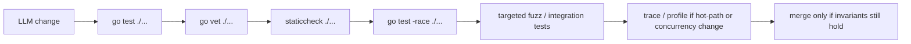

# AI 보조 Go 안전성

Go는 많은 동적 언어 워크플로와 달리 두 가지 강한 기본값을 줍니다.

- 진짜 컴파일러
- 진짜 정적 타입 시스템

이건 AI-assisted coding에서 큰 장점입니다.

하지만 그것만으로 충분하지는 않습니다.

Go에서 위험한 버그는 “컴파일이 안 된다”가 아니라 “컴파일도 되고 타입도 맞는데, 부하나 종료나 엣지 입력에서 깨진다”는 종류입니다.

## 빠른 모델



## 컴파일러와 타입 시스템이 실제로 보장하는 것

Go의 컴파일러와 타입 체커는 다음을 아주 잘 잡습니다.

- 문법 에러
- 타입 불일치
- 잘못된 method set
- 유효하지 않은 assignment
- 많은 interface-conformance 실수
- 리팩터링 과정의 큰 클래스의 깨짐

그래서 Go는 AI-assisted work에 잘 맞습니다. 말이 안 되는 코드의 범위를 빠르게 줄여주기 때문입니다.

## 그래도 컴파일되는데 깨지는 것들

성공적인 build가 다음을 증명해주지는 않습니다.

- response body가 닫히는가
- context가 cancel되는가
- goroutine이 종료되는가
- channel protocol이 deadlock되지 않는가
- retry loop가 bounded한가
- map이 실제 트래픽에서 raced하지 않는가
- offset이나 ack가 실제 side effect 뒤에 오는가
- timeout이 올바른 budget boundary를 반영하는가
- 중요한 경로에서 nil이 실제로 불가능한가
- business invariant가 유지되는가

LLM이 만든 Go 코드가 “깔끔하게 컴파일되지만 실제로는 틀린” 지점이 바로 여기입니다.

## “컴파일은 되지만 위험한” 작은 예시

### Response body leak

```go
resp, err := client.Do(req)
if err != nil {
	return err
}
return decode(resp.Body) // bad: body를 닫지 않음
```

### Cancellation 없는 background work

```go
go func() {
	for msg := range jobs {
		process(msg)
	}
}()
```

이 코드는 컴파일도 되고 happy-path test도 통과할 수 있지만, shutdown에서 work를 leak할 수 있습니다.

### Business ordering bug

```go
sess.MarkMessage(msg, "")
err := writeToDB(msg) // bad: 실제 side effect보다 offset이 먼저 이동
```

이건 컴파일러가 절대 도와줄 수 없는 protocol correctness 문제입니다.

## Go에서 AI/LLM이 자주 만드는 실패 패턴

### Happy-path만 맞는 코드

모든 것이 빠르게 성공하는 경우만 맞고, shutdown/timeout/retry boundary가 빠져 있습니다.

### Ownership cleanup 누락

코드가:

- response body
- timer
- context
- stream
- goroutine

을 열어놓고도 누가 close/cancel/join하는지 정의하지 않습니다.

### `context.Background()` 남용

LLM은 컴파일이 쉬워서 `context.Background()`를 자주 넣습니다. request path에서는 거의 항상 budget과 cancellation boundary를 잃는 선택입니다.

### 조용한 error 무시

```go
_ = something.Close()
_ = producer.Send(msg)
```

error를 무시하는 것이 맞는 경우도 있지만, LLM은 이유 설명 없이 자주 그렇게 씁니다.

### 명시적 owner 없는 shared state

map, slice, struct는 타입상 유효하니 컴파일은 됩니다. 하지만 mutation을 goroutine, mutex, protocol 중 누가 소유하는지 없으면 나중에 깨집니다.

### 너무 약한 테스트

에이전트가:

- success-path unit test 하나,
- 짧은 `time.Sleep`,
- race test 없음,
- timeout path 없음,
- leak path 없음

으로 끝내는 경우가 많습니다.

동시성 Go에서는 이걸로는 부족합니다.

## 검증 스택

이 레이어들은 같이 써야 합니다. 각자 잡는 실패 클래스가 다릅니다.

| 도구 | 잘 잡는 것 | 증명하지 못하는 것 |
| --- | --- | --- |
| `go test ./...` | compile + unit/regression | race, 약한 invariant, 실행되지 않은 경로 |
| `go vet ./...` | 컴파일러가 못 잡는 suspicious construct | full correctness |
| `staticcheck ./...` | 더 넓은 static bug / performance check | runtime-only failure |
| `go test -race ./...` | unsynchronized shared-memory access | deadlock, leak, protocol bug |
| fuzzing | edge case와 crash-causing input | 외부 dependency semantics |
| integration test | 실제 dependency contract | 모든 scheduler/load behavior |
| trace/profile | contention, scheduler, blocking, GC behavior | 논리 correctness 자체 |
| `govulncheck ./...` | 알려진 취약한 dependency usage | logic bug, 운영 버그 |

## 추천 명령 사다리

빠른 검사부터 시작하고, concurrency/I/O/wire-format 변화가 있으면 더 깊게 갑니다.

```bash
go test ./...
go vet ./...
staticcheck ./...
go test -race ./...
go test ./... -run=Fuzz
go test ./... -fuzz=Fuzz -fuzztime=5s
govulncheck ./...
```

실무적으로는:

1. 항상 `go test ./...`
2. nontrivial change마다 `go vet ./...`
3. 더 넓은 정적 검사를 위해 `staticcheck ./...`
4. concurrency/shared-state change면 `go test -race ./...`
5. parser/codec/handler/input boundary에는 targeted fuzzing
6. network/SQL/Kafka/Redis/subprocess semantics가 걸리면 integration test

## 컴파일러가 더 많이 잡게 만드는 설계

컴파일러가 business correctness를 증명할 수는 없지만, 코드를 더 일찍 깨지게 만드는 방향으로 설계할 수는 있습니다.

### `map[string]any`보다 강한 타입을 선호

typed struct와 typed enum은 refactor를 더 크게, 더 빨리 깨뜨립니다.

### Illegal state를 표현하기 어렵게 만든다

필수 필드를 검증하는 constructor를 두고 early error를 반환합니다.

### mutable state machine에는 owner를 하나 둔다

값이 mutate된다면 owner가 무엇인지 명시합니다.

- goroutine 하나
- mutex 하나
- channel protocol 하나

ownership을 암묵적으로 두면 안 됩니다.

### Budget은 boundary에 둔다

caller에서 `context.Context`를 내려보내고, leaf function 안에 `context.Background()`를 묻지 않습니다.

### Side effect seam을 좁게 둔다

interface boundary가 좁을수록 중요한 ordering을 테스트가 더 명확히 증명할 수 있습니다.

## AI-safe code review가 꼭 물어야 할 것

agent-generated Go를 리뷰할 때는 다음을 물어야 합니다.

1. 이 goroutine/stream/timer/body의 owner는 누구인가
2. timeout budget은 무엇이고, 올바른 edge에 걸려 있는가
3. caller가 먼저 떠나면 무슨 일이 일어나는가
4. failure path가 끝난다는 걸 어떤 테스트가 증명하는가
5. 여기서 가장 가능성 높은 regression은 어떤 도구가 잡는가

이 질문에 답이 안 나오면 아직 merge할 코드가 아닙니다.

## 각 도구의 위치

- `go vet`은 공식 도구이고, 컴파일러가 놓치는 suspicious construct를 잡습니다.
- `-race`는 Go에 내장된 runtime race detector입니다.
- Go fuzzing은 공식 기능이며 crash-causing input이나 취약한 입력을 찾는 데 맞습니다.
- `govulncheck`는 공식 Go vulnerability checker입니다.
- `staticcheck`는 Go toolchain 일부는 아니지만, `go vet` 옆에 두기 좋은 고신호 static analysis 층입니다.

## 이 사이트의 다른 문서와 연결

- shared-memory bug는 [Race Detector](/ko/testing/race-detector)
- time-heavy code는 [synctest로 결정적 테스트](/ko/testing/synctest)
- lifecycle proof는 [리크, 종료, 타임아웃 테스트](/ko/testing/leaks-and-shutdowns)
- 논리는 맞는데 runtime behavior가 이상하면 [트레이싱과 경합 관측](/ko/testing/tracing-and-profiling)

## 공식 자료

- [Data Race Detector](https://go.dev/doc/articles/race_detector)
- [Tutorial: Getting started with fuzzing](https://go.dev/doc/tutorial/fuzz)
- [`go vet`](https://pkg.go.dev/cmd/vet)
- [`govulncheck`](https://pkg.go.dev/golang.org/x/vuln/cmd/govulncheck)
- [Staticcheck docs](https://staticcheck.dev/docs/)

## Practical takeaway

AI-assisted Go의 안전성은 컴파일러를 첫 번째 gate로 쓰는 데서 시작합니다.

하지만 끝은 아닙니다.

진짜 강한 워크플로는:

- 타입 에러를 초기에 자르고
- suspicious construct를 정적으로 잡고
- race를 동적으로 잡고
- 이상한 입력을 fuzzing으로 찾고
- 실제 dependency behavior를 integration test로 확인하고
- runtime pathology를 trace/profile로 드러내는

여러 겹의 검증 체인입니다.
