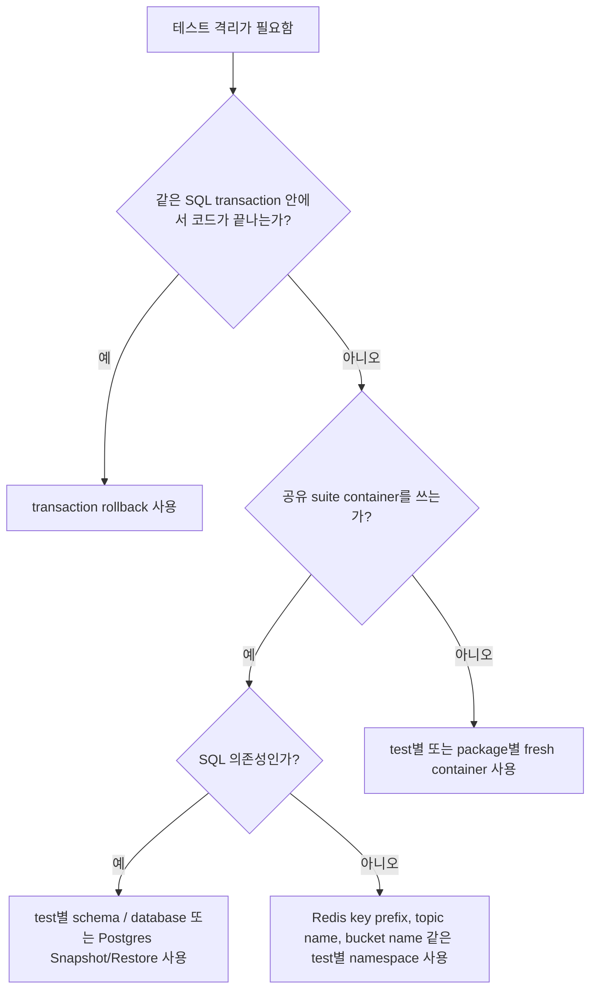

# Testcontainers로 통합 테스트하기

실제 서비스는 순수 함수가 숫자를 하나 잘못 내서만 깨지지 않습니다.

더 자주 깨지는 이유는:

- 이전 테스트의 Postgres 상태가 남아 있고,
- Redis 키가 다음 테스트를 오염시키고,
- 의존성이 실제로 준비되기 전에 테스트가 시작되고,
- teardown의 소유권 경계가 잘못 잡혀 있고,
- `user + partner + payment method + order` 같은 선행 상태 준비가 읽기 어려운 스크립트가 되기 때문입니다.

이 문서는 그런 테스트를 믿을 수 있게 만드는 방법에 집중합니다.

## 멘탈 모델

통합 테스트는 "조금 더 큰 unit test"가 아닙니다. 의존성 경계와 lifecycle ownership이 있는 테스트입니다.

핵심 규칙은 이렇습니다.

1. 자원 획득은 bounded context로 한다.
2. cleanup은 자원을 획득한 지점에서 바로 등록한다.
3. 상태 격리는 namespace, schema, snapshot, fresh container 중 하나로 명시한다.
4. fixture setup은 typed, domain-shaped helper로 감춘다.
5. readiness를 `sleep`에 맡기지 않는다.

## 상태 격리 결정 트리



## 언제 `testcontainers-go`가 맞는가

아래처럼 실제 의존성의 동작이 중요할 때는 `testcontainers-go`가 맞습니다.

- SQL schema, index, constraint, lock, transaction semantics
- Redis TTL, script behavior, protocol behavior
- startup ordering과 network reachability
- 실제 wire contract가 있는 containerized service

반대로 모든 테스트를 무조건 container로 돌릴 필요는 없습니다.

| 테스트 방식 | 잘 맞는 경우 | 부족한 경우 |
| --- | --- | --- |
| in-memory fake | 순수 domain rule, validation, branching logic | SQL isolation level, Redis expiration, network failure, migration correctness |
| transaction rollback | 같은 DB 경계 안에서 끝나는 빠른 SQL 테스트 | 코드가 별도 connection pool을 열고 독립 commit하는 경우 |
| shared container + namespace reset | startup 비용이 큰 대형 suite | 진짜 global state를 건드리는 테스트 |
| fresh container per test | 가장 강한 격리, reasoning이 쉬움 | 매우 큰 suite에서 startup 비용이 큰 경우 |

## Lifecycle ownership

테스트 자원의 owner는 `testing.T`가 되어야 합니다.

- 활성 테스트 수명에는 `t.Context()`를 쓰고
- teardown에는 `t.Cleanup`을 쓰고
- cleanup은 acquisition 직후 바로 등록하고
- cleanup 자체도 bounded, idempotent하게 유지합니다.

`testing.T.Context()`는 Go 1.24에서 추가됐고, `Cleanup` 함수가 실행되기 **직전**에 취소됩니다. 즉 cleanup에서 살아 있는 context가 필요하면 `t.Context()`를 재사용하면 안 되고, cleanup 내부에서 새로운 bounded background context를 만들어야 합니다.

## 컨테이너 시작 기본 패턴

container-backed 테스트의 기본형은 이렇습니다.

```go
func startPostgres(t *testing.T) *postgres.PostgresContainer {
	t.Helper()

	ctx, cancel := context.WithTimeout(t.Context(), 2*time.Minute)
	t.Cleanup(cancel)

	ctr, err := postgres.Run(
		ctx,
		"postgres:16-alpine",
		postgres.WithDatabase("app_test"),
		postgres.WithUsername("app"),
		postgres.WithPassword("app"),
		postgres.BasicWaitStrategies(),
		testcontainers.WithLogger(log.TestLogger(t)),
	)
	require.NoError(t, err)

	testcontainers.CleanupContainer(t, ctr)
	return ctr
}
```

이 패턴이 좋은 이유는:

- startup timeout이 명확하고
- 컨테이너 로그가 테스트 출력에 붙고
- cleanup owner가 `t`로 고정되고
- readiness를 `sleep` 대신 wait strategy에 맡기기 때문입니다.

## Teardown 규칙: cleanup은 경계를 소유해야 한다

좋은 cleanup 경계는 보통 "row를 하나씩 지우기"가 아닙니다.

우선순위는 보통 이렇습니다.

- transaction rollback
- test별 schema/database drop
- Postgres `Snapshot` / `Restore`
- Redis key-prefix cleanup
- fresh container terminate

delete 순서 자체를 검증하는 테스트가 아니라면, ad-hoc delete를 기본값으로 두지 않는 편이 좋습니다.

## Postgres 전략

### 1. 같은 transaction을 공유할 수 있으면 rollback

가장 빠른 방식이지만, 코드가 같은 connection 또는 transaction 경계 안에서 실행될 때만 통합니다.

```go
func withTx(t *testing.T, db *sql.DB) *sql.Tx {
	t.Helper()

	tx, err := db.BeginTx(t.Context(), nil)
	require.NoError(t, err)

	t.Cleanup(func() {
		_ = tx.Rollback()
	})

	return tx
}
```

handler/service가 내부에서 별도 connection pool을 열고 독립적으로 commit하면, 테스트 쪽 rollback으로는 격리가 되지 않습니다.

### 2. 공유 Postgres 컨테이너 + `Snapshot` / `Restore`

컨테이너는 하나만 띄우고, migration도 한 번만 하고, 각 테스트는 깨끗한 DB에서 시작하고 싶다면 이 방식이 강한 기본값입니다.

```go
type SuitePostgres struct {
	Container *postgres.PostgresContainer
	DSN       string
}

func newSuitePostgres(t *testing.T) *SuitePostgres {
	t.Helper()

	ctx, cancel := context.WithTimeout(t.Context(), 2*time.Minute)
	t.Cleanup(cancel)

	ctr, err := postgres.Run(
		ctx,
		"postgres:16-alpine",
		postgres.WithDatabase("app_test"),
		postgres.WithUsername("app"),
		postgres.WithPassword("app"),
		postgres.BasicWaitStrategies(),
		postgres.WithSQLDriver("pgx"),
	)
	require.NoError(t, err)
	testcontainers.CleanupContainer(t, ctr)

	dsn, err := ctr.ConnectionString(ctx)
	require.NoError(t, err)

	runMigrations(t, dsn)

	snapshotCtx, snapshotCancel := context.WithTimeout(context.Background(), 15*time.Second)
	defer snapshotCancel()
	require.NoError(t, ctr.Snapshot(snapshotCtx))

	return &SuitePostgres{
		Container: ctr,
		DSN:       dsn,
	}
}

func (s *SuitePostgres) Reset(t *testing.T) {
	t.Helper()

	restoreCtx, cancel := context.WithTimeout(context.Background(), 15*time.Second)
	defer cancel()

	require.NoError(t, s.Container.Restore(restoreCtx))
}
```

중요한 디테일:

- snapshot을 쓸 계획이면 container database 이름을 `"postgres"`로 두면 안 됩니다.
- migration은 snapshot 전에 한 번만 돌립니다.
- `Restore`가 shared global state를 바꾸므로, 같은 DB에 대해 `t.Parallel()`과 같이 쓰면 충돌하기 쉽습니다.

### 3. test별 schema 또는 database

공유 컨테이너를 유지하면서 병렬성도 확보하고 싶으면 이 방식이 자주 가장 현실적입니다.

- 테스트마다 schema를 만들고
- 애플리케이션 또는 session에 그 schema를 주입하고
- `Cleanup`에서 schema를 drop하고
- 하나의 shared schema를 `TRUNCATE`로 정리하는 패턴은 피합니다.

whole-database restore보다 병렬화가 쉬운 편입니다.

## Redis 전략

Redis cleanup은 대개 whole-instance reset보다 namespace ownership 문제입니다.

### 좋은 기본값: test별 key prefix

```go
func newRedisPrefix(t *testing.T) string {
	t.Helper()
	return "it:" + strings.NewReplacer("/", ":", " ", "_").Replace(t.Name()) + ":" + xid.New().String()
}

func cleanupRedisPrefix(t *testing.T, rdb *redis.Client, prefix string) {
	t.Helper()

	t.Cleanup(func() {
		ctx, cancel := context.WithTimeout(context.Background(), 5*time.Second)
		defer cancel()

		var cursor uint64
		for {
			keys, next, err := rdb.Scan(ctx, cursor, prefix+":*", 100).Result()
			require.NoError(t, err)

			if len(keys) > 0 {
				require.NoError(t, rdb.Del(ctx, keys...).Err())
			}

			if next == 0 {
				return
			}
			cursor = next
		}
	})
}
```

이 전략은 다음 경우에 잘 맞습니다.

- suite가 Redis 컨테이너를 공유하고
- key naming만으로 테스트를 분리할 수 있고
- `t.Parallel()`까지 쓰고 싶을 때

### 언제 `FLUSHDB`가 허용되는가

`FLUSHDB`는 그 Redis instance를 한 테스트 또는 순차 실행되는 한 suite만 독점할 때만 허용됩니다.

여러 테스트가 같은 Redis를 만질 수 있으면, `FLUSHDB`는 cleanup이 아니라 레이스입니다.

### In-memory 대안

아래가 중요하지 않을 때만 in-memory 대안을 써도 됩니다.

- expiration behavior
- Lua/script semantics
- network round-trip
- Redis protocol 차이
- 실제 서버의 concurrent access pattern

domain logic 테스트에는 좋지만, production Redis behavior를 증명해 주지는 않습니다.

## 선행 상태가 많은 테스트를 위한 fixture builder

선행 조건이 많은 테스트는 더 큰 setup script가 필요한 게 아니라 fixture 설계가 더 좋아져야 합니다.

나쁜 테스트는 본문마다 이렇게 적습니다.

- user 생성
- partner 생성
- card 생성
- cart 생성
- order 생성

좋은 테스트는 이걸 typed builder 뒤로 숨기고 typed handle을 돌려줍니다.

```go
type CheckoutFixture struct {
	UserID          string
	PartnerID       string
	PaymentMethodID string
	OrderID         string
}

type CheckoutBuilder struct {
	users    UserRepository
	partners PartnerRepository
	payments PaymentMethodRepository
	orders   OrderRepository
}

func (b CheckoutBuilder) Seed(ctx context.Context, t *testing.T) CheckoutFixture {
	t.Helper()

	userID := mustCreateUser(ctx, t, b.users)
	partnerID := mustCreatePartner(ctx, t, b.partners)
	paymentMethodID := mustAttachPaymentMethod(ctx, t, b.payments, userID)
	orderID := mustCreateDraftOrder(ctx, t, b.orders, userID, partnerID)

	return CheckoutFixture{
		UserID:          userID,
		PartnerID:       partnerID,
		PaymentMethodID: paymentMethodID,
		OrderID:         orderID,
	}
}
```

이게 더 좋은 이유는:

- dependency graph가 읽히고
- 테스트 본문이 실제 검증하려는 business behavior부터 시작하고
- fixture state가 이름과 타입을 가지며
- cleanup이 row delete가 아니라 storage boundary reset에 남기 때문입니다.

## 여러 프로세스 / 여러 단계 orchestration

워크플로우가 여러 actor를 먼저 필요로 하면, setup을 business invariant 중심으로 모델링해야 합니다.

- identity가 존재하는가
- partner가 활성화되었는가
- payment method가 연결되었는가
- inventory가 준비되었는가
- test가 ledger/outbox에 의존하면 그것도 준비되었는가

각 테스트가 이 그래프를 매번 본문에서 직접 다시 적게 만들지 마세요.

작은 seed helper를 둡니다.

- `SeedUser`
- `SeedPartner`
- `SeedCheckoutFixture`
- `SeedSettledInvoice`

반환값은 `map[string]string`이 아니라 struct여야 합니다.

## 실패 패턴

### readiness를 `sleep`으로 기다리기

```go
time.Sleep(3 * time.Second) // bad
```

이건 실제 readiness를 증명하지도 못하고 suite만 느리게 만듭니다.

module wait strategy와 bounded startup context를 사용해야 합니다.

### cleanup에서 `t.Context()` 쓰기

```go
t.Cleanup(func() {
	_ = ctr.Terminate(t.Context()) // bad: 이 시점에는 이미 취소됨
})
```

custom cleanup에 context가 필요하면 cleanup 내부에서 새로운 bounded background context를 만들어야 합니다.

### 글로벌 DB 하나 두고 `TRUNCATE` 남발

```go
t.Cleanup(func() {
	_, _ = db.Exec("TRUNCATE users, payments, orders")
})
```

이 패턴은 금방 깨집니다.

- foreign key 순서가 중요해지고
- 병렬 테스트가 서로 간섭하고
- 새 테이블이 cleanup에서 빠져도 조용히 넘어갑니다.

schema/database reset이나 snapshot이 더 낫습니다.

### 불투명한 `setupEverything`

```go
ids := setupEverything(t)
paymentID := ids["payment"]
```

이건 domain graph를 숨기고, 실패 분석을 어렵게 만듭니다.

typed fixture가 낫습니다.

## Practical checklist

- live test work에는 `t.Context()`를 쓰고, cleanup 시 shutdown에는 그대로 쓰지 않습니다.
- 자원을 획득하자마자 cleanup을 등록합니다.
- startup과 teardown 모두 timeout을 둡니다.
- readiness는 `sleep` 대신 wait strategy로 확인합니다.
- row-by-row delete보다 boundary-level reset을 우선합니다.
- 공유 컨테이너를 쓰기 전에 schema, namespace, snapshot 중 무엇으로 격리할지 먼저 정합니다.
- `t.Parallel()`은 공짜 속도 버튼이 아니라 격리 계약이라고 생각합니다.
- fixture builder는 typed, domain-shaped하게 유지합니다.
- 실제 의존성 의미가 중요하지 않을 때만 in-memory fake를 씁니다.

## 공식 문서

- [`testing.T.Cleanup` / `testing.T.Context`](https://pkg.go.dev/testing)
- [testcontainers-go: common functional options](https://golang.testcontainers.org/features/common_functional_options/)
- [testcontainers-go Postgres module](https://golang.testcontainers.org/modules/postgres/)
- [testcontainers-go Redis module](https://golang.testcontainers.org/modules/redis/)

## Practical takeaway

좋은 통합 테스트의 핵심은 ownership과 isolation입니다.

테스트가 아래를 제대로 소유하면:

- startup
- readiness
- namespace
- teardown
- fixture graph

그 suite는 충분히 빠르고, 충분히 결정적이고, 충분히 읽기 쉬워져서 믿고 쓸 수 있습니다.
