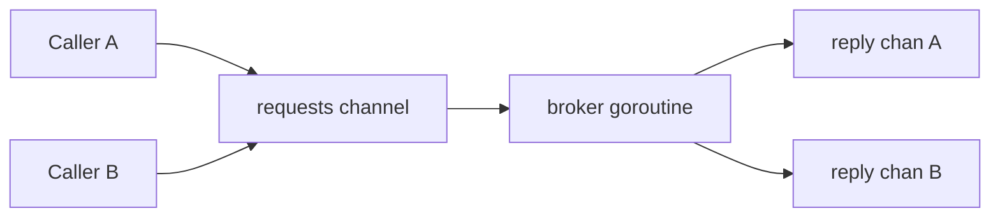

# Channel of Channels

A "channel of channels" pattern appears whenever one goroutine sends another goroutine a dedicated communication path.

The most practical form is request/reply:

- the caller creates a private response channel,
- the caller sends a request that includes that channel,
- the worker or broker sends the answer back on that specific reply path.

## When this pattern fits

- many callers share one coordinator or broker,
- each caller needs its own response path,
- a single global results channel would force extra correlation logic,
- you want a protocol that is still channel-first rather than lock-first.

## Example scenario

`examples/requestreply` models a fraud-scoring broker.

Each order check is sent through one shared requests channel, but every request carries its own reply channel so the caller gets the exact response for that request.



## Core shape

```go
type request struct {
    payload Check
    reply   chan result
}

func (b *Broker) Check(ctx context.Context, check Check) (Decision, error) {
    reply := make(chan result, 1)

    select {
    case b.requests <- request{payload: check, reply: reply}:
    case <-ctx.Done():
        return Decision{}, ctx.Err()
    }

    select {
    case res := <-reply:
        return res.decision, res.err
    case <-ctx.Done():
        return Decision{}, ctx.Err()
    }
}
```

The subtle but important detail is the buffered reply channel.

If the caller times out after sending the request, the broker must still be able to send the result without getting stuck forever.

## Why this is better than a global results channel

With one global `results` channel, every response needs correlation metadata and a demultiplexer.

With a per-request reply channel:

- correlation is built into the protocol,
- ownership stays local to the request,
- the broker stays simpler.

## What the tests should prove

The tests in `examples/requestreply/requestreply_test.go` verify:

- concurrent callers get the correct decision for their own request,
- caller cancellation after send does not block the broker,
- the broker can stop cleanly when its parent context ends.

## Common mistakes

### Unbuffered reply channels with cancellation

If the caller gives up before the broker replies, an unbuffered reply channel can wedge the broker.

### Forgetting who owns channel closing

The request owner creates the reply channel, but the broker usually owns the send side. In many request/reply patterns the channel does not need explicit closing at all because there is only one response.

### Using this pattern when a plain function call is enough

If there is no concurrency boundary and no broker loop, do not force a channel protocol just because it looks elegant.

## Failure pattern

The broker can wedge if it replies on an unbuffered per-request channel after the caller has already left:

```go
func respond(req Request, result Result) {
	req.Reply <- result // bad: caller may have timed out and stopped receiving
}
```

In one-shot request/reply flows, a size-1 buffered reply channel or a `select` on caller cancellation usually makes the protocol much safer.

## Use this pattern when

Use channel-of-channels when you need a brokered request/reply protocol with clear per-call ownership.

If you need bulk parallel work rather than routed replies, use [Worker Pool](/patterns/worker-pool). If you need one goroutine to own mutable state, compare with [Actor Pattern](/advanced/actor-pattern).

## Full runnable example

The blocks below render the exact files from `examples/requestreply`.

::: code-group
```go [requestreply.go]
<<< ../../examples/requestreply/requestreply.go
```

```go [requestreply_test.go]
<<< ../../examples/requestreply/requestreply_test.go
```
:::
