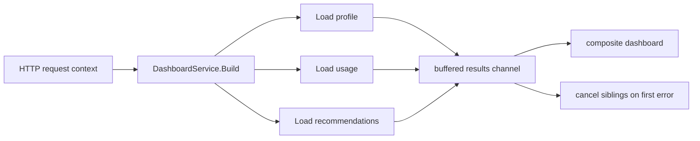

# Context Cancellation

Many production concurrency bugs are not about parallelism. They are about shutdown.

The example in `examples/contexttimeout` builds a user dashboard by loading profile, usage, and recommendations concurrently under one request context.

The rule is simple: if one dependency fails, sibling work should stop. If the caller deadline expires, every goroutine should stop.

## Example scenario



## Key implementation idea

The implementation creates one derived context that every loader shares:

```go
func (service DashboardService) Build(ctx context.Context, userID string) (Dashboard, error) {
    ctx, cancel := context.WithCancel(ctx)
    defer cancel()

    results := make(chan result, 3)

    go loadProfile(ctx, userID, results)
    go loadUsage(ctx, userID, results)
    go loadRecommendations(ctx, userID, results)

    for range 3 {
        select {
        case <-ctx.Done():
            return Dashboard{}, ctx.Err()
        case result := <-results:
            if result.err != nil {
                cancel()
                return Dashboard{}, result.err
            }
            applyResult(&dashboard, result)
        }
    }

    return dashboard, nil
}
```

Two details matter here:

1. The result channel is buffered, so goroutines are not left hanging on a send if the collector exits early.
2. The collector owns cancellation, because it has enough context to decide whether an error should abort the whole workflow.

## Simplified cancellation sketch

```go
ctx, cancel := context.WithCancel(parent)
defer cancel()

go func() { results <- loadA(ctx) }()
go func() { results <- loadB(ctx) }()
go func() { results <- loadC(ctx) }()
```

That small shape already carries the whole idea: one parent lifetime, many children, one shared stop signal.

## What the tests prove

The tests verify:

- successful loaders produce a complete dashboard,
- one failed dependency cancels sibling calls,
- caller deadlines surface as `context.DeadlineExceeded`.

## Common mistakes

### Failure pattern: detached child goroutine

```go
go loadProfile(context.Background(), userID, results) // detached from request lifetime
```

This turns request cancellation into a lie. The caller may leave, but the child work keeps running.

### Forgetting to pass the derived context downstream

Creating `context.WithCancel` is pointless if child calls still receive the original parent context or no context at all.

### Using unbuffered result channels for early-return flows

If the collector exits after the first error, an unbuffered channel can leave sibling goroutines blocked forever.

### Hiding cancellation in helper functions

Keep the cancellation decision near the aggregation point. That is where the business contract is visible.

### Returning before senders can escape

If child goroutines have no buffered send path, no select on `ctx.Done()`, and no external shutdown path, an early return from the collector can leave them wedged forever.

## Use this pattern when

Use this pattern whenever multiple goroutines belong to the lifetime of one request, job, or CLI command.

It is the safety net that keeps the rest of your concurrency patterns from leaking work.

## Full runnable example

The blocks below render the exact files from `examples/contexttimeout`.

::: code-group
<<< ../../examples/contexttimeout/contexttimeout.go [contexttimeout.go]
<<< ../../examples/contexttimeout/contexttimeout_test.go [contexttimeout_test.go]
:::
