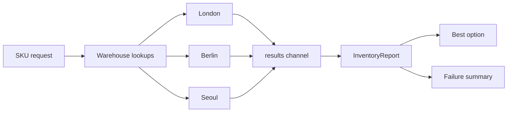

# Fan-Out / Fan-In

Fan-out / fan-in is the right pattern when you want to ask the same question to many independent sources and then combine the answers.

The example in `examples/fanoutfanin` checks product inventory across multiple warehouses at the same time.

Unlike the worker pool example, this pattern does not treat one backend failure as a total failure by default. Partial results are still valuable.

## Example scenario

- fan out: send one lookup to each warehouse,
- fan in: collect all responses in one channel,
- aggregate: sort viable options and record failures separately.



## Key implementation idea

The report preserves good data and bad data separately.

```go
func CollectInventory(ctx context.Context, sku string, lookups map[string]WarehouseLookup) (InventoryReport, error) {
    results := make(chan result, len(lookups))

    for name, lookup := range lookups {
        go func(name string, lookup WarehouseLookup) {
            stock, err := lookup(ctx, sku)
            results <- result{name: name, stock: stock, err: err}
        }(name, lookup)
    }

    for item := range results {
        if item.err != nil {
            report.Failures[item.name] = item.err.Error()
            continue
        }

        report.Options = append(report.Options, item.stock)
    }

    sortOptions(report.Options)
    return report, nil
}
```

## Simplified aggregation sketch

```go
results := make(chan result, len(backends))

for _, backend := range backends {
    go func(backend Backend) {
        value, err := backend.Lookup(ctx, key)
        results <- result{value: value, err: err}
    }(backend)
}

for range backends {
    merge(<-results)
}
```

The important production question is not "did fan-out happen?" The important question is "what counts as an acceptable aggregate when some branches fail?"

That contract is practical because warehouse outages are common, but that does not mean the caller should lose all availability information.

## What the tests prove

The tests verify that:

- successful lookups are kept even when one warehouse fails,
- the report chooses the best option deterministically,
- full cancellation still propagates from the caller context.

## Important design choice

This example intentionally does **not** cancel on the first warehouse failure.

That is the difference between a useful aggregation flow and an overly fragile one.
If your product can work with partial inventory visibility, keep partial results.

## Common mistakes

### Failure pattern: accidental all-or-nothing policy

```go
if item.err != nil {
    return InventoryReport{}, item.err // throws away useful partial success
}
```

That policy may be correct in some systems, but it should be a conscious choice rather than the default reflex.

### Treating all downstream errors equally

Some systems need "all or nothing". Others need "best effort". Decide which one you are building before you write the code.

### Returning unsorted merged results

Concurrent completion order is rarely the same as business priority. Sort after fan-in so callers receive stable output.

### Unbounded fan-out

This example fans out once per warehouse. That is usually small and known. If the target set can grow large, combine this pattern with a worker pool or semaphore.

### Closing the shared results channel from a worker

The aggregator should usually own the receive loop and the final close condition. If multiple workers might close the same shared channel, the design is already in danger.

## Full runnable example

The blocks below render the exact files from `examples/fanoutfanin`.

::: code-group
```go [fanoutfanin.go]
<<< ../../examples/fanoutfanin/fanoutfanin.go
```

```go [fanoutfanin_test.go]
<<< ../../examples/fanoutfanin/fanoutfanin_test.go
```
:::
