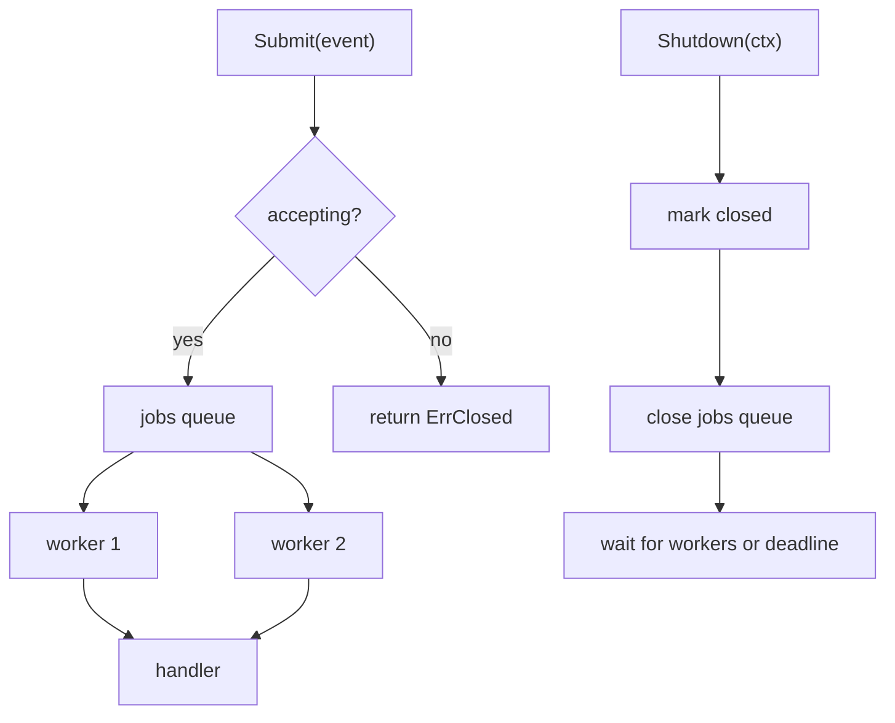

# Graceful Shutdown

Graceful shutdown is one of the most important production concurrency patterns.

The goal is not simply "stop."

The goal is:

1. stop accepting new work,
2. let already accepted work finish when reasonable,
3. enforce a final deadline so shutdown itself does not hang forever.

## When this pattern fits

- background workers consume queued tasks,
- the process handles signals or deployment termination,
- work already admitted should finish if possible,
- callers need a predictable failure once shutdown starts.

## Example scenario

`examples/gracefulshutdown` models an order-event processor with a bounded queue and a worker set.



## Core implementation idea

The crucial sequencing is:

1. mark the processor closed,
2. reject future submissions,
3. close the jobs queue,
4. wait for workers to drain,
5. give up if the shutdown context expires.

That sequencing is safer than "just cancel everything immediately" when your service contract says accepted work should finish.

## Simplified implementation sketch

```go
func (p *Processor) Shutdown(ctx context.Context) error {
    p.mu.Lock()
    p.closed = true
    close(p.jobs)
    p.mu.Unlock()

    done := make(chan struct{})
    go func() {
        defer close(done)
        p.wg.Wait()
    }()

    select {
    case <-done:
        return nil
    case <-ctx.Done():
        return ctx.Err()
    }
}
```

That small shape captures the whole contract: stop admission, close the queue, wait, enforce a deadline.

## What the example proves

The tests in `examples/gracefulshutdown/gracefulshutdown_test.go` verify:

- accepted jobs are drained before shutdown returns,
- submissions after shutdown start fail with a clear error,
- shutdown respects an external deadline if handlers are stuck.

## The failure policy question

Every graceful shutdown implementation has to answer this:

- do we finish admitted work,
- or do we cancel admitted work immediately,
- or do we finish only idempotent or short work?

The pattern is the same, but the policy is not universal.

## Common mistakes

### Closing channels from the wrong side

The coordinator that owns job admission should usually own queue closing too.

### Forgetting submit races

The bug to watch for is "submit sees queue open, shutdown closes it, submit panics on send." The example avoids that with explicit synchronization around admission and closing.

### No outer shutdown deadline

A graceful shutdown without a final timeout can become an infinite shutdown.

### Failure pattern: checking closed state without coordinating the send

```go
if !p.closed {
    p.jobs <- event // another goroutine may close jobs right here
}
```

This is how "works in tests" becomes "send on closed channel" in production.

## Use this pattern when

Use graceful shutdown whenever work crosses process lifetime boundaries.

If you skip this pattern, the problems are predictable:

- leaked goroutines,
- dropped in-flight work,
- hanging deploys,
- ambiguous failure states.
