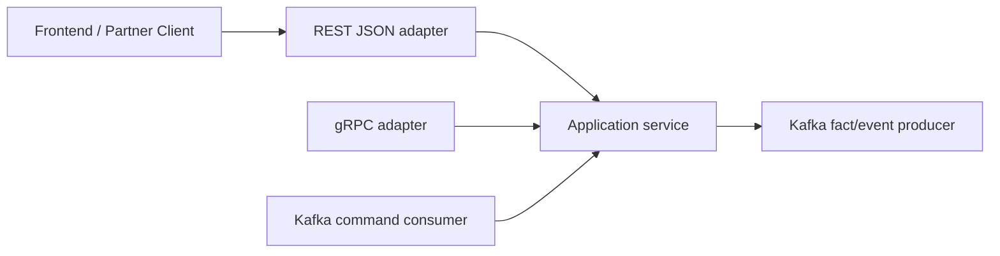

# Optional Values Across API Boundaries

Pointers are not wrong in Go.

The problem is that `*int`, `*string`, and `*time.Time` often blur several different meanings:

- field absent,
- field explicitly null,
- field loaded lazily,
- field optional in one transport but required in the domain,
- generated transport code leaking into application code.

This pattern separates those meanings instead of hoping one pointer shape will cover all of them.

## When this pattern fits

- response DTOs should always include the field, but `null` is meaningful,
- PATCH-like inputs must distinguish absent, explicit null, and concrete value,
- the same business concept crosses REST, gRPC, and message boundaries,
- frontend clients benefit from explicit `string | null` or `number | null` contracts.

## Core decision table

| Situation | Prefer | Why |
| --- | --- | --- |
| Response metadata such as `next_cursor` or `total_count` | `Optional[T]` | Two-state output contract: value or explicit null |
| PATCH/update/filter request fields | `Field[T]` or another tri-state type | You need absent, null, and concrete value to mean different things |
| Internal domain fields that are always required | Plain `T` | Keep transport semantics out of core business logic |
| gRPC scalar presence | Proto `optional`, `oneof`, or wrapper/message presence at the boundary | Express presence on the wire, then map into internal types |
| Kafka or other messages | Explicit schema semantics, usually normalized facts | Events should be easy to replay and reason about |

## One practical correction

Two common claims about this pattern are overstated:

- comparing a pointer to `nil` does not panic by itself,
- `Optional[T]` is not a magic zero-allocation guarantee because escape analysis still decides where values live.

The real win is semantic clarity at API boundaries, not magic runtime behavior.

## Example scenario

`examples/optionalvalues` models two common backend cases:

1. a transaction-list response with keyset pagination metadata,
2. a partner update request where absent, clear, and set must be distinct.



The key design point is simple:

- use `Optional[T]` on the way out,
- use a tri-state field type on the way in,
- normalize into plain domain fields as early as possible.

## Core types

```go
type Optional[T any] struct {
    Value T
    Valid bool
}

func Opt[T any](v T) Optional[T] {
    return Optional[T]{Value: v, Valid: true}
}

func (o Optional[T]) MarshalJSON() ([]byte, error) {
    if !o.Valid {
        return []byte("null"), nil
    }
    return json.Marshal(o.Value)
}

type Field[T any] struct {
    Value T
    Set   bool
    Valid bool
}
```

`Optional[T]` is a response type.

`Field[T]` is an input type. It tells you:

- field missing entirely: `Set=false`,
- field present but null: `Set=true`, `Valid=false`,
- field present with a value: `Set=true`, `Valid=true`.

## REST and JSON

### Response DTO: keyset pagination

In a real payments or partner API, keyset pagination metadata is a natural fit for `Optional[T]`.

```go
type Transaction struct {
    ID     string `json:"id"`
    Amount int    `json:"amount"`
}

type TransactionPage struct {
    Data       []Transaction    `json:"data"`
    HasMore    bool             `json:"has_more"`
    NextCursor Optional[string] `json:"next_cursor"`
    TotalCount Optional[int]    `json:"total_count"`
}
```

When there is no next page, `next_cursor` still exists in JSON and becomes `null`.

That is usually better than `omitempty` because the contract stays explicit.

### Request DTO: tri-state patch semantics

Now look at a partner update request:

```go
type UpdatePartnerRequest struct {
    DisplayName         Field[string] `json:"display_name"`
    SettlementDelayDays Field[int]    `json:"settlement_delay_days"`
    ExternalRef         Field[string] `json:"external_ref"`
}
```

The semantics are now precise:

- omitted `display_name`: leave it untouched,
- `display_name: null`: invalid,
- `display_name: "Acme Europe"`: replace the value,
- `external_ref: null`: clear the optional field,
- omitted `external_ref`: do not change it.

If you used `Optional[T]` for this request shape, you would lose the distinction between omitted and explicitly null.

## What the example tests prove

`examples/optionalvalues/optionalvalues_test.go` verifies:

- pagination responses emit explicit `null` for absent metadata,
- populated optional metadata marshals as concrete JSON values,
- tri-state request decoding distinguishes omitted, null, and concrete input,
- patch application can reject null for required fields while clearing optional ones.

## gRPC guidance

At the gRPC boundary, let protobuf express wire presence.

For response presence on scalars, proto `optional` is usually the clean default:

```proto
message ListTransactionsResponse {
  repeated Transaction data = 1;
  bool has_more = 2;
  optional string next_cursor = 3;
  optional int64 total_count = 4;
}
```

For update-style APIs, scalar presence alone is often not enough if "clear to null" and "leave untouched" must be different operations.

That is where `oneof`, wrapper/message presence, or a more explicit patch schema becomes useful.

The important boundary rule is:

- let protobuf define presence on the wire,
- map that presence into `Optional[T]` or `Field[T]` in your Go adapter,
- do not drag protobuf-specific wrapper types through the rest of the service.

## Kafka and other messages

Messages need even more discipline than HTTP requests.

For command-style messages, tri-state input can be reasonable before the update is applied:

```json
{
  "partner_id": "partner-77",
  "changes": {
    "display_name": { "set": true, "value": "Acme Europe" },
    "external_ref": { "set": true, "value": null }
  }
}
```

For event-style messages, publish normalized facts after the command has already been applied:

```json
{
  "event_type": "partner.updated",
  "partner_id": "partner-77",
  "display_name": "Acme Europe",
  "external_ref": null
}
```

That keeps replay and downstream consumers simpler. Events should not need to reconstruct PATCH intent if they really represent facts.

## Failure pattern

The most common mistake is using one two-state optional type for a three-state input problem:

```go
type UpdatePartnerRequest struct {
    ExternalRef Optional[string] `json:"external_ref"` // bad for PATCH
}
```

Now both of these collapse into the same Go value:

- field omitted entirely,
- field present with `null`.

That is exactly the distinction a PATCH endpoint often needs to preserve.

## Use this pattern when

Use `Optional[T]` when an output contract should say "this key exists, and today its value is null."

Use a tri-state input field type when write semantics must distinguish:

- leave unchanged,
- clear,
- set.

If a plain required value is enough, keep the field as plain `T` and avoid transport noise.

## Full runnable example

The blocks below render the exact files from `examples/optionalvalues`.

::: code-group
<<< ../../examples/optionalvalues/optionalvalues.go [optionalvalues.go]
<<< ../../examples/optionalvalues/optionalvalues_test.go [optionalvalues_test.go]
:::
