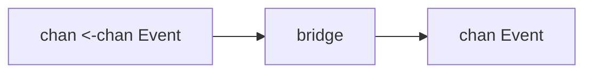

# Or-Done, Tee, and Bridge

These are not the first patterns most teams learn, but they become very useful once you start composing channel pipelines seriously.

## Why group them together

All three patterns solve "plumbing" problems:

- `or-done`: stop reading a channel when cancellation happens,
- `tee`: copy one input stream to two downstream consumers,
- `bridge`: flatten a stream of streams into one output stream.

They are small patterns, but they remove a surprising amount of leak risk.

## `or-done`

The goal is to wrap a receive loop so it does not block forever after cancellation.

```go
func orDone[T any](done <-chan struct{}, in <-chan T) <-chan T {
    out := make(chan T)
    go func() {
        defer close(out)
        for {
            select {
            case <-done:
                return
            case v, ok := <-in:
                if !ok {
                    return
                }
                select {
                case out <- v:
                case <-done:
                    return
                }
            }
        }
    }()
    return out
}
```

This pattern is simple and worth memorizing because it shows up everywhere cancellation meets channels.

## `tee`

`tee` duplicates one input stream into two outputs. The tricky part is preserving cancellation and making sure a slow consumer does not wedge everything without you noticing.

Good use cases:

- one stream goes to business logic and audit logging,
- one stream goes to metrics and persistence,
- one stream feeds two independent downstream analyses.

## `bridge`

`bridge` flattens a channel that itself yields channels.

This becomes relevant when one stage dynamically produces substreams, such as:

- paginated remote fetches,
- partitioned work sources,
- tenant-specific feeds,
- a channel-of-channels dispatcher.



## When to use these patterns

Use them when the *composition problem* is the hard part.

If the real difficulty is ownership or backpressure, these helpers will not save a weak design by themselves.

## Failure pattern

Small forwarding helpers become leak factories when they ignore cancellation:

```go
func forward(in <-chan Item, out chan<- Item) {
	for v := range in {
		out <- v // bad: blocks forever if downstream stops reading
	}
}
```

`or-done` exists precisely because real pipelines do not always drain every stage to completion.

## Practical takeaway

These are "advanced small patterns." They do not dominate architecture decisions, but they often clean up the hardest edges in channel-heavy code.

## Full runnable example

The blocks below render the exact files from `examples/ordoneteebridge`.

::: code-group
<<< ../../examples/ordoneteebridge/ordoneteebridge.go [ordoneteebridge.go]
<<< ../../examples/ordoneteebridge/ordoneteebridge_test.go [ordoneteebridge_test.go]
:::
