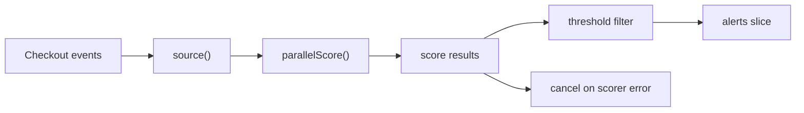

# Pipeline

A pipeline is useful when your work is not just "many jobs in parallel" but "data moving through ordered stages".

The example in `examples/pipeline` turns checkout events into fraud alerts:

1. source stage emits checkout events,
2. scoring stage evaluates risk concurrently,
3. sink stage filters and formats manual-review alerts.

## Why not just use one big goroutine?

Because different stages usually have different failure modes and different scaling needs.

- ingestion owns reading the input,
- scoring owns the expensive or remote work,
- alert formatting owns the business decision about what is actionable.



## Key implementation idea

The pipeline example keeps the stage boundaries explicit:

```go
func RunAlertPipeline(ctx context.Context, events []CheckoutEvent, workers int, threshold int, scorer RiskScorer) ([]Alert, error) {
    ctx, cancel := context.WithCancel(ctx)
    defer cancel()

    in := source(ctx, events)
    out := parallelScore(ctx, workers, in, scorer)

    for result := range out {
        if result.err != nil && firstErr == nil {
            firstErr = fmt.Errorf("score checkout %s: %w", result.checkoutID, result.err)
            cancel()
            continue
        }

        if firstErr != nil || result.signal.Score < threshold {
            continue
        }

        alerts = append(alerts, buildAlert(result.signal))
    }

    return alerts, firstErr
}
```

## Simplified stage sketch

The core pipeline shape is:

```go
in := source(ctx)
mid := stageA(ctx, in)
out := stageB(ctx, mid)

for item := range out {
    consume(item)
}
```

Each stage should have one clear responsibility:

- read,
- transform,
- filter,
- aggregate,
- or decide cancellation.

That structure keeps each decision in one place:

- `source()` is responsible for turning a slice into a stream,
- `parallelScore()` is responsible for bounded concurrent scoring,
- the collector is responsible for failure policy and final ordering.

## What the tests prove

The tests focus on the behavioral contract:

- only high-risk checkouts become alerts,
- alerts are returned in deterministic order for callers,
- a scorer failure cancels sibling workers quickly.

## Design tradeoffs

### Pipelines are great when stages have different meanings

That is the main advantage over a plain worker pool. Each stage is easier to reason about and test.

### Pipelines can reorder work

The scoring stage runs concurrently, so completion order is not stable. The example sorts final alerts by checkout ID to keep API output deterministic.

### Error handling must be intentional

Not every pipeline should stop on the first error. In this example, a failed risk score means the whole alert set is unreliable, so the collector cancels the run.

## Failure patterns

### A stage that never closes its output

```go
func stage(in <-chan Event) <-chan Score {
    out := make(chan Score)
    go func() {
        for event := range in {
            out <- score(event)
        }
        // forgot: close(out)
    }()
    return out
}
```

One forgotten `close(out)` can leave the downstream collector blocked forever.

### Ignoring cancellation inside a long stage

If a stage performs expensive remote work or CPU work and never checks `ctx.Done()`, the pipeline looks cancellable on paper but not in reality.

## Use this pattern when

Use a pipeline when you need explicit stage boundaries, different scaling characteristics per stage, or a streaming mental model.

If you mostly need to ask several backends the same question at once, the [Fan-Out / Fan-In](/patterns/fan-out-fan-in) pattern is a better fit.

## Full runnable example

The blocks below render the exact files from `examples/pipeline`.

::: code-group
```go [pipeline.go]
<<< ../../examples/pipeline/pipeline.go
```

```go [pipeline_test.go]
<<< ../../examples/pipeline/pipeline_test.go
```
:::
