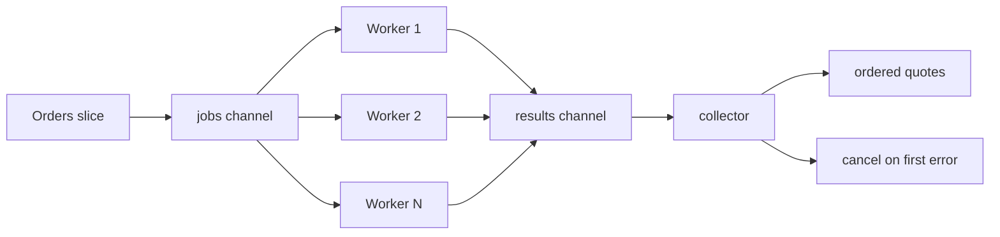

# Worker Pool

The worker pool pattern is the default answer when you have many independent jobs but you must cap parallelism.

In this repository, the example generates shipment quotes for a batch of orders. Each order can be priced independently, but hitting a carrier service with unbounded goroutines is a bad idea.

## When this pattern fits

- you have a large batch of independent tasks,
- downstream capacity is limited,
- you want predictable resource usage,
- one failure should usually stop the batch.

## Example scenario

`examples/workerpool` simulates batch shipment quoting:

- input: a slice of orders,
- workers: a fixed number of carrier quote workers,
- output: quotes returned in the same order as the original batch.



## Key implementation idea

The important detail is not "start N goroutines". The important detail is that the collector owns the failure policy.

```go
func GenerateQuotes(ctx context.Context, orders []Order, workers int, quoteFn QuoteFunc) ([]ShipmentQuote, error) {
    ctx, cancel := context.WithCancel(ctx)
    defer cancel()

    jobs := make(chan job)
    results := make(chan result, workers)

    // Start a bounded number of workers.
    for range workers {
        go worker()
    }

    // Feed the jobs channel from the input slice.
    go produceJobs()

    for item := range results {
        if item.err != nil && firstErr == nil {
            firstErr = fmt.Errorf("quote order %s: %w", orders[item.index].ID, item.err)
            cancel()
            continue
        }

        if firstErr == nil {
            quotes[item.index] = item.quote
        }
    }

    return quotes, firstErr
}
```

Three design choices matter here:

1. Results carry the original input index, so the collector can restore input order.
2. A derived context lets the collector cancel workers as soon as the first hard failure appears.
3. `results` is buffered by worker count, so workers can finish a send even when the collector is slightly behind.

## What the tests prove

The tests in `examples/workerpool/workerpool_test.go` verify more than "function returns a value".

They prove:

- output order stays aligned with input order even when work completes out of order,
- concurrent workers never exceed the configured limit,
- long-running jobs observe cancellation after another job fails.

## Common mistakes

### Returning completion order when callers expect input order

This is one of the easiest regressions to ship. If your API contract needs stable ordering, attach the original index to each job.

### Cancelling too late

If workers do not receive a shared derived context, a failed batch keeps burning CPU and downstream capacity until every goroutine exits on its own.

### Using a worker pool for tiny request sizes

If the batch is usually one or two items, the extra complexity may not buy you anything. Measure first.

## Use this pattern when

Use a worker pool when bounded parallelism is the main goal.

If you need multiple stages with different responsibilities, move to a [Pipeline](/patterns/pipeline) instead.
