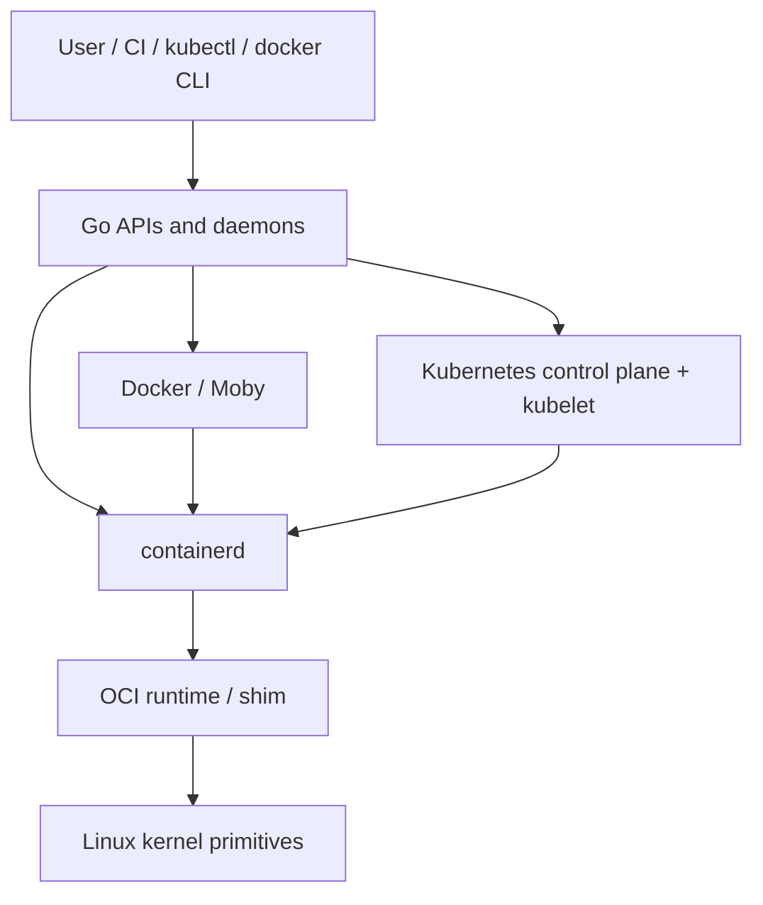
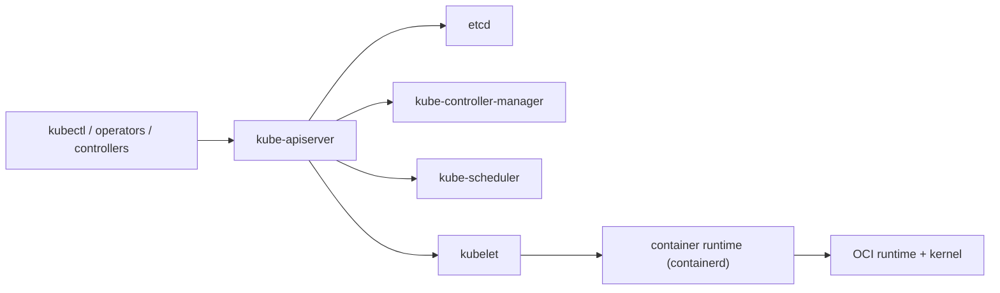

# Docker, containerd, and Kubernetes

If you want to understand why Go became such a dominant language in infrastructure, this stack is one of the clearest answers.

Docker, containerd, and Kubernetes are not "Go all the way down."

They are Go-heavy systems that sit on top of:

- Linux namespaces and cgroups,
- overlay and snapshot filesystems,
- OCI image and runtime contracts,
- network namespaces, iptables, eBPF, and storage drivers.

Go is what turns those lower-level primitives into APIs, daemons, controllers, reconciliation loops, and user-facing operational systems.

:::tip Quick takeaway
Docker is the user-facing engine and API layer, containerd is the runtime core and lifecycle daemon, and Kubernetes is the API-driven control plane that keeps cluster state moving toward the desired state.
:::

## The first mental model

The cleanest way to think about this stack is:

- Docker/Moby packages a product and daemon around container workflows,
- containerd owns image, snapshot, content, and task lifecycle concerns,
- Kubernetes treats containers as one node-level execution target inside a much larger control system.



This page is about the Go part of that stack: the long-lived processes, API boundaries, and controller loops.

## Docker is the product-shaped layer

The official Docker Engine docs describe Docker as a client-server application with:

- a server daemon,
- REST APIs,
- command-line clients.

The Moby project describes itself as the open-source project created by Docker to enable and accelerate containerized software.

That already tells you something important:

Docker is not only "run a container."
It is a product surface around:

- image build and distribution,
- API exposure,
- networking,
- volumes,
- lifecycle UX,
- and integration with the lower runtime stack.

### A useful source-reading path

- [`cmd/dockerd/main.go`](https://github.com/moby/moby/blob/master/cmd/dockerd/main.go)
- [`daemon/`](https://github.com/moby/moby/tree/master/daemon)
- [`api/server/`](https://github.com/moby/moby/tree/master/api/server)
- [`daemon/cluster/`](https://github.com/moby/moby/tree/master/daemon/cluster)

### What Docker actually owns

The Docker daemon is a Go server process that:

- exposes APIs,
- resolves image and config state,
- manages network and volume concerns,
- translates user requests into container lifecycle work,
- delegates lower execution concerns to the runtime stack below it.

### Simplified mental model

```go
func RunContainer(req CreateRequest) error {
	image := imageStore.Resolve(req.ImageRef)
	rootfs := snapshotter.Prepare(image)
	spec := ociSpecBuilder.Build(req, rootfs)

	container := runtimeClient.NewContainer(spec)
	return container.Start()
}
```

That code is intentionally compressed. The lesson is not the exact call graph. The lesson is that Docker is glue with opinionated product boundaries:

- resolve user intent,
- build OCI-ish execution state,
- hand off runtime work.

### The key correction

Docker did not replace the kernel.
It made kernel-backed containers operationally usable.

That is exactly the kind of system Go is good at:

- API-heavy,
- process-oriented,
- long-lived,
- operationally observable,
- cross-platform enough to matter.

## containerd is the runtime core

The official containerd README describes containerd as an industry-standard container runtime that manages the complete container lifecycle:

- image transfer and storage,
- container execution and supervision,
- low-level storage and network attachments.

This is where the stack becomes less "developer product" and more "runtime core."

### A useful source-reading path

- [`cmd/containerd/main.go`](https://github.com/containerd/containerd/blob/main/cmd/containerd/main.go)
- [`cmd/containerd/server/`](https://github.com/containerd/containerd/tree/main/cmd/containerd/server)
- [`core/content/`](https://github.com/containerd/containerd/tree/main/core/content)
- [`core/metadata/`](https://github.com/containerd/containerd/tree/main/core/metadata)
- [`core/snapshots/`](https://github.com/containerd/containerd/tree/main/core/snapshots)
- [`plugins/services/tasks/`](https://github.com/containerd/containerd/tree/main/plugins/services/tasks)

### The architectural idea

containerd is a daemon and gRPC surface around a few sharp responsibilities:

- content store for images and blobs,
- metadata for containers, images, and leases,
- snapshotters for root filesystem views,
- task services for running containers,
- plugin boundaries for different storage and runtime backends.

This is why containerd is such an important Go case study:

it is not a toy wrapper over `runc`.
It is a structured, long-lived daemon whose job is to make container lifecycle safe, observable, and composable.

### Simplified mental model

```go
func StartTask(req StartTaskRequest) error {
	container := metadataStore.LoadContainer(req.ContainerID)
	snapshot := snapshotter.Prepare(container.SnapshotKey)
	task := taskService.New(container, snapshot)
	return task.Start()
}
```

Again, the exact implementation is richer than this, but the useful boundary is clear:

- metadata and content are stored separately,
- execution is not the same thing as image storage,
- plugin surfaces keep the daemon extensible.

### Why this matters

When people say "Docker uses containerd," the important point is not the brand hierarchy.

The important point is architectural separation:

- user-facing product concerns can move at a different speed,
- runtime lifecycle can stay focused,
- orchestrators like Kubernetes can speak to a more stable runtime core.

## Kubernetes is the API-driven control plane

The official Kubernetes components docs describe the control plane as the components that make global decisions about the cluster and detect and respond to cluster events.

The controller docs describe a controller as a control loop that watches shared state and makes changes attempting to move the current state toward the desired state.

That is the Kubernetes core idea in one sentence:

Kubernetes is a giant collection of Go control loops around an API server.

### A useful source-reading path

- [`cmd/kube-apiserver/`](https://github.com/kubernetes/kubernetes/tree/master/cmd/kube-apiserver)
- [`pkg/controller/`](https://github.com/kubernetes/kubernetes/tree/master/pkg/controller)
- [`pkg/scheduler/`](https://github.com/kubernetes/kubernetes/tree/master/pkg/scheduler)
- [`cmd/kubelet/`](https://github.com/kubernetes/kubernetes/tree/master/cmd/kubelet)
- [`pkg/kubelet/`](https://github.com/kubernetes/kubernetes/tree/master/pkg/kubelet)

## The component model that matters



The architecture is not "the scheduler runs containers."

It is:

- the API server stores cluster intent,
- controllers reconcile higher-level objects,
- the scheduler assigns unscheduled Pods to nodes,
- the kubelet reconciles Pod state on one node,
- the container runtime executes containers on that node.

### Simplified reconciliation sketch

```go
func ReconcileDeployment(key string) error {
	desired := apiServer.GetDeployment(key)
	current := replicaStore.ListPodsForDeployment(key)

	diff := desired.Replicas - len(current)
	switch {
	case diff > 0:
		return podControl.Create(diff)
	case diff < 0:
		return podControl.Delete(-diff)
	default:
		return nil
	}
}
```

That sketch is intentionally generic, but it captures the shape of Kubernetes controller logic:

- read desired state from the API,
- observe actual state,
- compute a delta,
- push the system back toward convergence.

### Why the kubelet is a great Go example

The kubelet is not just "start containers on the node."

It is a long-lived Go process that owns:

- Pod lifecycle reconciliation,
- health checking,
- status reporting,
- node-local storage and volume plumbing,
- interaction with the container runtime,
- and shutdown / restart resilience on one machine.

That is a classic Go daemon shape:

- infinite loops,
- explicit state transitions,
- background workers,
- lots of I/O and API edges,
- and clear process ownership.

## Where Go stops

This is the part many readers miss.

Go is crucial in this stack, but Go is not the whole stack.

The boundary usually looks like this:

- Go daemons own APIs, metadata, reconciliation, and orchestration,
- OCI runtimes own low-level process creation and container spec execution,
- the Linux kernel owns namespaces, cgroups, mounts, networking, and process isolation.

If you ignore that boundary, you end up with a misleading mental model of how these systems work.

## Why Go fits this ecosystem so well

These projects are ideal Go-shaped problems:

- long-lived daemons with clear owners,
- lots of networking and API boundaries,
- controller loops and watchers,
- plugin and extension surfaces,
- operational tooling, tracing, profiling, and metrics,
- practical cross-platform binaries and packaging.

This is not mostly SIMD work or handwritten memory layout work.
It is mostly:

- coordination,
- lifecycle ownership,
- process supervision,
- background work,
- and control-plane correctness.

Go has historically been very strong there.

## Failure patterns when reading these systems

### Thinking Docker and containerd are interchangeable

They are related, but they sit at different abstraction layers.

### Thinking Kubernetes "runs containers directly"

Kubernetes is mostly an API and reconciliation system. Node execution is delegated downward.

### Thinking this is all pure Go magic

The hardest boundaries often sit at the Linux and OCI interfaces.

### Copying goroutine counts instead of control boundaries

The lesson is not "use more goroutines." The lesson is "design sharper ownership between APIs, loops, and runtime handoffs."

## What to steal for your own systems

- separate user-facing API concerns from runtime-core concerns,
- keep state ownership explicit at each layer,
- treat reconciliation as a first-class control loop,
- prefer API-driven convergence over ad hoc imperative scripts,
- keep node-local execution responsibilities separate from cluster-global control.

## Official reading

- [Docker Engine overview](https://docs.docker.com/engine/)
- [Moby README](https://github.com/moby/moby/blob/master/README.md)
- [containerd README](https://github.com/containerd/containerd/blob/main/README.md)
- [Kubernetes Components](https://kubernetes.io/docs/concepts/overview/components/)
- [Kubernetes Controllers](https://kubernetes.io/docs/concepts/architecture/controller/)

## Practical takeaway

Docker, containerd, and Kubernetes show the same Go strength at three different layers:

- product daemon,
- runtime core,
- distributed control plane.

That is why Go became so sticky in infrastructure. It turns operating-system and network primitives into understandable, debuggable, long-lived systems.
