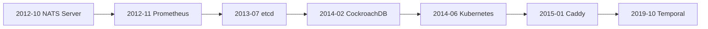

# Go Open-Source Histories

If you only look at today's Go ecosystem, it can feel inevitable that so many cloud and infrastructure projects ended up in Go.

It was not inevitable.

It was a historical fit.

Go arrived at exactly the moment when many teams wanted:

- networked systems,
- simpler deployment,
- fewer runtime dependencies,
- concurrency that was easier to reason about than callback-heavy designs,
- and a language productive enough for small infrastructure teams.

This page is the "fun side quest" version of the production section: not just how these systems work, but what their timelines say about why Go spread so hard through open infrastructure.

## One important note about dates

The dates below use public GitHub repository creation dates as a concrete proxy for when each project became public.

That is useful, but it is not always the full origin story.
Temporal, for example, publicly appeared on October 16, 2019, but its README explicitly says it originated as a fork of Uber Cadence.

## Timeline

## Quick map

| Public repo date | Project | System shape | What it says about Go |
| --- | --- | --- | --- |
| 2012-10-29 | NATS Server | low-latency messaging server | Go could build serious network daemons without C++-level ceremony |
| 2012-11-24 | Prometheus | monitoring system + TSDB | Go was a strong fit for self-contained ops binaries and periodic worker loops |
| 2013-07-06 | etcd | distributed coordination store | Go fit consensus-heavy control planes and service APIs well |
| 2014-02-06 | CockroachDB | distributed SQL database | Go was not only for CLIs and proxies; it could host ambitious distributed data systems |
| 2014-06-06 | Kubernetes | cluster control plane | Go became the language of controllers, APIs, and reconciliation loops |
| 2015-01-13 | Caddy | operations-first web server | deployability and standard-library networking mattered a lot |
| 2019-10-16 | Temporal | durable execution platform | Go could also host workflow orchestration and persistence-backed state machines |

## Why this wave happened

These projects are different, but they share a shape:

- long-lived server processes,
- lots of I/O,
- many background loops,
- clear operational boundaries,
- a need for easy build/test/release workflows,
- and a bigger premium on team productivity than on hand-managed memory tricks.

That is where Go was unusually strong.

## Era 1: operationally simple network software

### NATS Server

Public repo date: October 29, 2012.

NATS is a great early signal that Go was never just a scripting replacement.
It showed that Go could build:

- hot socket paths,
- long-lived read/write loops,
- low-latency messaging servers,
- operationally compact binaries.

What to read:

- [NATS Server repository](https://github.com/nats-io/nats-server)
- [client read/write loop ownership in `server/client.go`](https://github.com/nats-io/nats-server/blob/main/server/client.go)

Why it mattered:

This was evidence that Go could be credible in the core of network infrastructure, not only around it.

### Prometheus

Public repo date: November 24, 2012.

Prometheus showed a different strength:

- scrape loops,
- storage ingestion,
- service discovery,
- HTTP APIs,
- one self-contained binary that operators could run easily.

What to read:

- [Prometheus repository](https://github.com/prometheus/prometheus)
- [`scrape/scrape.go`](https://github.com/prometheus/prometheus/blob/main/scrape/scrape.go)

Why it mattered:

Prometheus made "single-binary operational software" feel normal.
That was a huge cultural win for Go.

## Era 2: control planes and distributed coordination

### etcd

Public repo date: July 6, 2013.

etcd is where the Go story becomes very infrastructure-shaped:

- a distributed coordination store,
- Raft,
- APIs,
- watch streams,
- operational safety over maximal feature complexity.

What to read:

- [etcd repository](https://github.com/etcd-io/etcd)
- [raft `node.go`](https://github.com/etcd-io/raft/blob/main/node.go)

Why it mattered:

It helped establish Go as a control-plane language, especially for systems that need correctness and networked coordination more than raw embedded-database style tight loops.

### Kubernetes

Public repo date: June 6, 2014.

Kubernetes turned the Go adoption wave into an ecosystem.

Its core shape is almost a manifesto for Go's strengths:

- APIs,
- controllers,
- reconciliation loops,
- work queues,
- shared informers,
- CLI + server tooling,
- large contributor base.

What to read:

- [Kubernetes repository](https://github.com/kubernetes/kubernetes)
- [`client-go/util/workqueue`](https://github.com/kubernetes/client-go/tree/master/util/workqueue)

Why it mattered:

Once the cloud-native control plane became a Go-shaped system, a huge number of adjacent projects followed that shape.

## Era 3: ambitious data systems

### CockroachDB

Public repo date: February 6, 2014.

CockroachDB is important because it breaks an overly narrow story about Go.

It showed that Go was not only for:

- CLIs,
- proxies,
- and orchestration layers.

It could also host a very ambitious distributed SQL database with:

- consensus,
- task lifecycles,
- admission control,
- quiesce/shutdown contracts,
- large internal concurrency surfaces.

What to read:

- [CockroachDB repository](https://github.com/cockroachdb/cockroach)
- [`pkg/util/stop/stopper.go`](https://github.com/cockroachdb/cockroach/blob/master/pkg/util/stop/stopper.go)

Why it mattered:

It pushed the industry view of Go upward from "operational tooling language" toward "serious distributed system implementation language."

## Era 4: operator-first servers

### Caddy

Public repo date: January 13, 2015.

Caddy is a reminder that Go's rise was not only about clusters and consensus.
It was also about product shape.

Caddy made a strong case that a web server could be:

- one binary,
- easy to configure,
- easy to extend,
- and operationally friendly by default.

What to read:

- [Caddy repository](https://github.com/caddyserver/caddy)
- [`caddy.go`](https://github.com/caddyserver/caddy/blob/master/caddy.go)

Why it mattered:

Go's standard library and binary model made it a natural fit for infrastructure software that people actually had to deploy themselves.

## Era 5: durable orchestration and workflow engines

### Temporal

Public repo date: October 16, 2019.

Temporal is a newer, more interesting wave.

Its README says it originated as a fork of Uber Cadence.
The system is not simply another API server.
It is a durable execution platform built around:

- workflow histories,
- matching/task queues,
- worker polling,
- event sourcing,
- and deterministic replay.

What to read:

- [Temporal repository](https://github.com/temporalio/temporal)
- [Temporal architecture docs](https://github.com/temporalio/temporal/blob/main/docs/architecture/README.md)
- [Temporal and Durable Execution](/production/temporal-durable-execution)

Why it mattered:

Temporal shows that the "Go infrastructure" story did not stop at orchestration or monitoring.
It extended into durable workflow control planes as well.

## What all of these projects have in common

They are not identical, but they cluster around the same engineering sweet spot:

- APIs and network services,
- background work loops,
- strong operational ergonomics,
- concurrency that should stay explicit,
- teams that want readable systems more than language pyrotechnics.

This is why "Go became popular in infra" is too vague.
More precisely:

Go became unusually good for systems whose hardest problems are coordination, lifecycle, throughput, and operability.

## Reading map by system shape

| If you care about... | Read... |
| --- | --- |
| control planes and reconciler loops | Kubernetes, etcd |
| messaging and hot socket ownership | NATS Server |
| periodic work and scrape ownership | Prometheus |
| large-system task lifetime and shutdown | CockroachDB |
| deployable operator-first edge/server software | Caddy |
| durable workflow orchestration | Temporal |

## Where to go next

- Read [Open-Source Case Studies](/production/open-source-case-studies) for deeper concurrency boundaries in source code.
- Read [Temporal and Durable Execution](/production/temporal-durable-execution) for a modern workflow-engine example.
- Read [Large-Scale Go Systems](/production/large-scale-go-systems) when you want operating rules rather than project history.

## Official project sources

- [Temporal repository metadata](https://github.com/temporalio/temporal)
- [CockroachDB repository metadata](https://github.com/cockroachdb/cockroach)
- [Kubernetes repository metadata](https://github.com/kubernetes/kubernetes)
- [etcd repository metadata](https://github.com/etcd-io/etcd)
- [Prometheus repository metadata](https://github.com/prometheus/prometheus)
- [NATS Server repository metadata](https://github.com/nats-io/nats-server)
- [Caddy repository metadata](https://github.com/caddyserver/caddy)

## Practical takeaway

The history is not "Go won."

The history is that, from roughly 2012 onward, many open-source teams found that Go was an unusually strong tool for:

- distributed control planes,
- operator-run binaries,
- network services,
- and concurrency-heavy systems whose hardest problems were coordination and lifecycle, not manual memory control.
