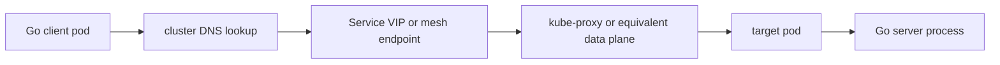
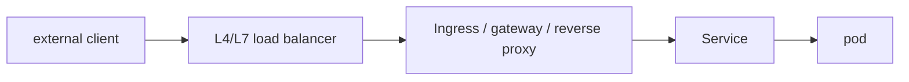

# Kubernetes and Service Networking for Go Engineers

Many Go services behave well on a laptop and then become confusing inside a cluster.

That is not because Kubernetes is “random.”

It is because the network path, identity model, and shutdown path are now different:

- DNS is cluster DNS,
- peers are often reached through a Service abstraction,
- packet paths may traverse kube-proxy or another data plane,
- readiness and draining affect whether traffic should still arrive,
- reverse proxies or meshes may sit between your client and server.

## Mental model

For ingress traffic, add another layer:

Every extra hop changes what connection reuse, source identity, and graceful shutdown look like.

## Pod and Service DNS are part of the runtime environment

Inside Kubernetes, hostname resolution often means:

- pod-to-Service lookup through cluster DNS,
- short names resolved relative to namespaces,
- DNS-based service discovery shaping dial targets before any TCP work begins.

For Go engineers, the practical rule is simple:

- resolution is still part of request latency,
- cluster DNS failure is application latency,
- `context deadline exceeded` during dial may really be DNS, not connect.

## Service abstraction changes connection ownership

A Go client usually thinks it is connecting to one authority.

In Kubernetes, that logical authority may actually front:

- many pods,
- changing endpoint sets,
- rolling deploy churn,
- connection draining during termination,
- extra proxies or sidecars.

That means transport policy matters more:

- body ownership and reuse,
- retry policy,
- per-request deadlines,
- connection pool size,
- readiness-aware backoff.

## Readiness is not the same as process liveness

Readiness controls whether a pod should receive new traffic.

That is not the same as:

- whether the process is alive,
- whether old connections are drained,
- whether current in-flight requests can still finish,
- whether upstream clients already cached or pooled connections.

A Go server that only flips readiness but never coordinates listener shutdown, request deadlines, and connection draining can still drop work during deploys.

## L4 and L7 paths affect Go differently

### L4 load balancing

At L4, the main concern is usually connection placement and reuse. One long-lived connection may pin traffic to one backend for longer than you intuitively expect.

### L7 proxies and meshes

At L7, the proxy may:

- terminate TLS,
- initiate its own upstream connection pools,
- retry or buffer requests,
- change timeout behavior,
- expose different observability than raw end-to-end TCP would.

This is one reason a Go service can look healthy locally and still behave differently in-cluster. The transport path is no longer just “client socket to server socket.”

## Reverse proxies change who owns deadlines

Once a reverse proxy or gateway sits in front of your Go handler, there are more timeout surfaces:

- client-to-proxy,
- proxy-to-service,
- service handler time,
- response streaming and idle timeouts.

If you only reason about the inner Go handler, you miss half the real request contract.

## Runtime and operational consequences for Go code

The most common consequences are:

- `http.Client` reuse policy now interacts with endpoint churn,
- gRPC channels sit on top of HTTP/2 streams that may traverse proxies,
- shutdown must align readiness changes with actual listener and handler draining,
- DNS and service discovery become measurable latency components,
- pooled connections can outlive endpoint freshness assumptions.

## Failure patterns

### Treating readiness as a complete drain policy

Readiness only affects new traffic routing. Existing connections and in-flight work still need explicit shutdown handling.

### Using one giant timeout for all cluster network phases

DNS, connect, TLS, handler, and response body lifetime often deserve different budgets.

### Ignoring connection reuse during rolling deploys

Long-lived clients can keep talking to a shrinking backend set in surprising ways if body ownership and idle pool policy are sloppy.

### Assuming source IP or direct peer identity means what it meant outside the cluster

Proxies, Services, and meshes often change what the server can safely infer from the immediate connection.

## How to observe and debug it

- Track DNS, connect, TLS, and handler phases separately.
- Correlate readiness transitions with connection drain and error spikes.
- Use cluster networking tools plus service metrics, not only application logs.
- When debugging pooled transports, confirm whether requests are reusing stale or long-lived connections across deploy churn.

## Related docs in this handbook

- [Docker, containerd, and Kubernetes](/production/docker-containerd-kubernetes)
- [net and netip](/stdlib/net-and-netip)
- [net/http Server and Transport Internals](/stdlib/net-http-server-transport)
- [grpc-go Production Playbook](/playbooks/grpc-go-production-playbook)
- [Debugging Go Network Services in Production](/production/debugging-go-network-services)

## Practical takeaway

Kubernetes does not replace Go's network model. It wraps it in more DNS, more indirection, more proxy behavior, and more lifecycle edges.

The services that stay predictable in-cluster are the ones that make those edges explicit.
