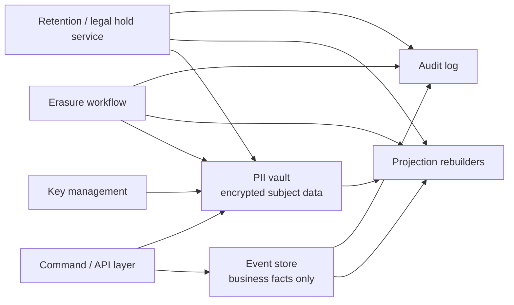

# Regulated Go Systems

Some of the hardest production Go systems are not just fast or concurrent.

They are regulated.

They have to answer questions like:

- what data is allowed in the canonical event log,
- how erasure requests work without destroying required business records,
- how long data must be retained,
- what happens to backups, caches, and search indexes,
- how to prove that an erase or purge workflow actually completed.

:::warning Not legal advice
This page is about engineering patterns for privacy- and audit-sensitive systems. It is not legal advice. Exact retention, disclosure, and erasure obligations depend on your jurisdiction, contract, and domain.
:::

## Why this topic matters

The tension is real:

- event sourcing wants durable, append-only history,
- privacy regimes such as GDPR emphasize data minimization, storage limitation, and erasure rights,
- security guidance such as NIST SP 800-88 recognizes cryptographic erase as a real sanitization technique when key handling is correct.

That means "just store everything forever in immutable events" is not a production design. It is an accident waiting for a compliance review.

## The high-level engineering rule

Do not put revocable personal data directly into the part of the system you want to keep forever.

The safe default shape is:

1. keep the canonical event log focused on business facts,
2. store sensitive personal data behind a separate boundary,
3. encrypt that sensitive data with explicit key ownership,
4. make erasure and retention workflows first-class background jobs,
5. keep an audit trail of the workflow, not of the erased payload.

## The regulatory pressure in plain English

The official GDPR text matters for system design even if lawyers do the final interpretation:

- Article 5 pushes data minimization and storage limitation,
- Article 17 creates erasure pressure,
- Article 25 pushes privacy by design and by default.

Those are architecture concerns, not only policy concerns.

If your Go service stores direct identifiers in immutable streams, hot projections, caches, logs, and object storage all at once, you have already made the erase path much harder than it needed to be.

## The requirement families repeat across regulations

Even when the rule is not literally GDPR, the engineering pressure often looks the same:

- some subject-linked data must be erased or anonymized,
- some business records must be retained for a defined period,
- some deletion paths must pause under legal hold or investigation,
- security review expects a defensible sanitization story,
- audit and risk teams expect proof that the workflow ran.

That is why the design patterns on this page generalize well to privacy laws, sector retention policies, and internal governance controls.

## A practical architecture shape



This shape solves a real problem:

- the event store can preserve business history,
- the PII vault can be deleted, redacted, or cryptographically erased,
- projections can be rebuilt without reintroducing deleted subject data,
- retention and legal hold become explicit workflows instead of tribal knowledge.

## Event sourcing under regulation

Event sourcing is still viable in regulated systems, but only if you are disciplined about boundaries.

### Good event shape

```go
type OrderPlaced struct {
	EventID         string
	AggregateID     string
	SubjectRef      string
	PlacedAt        time.Time
	TotalCents      int64
	Currency        string
	ShippingZone    string
	CustomerTier    string
	EncryptedPIIRef string
}
```

What is important here:

- `SubjectRef` is a stable internal reference, not an email or passport number,
- `EncryptedPIIRef` points to a different storage boundary,
- the canonical event still carries enough business meaning to rebuild state.

### Bad event shape

```go
type OrderPlaced struct {
	EventID      string
	AggregateID  string
	Email        string
	Phone        string
	Street       string
	PassportNo   string
	CardLastFour string
}
```

That is convenient once and expensive forever.

If you write direct personal data into an immutable append-only stream, then every replay, replica, backup, analytics export, and incident dump inherits the cleanup burden.

## Cryptographic erase is the real pattern behind "crypto-shredding"

Teams often say "crypto-shredding." The more formal term is usually cryptographic erase.

The idea is simple:

- encrypt sensitive payloads with a data encryption key,
- control that key through an explicit key hierarchy,
- destroy the relevant key material when the payload must become irrecoverable.

In practice, this only works if you are strict about key boundaries.

### Simplified Go sketch

```go
type PersonalRecord struct {
	SubjectRef string
	KeyID      string
	Ciphertext []byte
}

type Vault interface {
	Store(ctx context.Context, r PersonalRecord) error
	DeleteMetadata(ctx context.Context, subjectRef string) error
	ListBySubject(ctx context.Context, subjectRef string) ([]PersonalRecord, error)
}

type KeyManager interface {
	DestroyKey(ctx context.Context, keyID string) error
}

func CryptographicallyEraseSubject(ctx context.Context, vault Vault, km KeyManager, subjectRef string) error {
	records, err := vault.ListBySubject(ctx, subjectRef)
	if err != nil {
		return err
	}

	for _, record := range records {
		if err := km.DestroyKey(ctx, record.KeyID); err != nil {
			return err
		}
	}

	return vault.DeleteMetadata(ctx, subjectRef)
}
```

The code is intentionally small. The important part is not syntax. The important part is that the design has a destroyable key boundary at all.

### When cryptographic erase is weak

It is not enough to say "the data was encrypted."

Cryptographic erase becomes weak or meaningless when:

- one long-lived master key protects too much unrelated data,
- plaintext copies exist in projections, logs, caches, data lakes, or support dumps,
- backups still contain the same live keys,
- operators cannot prove which key protected which subject,
- the application continues to accept new writes for the subject during erasure.

## Retention and legal hold are workflow problems

Most regulated systems do not only erase data. They also retain some data for explicit periods, suspend deletion under legal hold, and keep an auditable record of which policy fired.

That means retention belongs in a state machine, not in an undocumented cron job.

```go
type RetentionClass string

const (
	RetentionCustomerPII RetentionClass = "customer_pii"
	RetentionInvoice     RetentionClass = "invoice"
)

type RetentionPolicy struct {
	Class       RetentionClass
	KeepFor     time.Duration
	LegalHold   bool
	ArchiveOnly bool
}

func ShouldPurge(now, createdAt time.Time, p RetentionPolicy) bool {
	if p.LegalHold {
		return false
	}
	return now.Sub(createdAt) >= p.KeepFor
}
```

The production rule is straightforward:

- policy must be typed,
- policy decisions must be inspectable,
- legal hold must override normal purge,
- purge must be idempotent and restart-safe.

## Erasure workflow in a Go service

In practice, erasure is rarely a single SQL `DELETE`.

A real Go workflow usually looks more like this:

```go
func HandleEraseRequest(ctx context.Context, subjectRef string) error {
	if err := admission.StopNewWrites(ctx, subjectRef); err != nil {
		return err
	}

	if err := vault.CryptographicallyErase(ctx, subjectRef); err != nil {
		return err
	}

	if err := projections.RedactSubject(ctx, subjectRef); err != nil {
		return err
	}

	if err := search.RemoveSubject(ctx, subjectRef); err != nil {
		return err
	}

	return audit.Append(ctx, AuditEvent{
		Kind:       "subject_erasure_completed",
		SubjectRef: subjectRef,
		At:         time.Now(),
	})
}
```

Why this shape works:

- it closes the admission boundary first,
- it treats the vault, projections, and search systems as separate cleanup targets,
- it records workflow completion without re-storing the sensitive payload.

## Event sourcing vs erasure: the real tradeoff

The right question is not "can event sourcing ever satisfy erasure?"

The right question is:

> Can the immutable history preserve the business truth without preserving revocable personal payloads?

If yes, event sourcing can still be a very strong fit.

If no, you may need one of these:

- a different event model with indirection,
- a split history where personal payloads live in a redactable side store,
- a system that is not fully append-only for the affected records,
- or a different architecture entirely.

## Failure patterns

### Putting emails, addresses, and IDs straight into immutable events

This is the most common structural mistake.

### Treating projections as disposable but ignoring search indexes and caches

The PII rarely lives in only one place.

### Using the same key hierarchy for every tenant or subject

The broader the blast radius of one key, the weaker your erase boundary becomes.

### Making erasure "best effort"

If the workflow cannot be resumed, retried, and audited, it will fail exactly when you need it most.

### Keeping audit logs that reproduce the sensitive payload

The audit trail should prove the workflow happened, not recreate the deleted data.

## Why Go is a good fit here

This problem shape fits Go unusually well:

- explicit request and job lifetimes with `context.Context`,
- typed policies rather than implicit scripting,
- background workers for retention, redaction, and reconciliation,
- clean boundary code around SQL, Kafka, Redis, and object stores,
- observability and testability for long-running workflows.

Go does **not** remove the need for careful data modeling. But it is a very good language for building the control-plane services that enforce that model.

## A practical decision rule

Use event sourcing in regulated systems when:

- the immutable log can stay mostly about business facts,
- sensitive payloads can live behind indirection,
- key ownership is explicit,
- retention and erasure are first-class workflows,
- rebuilds and replays do not silently resurrect deleted personal data.

Be cautious or choose a different architecture when:

- the core business event is itself mostly personal data,
- downstream systems duplicate raw payloads everywhere,
- you cannot guarantee key destruction boundaries,
- compliance depends on rewriting canonical history in place.

## Official reading

- [GDPR Article 5](https://eur-lex.europa.eu/eli/reg/2016/679/oj/eng)
- [GDPR Article 17](https://eur-lex.europa.eu/eli/reg/2016/679/oj/eng)
- [EDPB Basics on Data Protection by Design and by Default](https://www.edpb.europa.eu/sme-data-protection-guide/respect-individuals-rights/data-protection-design-and-default_en)
- [NIST SP 800-88 Rev. 1](https://csrc.nist.gov/pubs/sp/800/88/r1/final)

## Practical takeaway

The production-grade answer is not "event sourcing or regulation."

It is:

keep durable business history, isolate revocable personal data, make erasure and retention workflows explicit, and prove those workflows with code and audit trails.
