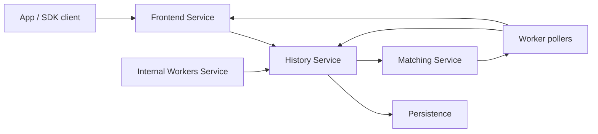

# Temporal and Durable Execution

Temporal is one of the clearest modern answers to the question:

"What kind of very large system can Go build well?"

It is not just a queue, not just a workflow DSL, and not just a retry engine.
It is a durable execution system built from:

- gRPC services,
- history shards,
- task queues,
- worker polling,
- deterministic workflow replay,
- and a persistence-backed event log.

The important lesson is not "Go can sleep a goroutine for 30 days."

The real lesson is:

Go is very good at building long-lived control-plane services that coordinate state machines, RPCs, queue processors, and background work with explicit ownership boundaries.

## What Temporal says its system must do

Temporal's own architecture docs describe four core requirements:

- workflows are defined as code in supported SDK languages,
- durable execution must survive transient failures,
- the system must scale to arbitrarily many concurrent workflow executions,
- user code runs in user-owned worker processes, not inside the core server.

That set of constraints naturally leads to a multi-service Go system with strict boundaries.

## High-level shape



This is already a strong hint about why Go fits:

- many long-lived RPC services,
- lots of concurrent request handling,
- explicit background queue processors,
- deployment as practical server binaries rather than a huge runtime stack.

## Why Go is a fit here

Temporal does not work because Go is magical. It works because the problem shape matches what Go is strong at.

### 1. Many networked services, one codebase

The Temporal server repository exposes distinct services such as:

- `frontend`
- `history`
- `matching`
- `worker`

That is classic Go terrain:

- protobuf + gRPC integration,
- straightforward service binaries,
- clear package boundaries,
- concurrency expressed with goroutines, contexts, queues, and locks rather than language-level async state machines.

### 2. Background processors with explicit ownership

Temporal is full of loops that:

- poll,
- append state,
- enqueue follow-up work,
- checkpoint queue progress,
- acknowledge or retry tasks.

Go is excellent when one goroutine or one component clearly owns a hot loop and the rest of the system talks to it through explicit APIs or queues.

### 3. Operational simplicity matters

Temporal is infrastructure software. People run it as a cluster.

That means build and deployment ergonomics matter:

- static binaries,
- predictable toolchain,
- direct profiling and tracing support,
- standard library networking and TLS,
- straightforward container packaging.

### 4. The hard part is coordination, not SIMD

Temporal is not primarily a handwritten-memory-layout system.
Its hard problems are:

- correctness boundaries,
- persistence ordering,
- replay semantics,
- queue ownership,
- sharding,
- and backpressure.

That is exactly the class of problem where Go has historically been very productive.

## The key idea: durable execution is not "goroutines with timers"

If a workflow must survive process crashes, machine restarts, and worker replacement, the workflow cannot simply live in server memory.

Temporal's architecture docs make that explicit:

- workflow history is append-only,
- mutable state is persisted,
- workers poll for tasks,
- workflow code is replayed deterministically from history.

This is why a system like Temporal can be written in Go without pretending the runtime itself is durable.

The durability boundary lives in persistence plus history replay, not in goroutine suspension.

## The History Service is the real correctness core

Temporal's History Service handles requests tied to one workflow execution and turns them into:

- new history events,
- mutable-state updates,
- transfer tasks for future work,
- timer tasks for delayed work.

The official History Service docs explain that this service:

- owns workflow histories,
- partitions them into history shards,
- persists queue progress,
- and uses queue processors to dispatch work onward.

### Simplified mental model

```go
func handleWorkerCompletion(req Completion) {
	state := loadMutableState(req.WorkflowKey)

	events, commands := applyDeterministicTransition(state, req)
	appendHistory(events)
	persistMutableState(state)

	for _, cmd := range commands {
		switch cmd.Kind {
		case ScheduleActivity:
			enqueueTransferTask(cmd)
		case StartTimer:
			enqueueTimerTask(cmd)
		case ContinueWorkflow:
			enqueueTransferTask(cmd)
		}
	}
}
```

That sketch is intentionally smaller than the real code, but the shape is correct:

- state transition first,
- durable record first,
- dispatchable follow-up work after that.

This is the same design instinct you saw earlier in `etcd/raft` with `Ready` / `Advance`: communication boundaries often double as correctness boundaries.

## History shards explain how Go scales the design

Temporal does not put all workflow execution state behind one global lock or one global loop.

Instead, history is partitioned into shards.
Each owned shard has:

- its own request handling,
- internal queues,
- checkpointing,
- task execution plumbing.

That maps well to Go because the runtime is comfortable running many independent service loops, queue processors, and RPC handlers inside one process without forcing a whole async/await programming model on the codebase.

## Matching Service is the concurrency shock absorber

The Matching Service owns task queues polled by workers.
Its job is not to decide workflow correctness. Its job is to make delivery and throughput work.

The official docs highlight:

- task queues,
- long polling,
- partitions for higher throughput,
- forwarding when an empty partition or unpolled task needs help finding a worker.

### Simplified mental model

```go
func pollTask(queue Partition) Task {
	for {
		if task := queue.LocalBacklog.Pop(); task != nil {
			return task
		}

		if task := queue.ParentForwarder.TryPoll(); task != nil {
			return task
		}

		queue.WaitForTaskOrPoller()
	}
}
```

Again, the exact code is richer than this, but the useful idea is simple:

- History decides what should happen,
- Matching decides how tasks are handed to workers at scale.

That separation keeps the core state machine from collapsing into transport mechanics.

## Frontend and worker boundaries matter too

Frontend is the RPC edge.
Workers are outside the core server and poll for workflow or activity tasks.

That separation is one of the biggest reasons Temporal can be both durable and language-agnostic:

- the server owns history and task routing,
- user code runs in SDK workers,
- the system boundary is explicit and gRPC-shaped.

This is a very Go-like system decomposition:

- boring service boundaries,
- explicit process ownership,
- clear responsibility split.

That is not a weakness. It is one of the reasons the system is understandable.

## What to steal if you are building something smaller

Most teams should not build Temporal.
But many teams should steal some of its design instincts.

### Separate correctness state from throughput plumbing

Keep:

- the state transition engine,
- the persistence boundary,
- the dispatch queue,

as separate concerns.

### Make durable follow-up work explicit

If a request implies future work, turn that into a real task with a real lifecycle.
Do not hide it in a fire-and-forget goroutine.

### Shard ownership instead of centralizing everything

If the workload is fundamentally many independent keys or workflows, shard the responsibility and keep the per-shard lifecycle explicit.

### Keep user code out of the control plane

Temporal keeps user workflow/activity execution in worker processes.
That is a powerful boundary for safety and operability.

## Failure patterns to avoid

### "We'll just keep workflow state in memory"

That is not durable execution. That is an in-memory orchestrator.

### "Every poller can mutate workflow state directly"

This destroys the state-ownership boundary.

### "A goroutine sleeping is the same as a persisted timer"

It is not. A process crash destroys the first and not the second.

### "The queue and the state machine can be one blob"

Temporal is useful to study precisely because it keeps these boundaries explicit.

## Source map

- [Temporal server README](https://github.com/temporalio/temporal/blob/main/README.md)
- [Temporal architecture overview](https://github.com/temporalio/temporal/blob/main/docs/architecture/README.md)
- [History Service architecture](https://github.com/temporalio/temporal/blob/main/docs/architecture/history-service.md)
- [Matching Service architecture](https://github.com/temporalio/temporal/blob/main/docs/architecture/matching-service.md)
- [Frontend service code](https://github.com/temporalio/temporal/tree/main/service/frontend)
- [History service code](https://github.com/temporalio/temporal/tree/main/service/history)
- [Matching service code](https://github.com/temporalio/temporal/tree/main/service/matching)
- [Worker service code](https://github.com/temporalio/temporal/tree/main/service/worker)

## Practical takeaway

Temporal is a strong example of what Go is genuinely good at:

- distributed control planes,
- stateful orchestrators,
- task-queue based systems,
- and multi-service backends whose hardest problems are correctness, scale, and operability rather than raw low-level memory control.

That is why a system this ambitious can still feel recognizably Go-shaped.
