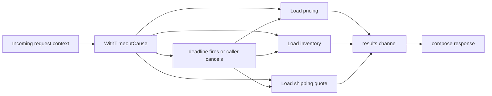

# context Package Internals

Many Go concurrency failures are not caused by goroutines themselves.

They are caused by work that no longer has a valid owner but keeps running anyway.

The `context` package is Go's main answer to that problem.

## Why this package exists

`context` gives one operation tree a shared lifetime:

- a request can expire,
- a parent can cancel child work,
- deadlines can stop I/O or database waits,
- request-scoped metadata can flow through the call graph.

Without that shared lifetime, concurrent code tends to turn into detached work plus cleanup bugs.

## Example scenario



## Production sketch

```go
func (svc CheckoutService) Quote(ctx context.Context, sku string) (Quote, error) {
	ctx, cancel := context.WithTimeoutCause(ctx, 150*time.Millisecond, ErrQuoteTimeout)
	defer cancel()

	results := make(chan quoteResult, 3)

	go func() { results <- svc.fetchPrice(ctx, sku) }()
	go func() { results <- svc.fetchInventory(ctx, sku) }()
	go func() { results <- svc.fetchShipping(ctx, sku) }()

	var quote Quote

	for range 3 {
		select {
		case <-ctx.Done():
			return Quote{}, context.Cause(ctx)
		case result := <-results:
			if result.err != nil {
				cancel()
				return Quote{}, result.err
			}
			quote.Merge(result.partial)
		}
	}

	return quote, nil
}
```

The important part is not the syntax. It is the ownership model:

- one parent lifetime,
- many children,
- one place that decides when the whole subtree stops.

## Mental model

`context` is not a scheduler and not a general-purpose bag of globals.

It is a tree of derived nodes:

- `cancelCtx` adds cancellation,
- `timerCtx` adds a timer-driven deadline,
- `valueCtx` adds one key-value pair,
- `withoutCancelCtx` keeps values but drops cancellation.

That means:

- cancellation flows downward,
- values are found by walking upward,
- deadlines are just timed cancellation,
- `Done()` is a shared stop signal, not a work queue.

## Simplified internal sketch

This is not the exact source, but it is close enough to explain the shape:

```go
type cancelCtx struct {
	parent   context.Context
	mu       sync.Mutex
	done     chan struct{}
	children map[canceler]struct{}
	err      error
	cause    error
}

func (c *cancelCtx) cancel(err error, cause error) {
	c.mu.Lock()
	defer c.mu.Unlock()

	if c.err != nil {
		return
	}

	c.err = err
	c.cause = cause

	if c.done == nil {
		c.done = closedChan
	} else {
		close(c.done)
	}

	for child := range c.children {
		child.cancel(err, cause)
	}
	c.children = nil
}

type timerCtx struct {
	cancelCtx
	timer    *time.Timer
	deadline time.Time
}

type valueCtx struct {
	parent context.Context
	key    any
	value  any
}
```

The real package adds atomics, lazy channel creation, and several fast paths, but the control flow above is the core idea.

## Runtime source walk

The Go 1.26 source is worth reading directly:

- `cancelCtx` stores a lazy `done` channel, a `children` set, and the first cancellation error and cause.
- `Err()` uses an atomic fast path because it may be called in hot loops.
- `propagateCancel` avoids spawning a helper goroutine when it can attach the child directly to a parent `cancelCtx`.
- `timerCtx` embeds `cancelCtx` and stops its timer during cancel.
- `valueCtx` is just a linked chain, so deep value stacks cost linear lookup time.
- `WithoutCancel` returns a wrapper with `Done() == nil` and `Err() == nil`, but it still forwards values.

In the real source, the most important functions and types are:

- [`context.go` `cancelCtx`](https://github.com/golang/go/blob/go1.26.0/src/context/context.go#L431)
- [`context.go` `propagateCancel`](https://github.com/golang/go/blob/go1.26.0/src/context/context.go#L469)
- [`context.go` `WithoutCancel`](https://github.com/golang/go/blob/go1.26.0/src/context/context.go#L585)
- [`context.go` `timerCtx`](https://github.com/golang/go/blob/go1.26.0/src/context/context.go#L662)
- [`context.go` `valueCtx`](https://github.com/golang/go/blob/go1.26.0/src/context/context.go#L742)

## Newer APIs that matter

### `Cause` and `WithCancelCause`

If cancellation reason matters to business logic, `context.Cause` is much better than collapsing everything to `context.Canceled`.

That matters when you need to distinguish:

- client disconnected,
- internal budget exhausted,
- upstream timeout,
- manual shutdown.

### `AfterFunc`

`AfterFunc` lets the context trigger cleanup or compensation work when cancellation happens:

```go
stopRollback := context.AfterFunc(ctx, func() {
	_ = tx.Rollback()
})
defer stopRollback()
```

This is useful, but it is still easy to overuse. Keep the cleanup local and obvious.

### `WithoutCancel`

`WithoutCancel` is a narrow tool.

Use it when you intentionally want to preserve values from a request while detaching from request cancellation, such as background audit logging during a graceful handoff. If you use it casually, you are usually lying about lifetime ownership.

## Failure patterns

### Forgetting to call `cancel`

```go
ctx, cancel := context.WithTimeout(parent, 200*time.Millisecond)
_ = cancel // bug: timer and child reference are kept until parent cancels
```

The leak is not only the timer. The parent also keeps a reference to the child until cancellation removes it.

### Replacing the request tree with `context.Background()`

```go
go svc.writeAuditLog(context.Background(), event) // detached from caller and shutdown
```

This silently discards request lifetime, shutdown propagation, and budget control.

### Treating values as optional parameters

```go
ctx = context.WithValue(ctx, "retries", 3)
ctx = context.WithValue(ctx, "region", "eu-west-1")
ctx = context.WithValue(ctx, "debug", true)
```

This is weakly typed, easy to abuse, and makes the call contract harder to read.

### Deep value chains in hot paths

Every `WithValue` adds another node. `Value` lookup walks the chain. That usually does not matter once or twice, but it is not free inside hot middleware or RPC paths.

### Assuming cancellation kills arbitrary work immediately

Cancellation closes `Done()`. It does not preempt CPU loops or magically stop libraries that ignore the context.

## Production consequences

- Context trees are cheap enough to use per request, but not free enough to spray without ownership discipline.
- Missing `cancel()` calls show up as timer retention, child retention, and muddy shutdown behavior.
- `Cause` is valuable for observability because `ctx.Err()` loses detail.
- A `context.Context` should almost always be the first function parameter, not a field on a struct.

## How to test and observe it

- Use short deadlines in tests and assert `context.DeadlineExceeded` or `context.Cause`.
- Verify that child goroutines exit on parent cancellation instead of only checking return values.
- Add leak tests around request abort, timeout, and shutdown paths.
- Use traces or metrics around timeout causes if many operations converge on one budget.

## Official reading

- [Package docs for `context`](https://pkg.go.dev/context)
- [Go blog: Context](https://go.dev/blog/context)
- [Go blog: Contexts and structs](https://go.dev/blog/context-and-structs)
- [Go 1.26 `context` source](https://github.com/golang/go/blob/go1.26.0/src/context/context.go)

## Practical takeaway

If you treat `context` as a lifetime tree instead of just a parameter to satisfy APIs, a large class of goroutine leaks and shutdown bugs becomes easier to reason about.
