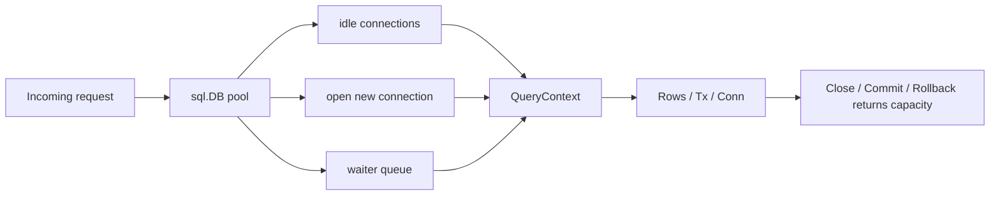

# database/sql Pool Internals

The biggest `database/sql` misconception is simple:

`sql.DB` is not one connection. It is a concurrent pool manager.

If you miss that, you will size it badly, close it at the wrong time, or accidentally turn query pressure into system-wide latency.

## Why this package matters

In production, database concurrency is rarely limited by goroutines.

It is limited by:

- pool size,
- driver behavior,
- transaction lifetime,
- query duration,
- cancellation support,
- cleanup discipline for rows and statements.

`database/sql` is where those concerns are centralized.

## Example scenario



## Production sketch

```go
db, err := sql.Open("pgx", dsn)
if err != nil {
	return err
}

db.SetMaxOpenConns(64)
db.SetMaxIdleConns(16)
db.SetConnMaxIdleTime(5 * time.Minute)
db.SetConnMaxLifetime(30 * time.Minute)

ctx, cancel := context.WithTimeout(r.Context(), 200*time.Millisecond)
defer cancel()

rows, err := db.QueryContext(ctx, query, tenantID)
if err != nil {
	return err
}
defer rows.Close()
```

Two rules matter immediately:

- `sql.Open` returns a pool handle that should usually live for the whole process,
- query lifetime must still be bounded per request.

## Mental model

`sql.DB` owns several moving pieces:

- free idle connections,
- the count of open and opening connections,
- waiters that block when the pool is full,
- an opener goroutine,
- a cleaner goroutine for idle-time and lifetime expiry.

`Conn`, `Tx`, `Rows`, and `Stmt` narrow ownership further:

- `Conn` pins one physical connection,
- `Tx` pins a connection for the whole transaction,
- `Rows` must be closed to release resources,
- `Stmt` can be concurrent, but still holds driver-side state.

## Simplified internal sketch

```go
type DB struct {
	mu           sync.Mutex
	freeConn     []*driverConn
	numOpen      int
	maxOpen      int
	maxIdleCount int
	openerCh     chan struct{}
	waitCount    int64
	maxLifetime  time.Duration
	maxIdleTime  time.Duration
}

func (db *DB) conn(ctx context.Context) (*driverConn, error) {
	if c := takeIdle(db.freeConn); c != nil {
		return c, nil
	}
	if db.maxOpen > 0 && db.numOpen >= db.maxOpen {
		return waitForReturnedConnOrContext(ctx)
	}
	return openNewConn(ctx)
}

func (db *DB) putConn(c *driverConn, err error) {
	if bad(err) || expired(c) {
		c.Close()
		return
	}
	if waiter := takeWaitingRequest(); waiter != nil {
		waiter <- c
		return
	}
	db.freeConn = append(db.freeConn, c)
}
```

That is the shape to remember: reuse if possible, wait if capped, open if allowed, return carefully.

## Source walk

In the Go 1.26 source:

- `DB` stores idle connections, waiter state, open counts, and pool limits.
- `OpenDB` launches a `connectionOpener` goroutine immediately.
- `conn` prefers idle reuse, otherwise waits or opens.
- `putConn` either satisfies a waiter, returns to idle, or closes bad/expired connections.
- `connectionCleaner` trims by idle time and max lifetime.

The key source entry points are:

- [`sql.go` `DB`](https://github.com/golang/go/blob/go1.26.0/src/database/sql/sql.go#L507)
- [`sql.go` `Open`](https://github.com/golang/go/blob/go1.26.0/src/database/sql/sql.go#L863)
- [`sql.go` `connectionOpener`](https://github.com/golang/go/blob/go1.26.0/src/database/sql/sql.go#L1259)
- [`sql.go` `conn`](https://github.com/golang/go/blob/go1.26.0/src/database/sql/sql.go#L1316)
- [`sql.go` `putConn`](https://github.com/golang/go/blob/go1.26.0/src/database/sql/sql.go#L1481)
- [`sql.go` `Tx`](https://github.com/golang/go/blob/go1.26.0/src/database/sql/sql.go#L2166)
- [`sql.go` `Rows`](https://github.com/golang/go/blob/go1.26.0/src/database/sql/sql.go#L2929)

## What pool settings really mean

### `SetMaxOpenConns`

This is your hard parallelism cap against the database.

Too low and requests pile up in the application. Too high and the database becomes the bottleneck instead.

### `SetMaxIdleConns`

This controls how much warm capacity you keep.

Too low and the service redials often. Too high and the app holds more server resources than needed.

### `SetConnMaxLifetime` and `SetConnMaxIdleTime`

These are not throughput features. They are hygiene features:

- rebalance long-lived connections,
- reduce risk from stale server-side state,
- avoid unbounded idle retention.

## Failure patterns

### Opening a new `sql.DB` per request

```go
func handle(w http.ResponseWriter, r *http.Request) {
	db, _ := sql.Open("pgx", dsn) // bug: new pool for one request
	defer db.Close()
}
```

That defeats pooling and creates avoidable connection churn.

### Forgetting to close rows

```go
rows, err := db.QueryContext(ctx, query)
if err != nil {
	return err
}
return scanAll(rows) // rows never closed
```

Until `Rows.Close` happens or iteration drains fully, the connection may stay pinned longer than expected.

### Holding transactions open across unrelated work

```go
tx, _ := db.BeginTx(ctx, nil)
defer tx.Rollback()

callSlowExternalAPI()
```

A transaction usually pins one connection. Slow work inside the transaction shrinks effective pool capacity.

### Assuming context cancellation always aborts the query on the server

Drivers that do not support context cancellation may not return until the query completes. The package docs state this explicitly.

### Ignoring `DB.Stats`

If you never inspect `WaitCount`, `WaitDuration`, `OpenConnections`, `InUse`, and `Idle`, you are guessing about pool pressure.

## Production consequences

- One process usually needs one long-lived `*sql.DB` per distinct DSN and policy boundary.
- Query contexts should be shorter than the outer request budget, not longer.
- Transaction scope should be kept as narrow as possible.
- Pool configuration is a coordination problem with database capacity, not an app-only decision.

## How to test and observe it

- Assert that handlers close `Rows` and roll back failed transactions.
- Use integration tests with a deliberately tiny `MaxOpenConns` to exercise waiter behavior.
- Inspect `DB.Stats()` during load tests to confirm whether latency is pool wait or database execution time.
- Test driver-specific cancellation behavior explicitly instead of assuming it works.

## Official reading

- [Package docs for `database/sql`](https://pkg.go.dev/database/sql)
- [Go SQL drivers overview](https://golang.org/s/sqldrivers)
- [Go wiki: SQLInterface](https://tip.golang.org/wiki/SQLInterface)
- [Go 1.26 `database/sql` source](https://github.com/golang/go/blob/go1.26.0/src/database/sql/sql.go)

## Practical takeaway

Treat `sql.DB` as a shared concurrency governor, not a convenience handle, and many database latency bugs become easier to see before production sees them.
