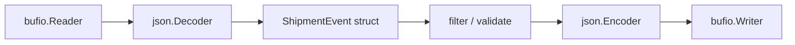

# encoding/json in Production

`encoding/json` is convenient, ubiquitous, and easy to misuse.

Its real cost is not only CPU time. It is also the semantic assumptions people quietly make about:

- strictness,
- duplicate keys,
- number handling,
- buffered stream boundaries,
- schema drift.

## Why this package matters

A huge amount of Go production code reads or writes JSON at service boundaries.

That means the package is often responsible for:

- request decoding,
- response encoding,
- NDJSON streaming,
- audit or event logs,
- config snapshots,
- compatibility between old and new clients.

## Example scenario

The `examples/ndjsonstream` package uses `json.Decoder` and `json.Encoder` to filter newline-delimited shipment events without buffering the whole stream in memory.



## Production sketch

```go
decoder := json.NewDecoder(req.Body)
decoder.DisallowUnknownFields()
decoder.UseNumber()

var payload CreateOrderRequest
if err := decoder.Decode(&payload); err != nil {
	return err
}

encoder := json.NewEncoder(w)
encoder.SetEscapeHTML(false)
return encoder.Encode(response)
```

This is small code, but every line changes the contract:

- `DisallowUnknownFields` turns ignored drift into explicit failure,
- `UseNumber` avoids silent float conversion in interface-heavy paths,
- `SetEscapeHTML(false)` changes output readability and escaping behavior.

## Mental model

The package has two main modes:

| API | Best fit |
| --- | --- |
| `Marshal` / `Unmarshal` | whole-value encode/decode already in memory |
| `Encoder` / `Decoder` | stream-oriented I/O boundaries |

Two important caveats:

1. `Decoder` introduces its own buffering and may read past the current value.
2. The package intentionally preserves some compatibility behaviors that are not “strict JSON schema” behavior.

## Simplified internal sketch

The streaming decoder roughly works like this:

```go
type Decoder struct {
	r     io.Reader
	buf   []byte
	scanp int
	scan  scanner
}

func (dec *Decoder) Decode(v any) error {
	n := dec.readValue()
	state := dec.buf[dec.scanp : dec.scanp+n]
	return unmarshalInto(v, state)
}
```

The key idea is that the decoder scans until it has one complete JSON value, then unmarshals that value from its internal buffer. That is why `Buffered()` exists and why you should not assume exact one-value-per-read behavior from the underlying reader.

## Compatibility behaviors you need to know

The package docs call these out because they matter in real systems:

- duplicate object keys are accepted, with later values replacing or merging into earlier ones depending on destination type,
- struct field matching is case-insensitive,
- unknown object keys are ignored unless `DisallowUnknownFields` is enabled on a `Decoder`,
- invalid UTF-8 in strings is replaced,
- large integers lose precision when decoded into floating-point destinations.

These behaviors are part of the compatibility surface, not just incidental implementation choices.

## Stream decoding details

`Encoder.Encode` appends a trailing newline. That is useful for logs and NDJSON-style output.

`Decoder.Token` and `Decoder.More` let you walk arrays or objects token by token, which is useful when you need streaming control rather than whole-struct decode.

`json.RawMessage` is useful when one layer should validate an envelope but delay parsing of a nested payload.

## Runtime source walk

Useful entry points in the default Go 1.26 implementation:

- [`encoding/json/stream.go` `Decoder`](https://github.com/golang/go/blob/go1.26.0/src/encoding/json/stream.go#L16)
- [`encoding/json/stream.go` `NewDecoder`](https://github.com/golang/go/blob/go1.26.0/src/encoding/json/stream.go#L33)
- [`encoding/json/stream.go` `Decode`](https://github.com/golang/go/blob/go1.26.0/src/encoding/json/stream.go#L51)
- [`encoding/json/stream.go` `Encode`](https://github.com/golang/go/blob/go1.26.0/src/encoding/json/stream.go#L204)
- [`encoding/json/decode.go`](https://github.com/golang/go/blob/go1.26.0/src/encoding/json/decode.go)
- [`encoding/json/encode.go`](https://github.com/golang/go/blob/go1.26.0/src/encoding/json/encode.go)

One detail worth noticing in the tree is that Go 1.26 also contains `jsonv2` experiment files behind build tags. The default package behavior is still the classic implementation unless that experiment is enabled.

## Failure patterns

### Treating `map[string]any` as a free abstraction

```go
var payload map[string]any
if err := json.Unmarshal(body, &payload); err != nil {
	return err
}
```

This is flexible, but it pushes type checks, number coercion, and field validation into later code.

### Assuming unknown fields are rejected by default

They are not when you use plain `Unmarshal` or a default `Decoder`.

### Assuming duplicate keys are an error

They are not. If interoperability or security depends on strict duplicate-key rejection, you need stronger validation than default `encoding/json`.

### Using `Scanner` instead of `Decoder` for large NDJSON records

This often creates a hidden token-size limit that the JSON layer itself did not require.

### Forgetting that `Decoder` may read ahead

If several protocols share one underlying stream, read-ahead behavior matters.

## Production consequences

- Prefer typed structs at service boundaries.
- Use `Decoder` for streaming and enable `DisallowUnknownFields` where schema strictness matters.
- Use `UseNumber` when generic decoding must preserve numeric intent.
- Keep `RawMessage` for delayed decoding, not as a permanent “we will type this later” escape hatch.
- Review compatibility assumptions when JSON crosses trust boundaries.

## Example and tests

- Example: `examples/ndjsonstream`
- The example shows stream filtering with `Decoder`, `Encoder`, buffered I/O, and strict field handling.

## Official reading

- [Package docs for `encoding/json`](https://pkg.go.dev/encoding/json)
- [JSON and Go](https://go.dev/blog/json)

## Practical takeaway

`encoding/json` is usually good enough for production. The danger is not that it exists. The danger is using it without being explicit about strictness, numbers, and stream boundaries.
