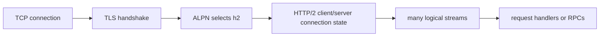

# HTTP/2, ALPN, and Stream Multiplexing

HTTP/2 is where many Go engineers realize that “one connection” no longer means “one request at a time.”

That is powerful, but it also changes what connection reuse means, how backpressure behaves, and why gRPC sits where it does in the ecosystem.

## Mental model



In HTTP/1.1, connection reuse usually means serial request reuse across a keep-alive socket.

In HTTP/2, reuse often means stream reuse on a multiplexed transport.

Those are not the same thing operationally.

## ALPN is the protocol switch

Application-Layer Protocol Negotiation (ALPN) happens during the TLS handshake.

In Go, the important configuration surface is still `tls.Config.NextProtos`.

That means HTTP/2 is not an isolated feature living only inside `net/http`. It is the product of:

- a TCP connection,
- a TLS handshake,
- negotiated protocol selection,
- HTTP/2 connection state in `net/http`.

If ALPN does not negotiate `h2`, you do not have HTTP/2, no matter what the rest of your code expects.

## Production sketch

```go
transport := &http.Transport{
	MaxIdleConns:       256,
	MaxConnsPerHost:    128,
	ForceAttemptHTTP2:  true,
	TLSClientConfig: &tls.Config{
		MinVersion: tls.VersionTLS12,
		NextProtos: []string{"h2", "http/1.1"},
	},
}

client := &http.Client{Transport: transport}
```

Important points:

- `ForceAttemptHTTP2` matters when custom dial or TLS hooks would otherwise disable automatic HTTP/2 attempts.
- `NextProtos` must still allow `h2`.
- per-request contexts still matter even when many requests share one connection.

## Stream reuse is not free concurrency

One TCP connection carrying many streams can reduce dial churn and improve latency, but multiplexing still has limits:

- connection-level flow control,
- stream-level flow control,
- head-of-line behavior inside your application handlers,
- server-side concurrency limits,
- shared fate if one connection is reset or misconfigured.

The wrong mental model is:

“HTTP/2 means one connection can safely carry infinite concurrent work.”

The right mental model is:

“HTTP/2 moves some reuse from socket count to stream scheduling, but budgets and backpressure still matter.”

## Why gRPC lives here

gRPC on Go rides on HTTP/2 semantics:

- one long-lived channel,
- many RPC streams,
- ALPN and TLS policy underneath,
- flow control and cancellation shaping behavior above.

That is why [`grpc-go Production Playbook`](/playbooks/grpc-go-production-playbook) and this page belong next to each other. If your HTTP/2 model is wrong, your gRPC model is usually wrong too.

## Runtime and stdlib source pointers

These are the useful entry points in Go 1.26:

- [`net/http/h2_bundle.go`](https://github.com/golang/go/blob/go1.26.0/src/net/http/h2_bundle.go)
- [`net/http/transport.go` `Transport`](https://github.com/golang/go/blob/go1.26.0/src/net/http/transport.go#L97)
- [`net/http/server.go` `Server`](https://github.com/golang/go/blob/go1.26.0/src/net/http/server.go#L2964)
- [`net/http/doc.go`](https://github.com/golang/go/blob/go1.26.0/src/net/http/doc.go#L102)

Read them with three questions in mind:

1. how does protocol selection happen,
2. where is per-connection state kept,
3. where do many logical streams become ordinary request handlers.

## Failure patterns

### Assuming one HTTP/2 connection removes the need for budgets

One busy connection can still saturate server-side concurrency, flow-control windows, or downstream dependencies.

### Forgetting that response bodies still need ownership discipline

HTTP/2 does not remove the need to read or close bodies correctly. Stream reuse and connection health still depend on correct client behavior.

### Custom TLS or dial hooks accidentally disabling HTTP/2

If you customize transport behavior, verify whether HTTP/2 is still attempted and negotiated.

### Measuring only socket count

A low socket count can look healthy while stream-level saturation or flow-control stalls are already hurting latency.

## How to observe and debug it

- Use `httptrace` for dial, TLS, and connection reuse phases.
- Use `GODEBUG=http2debug=1` or `GODEBUG=http2debug=2` when you need frame-level visibility.
- Track handshake latency, stream concurrency, and connection churn separately.
- When debugging gRPC, decompose channel/connect/TLS/stream behavior instead of treating “gRPC latency” as one number.

## Production consequence

HTTP/2 changes the unit of reuse from “just sockets” to “sockets plus streams.” If your monitoring and mental model stay HTTP/1.1-shaped, you will miss the real bottleneck.

## Practical takeaway

ALPN decides whether HTTP/2 exists. `net/http` then turns that negotiated protocol into multiplexed request streams. Use it deliberately, observe it at the right level, and keep response-body ownership just as strict as in HTTP/1.1.
