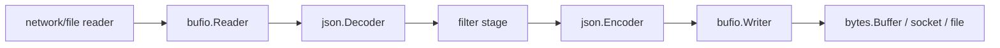

# io, bufio, and bytes

Go's I/O stack is powerful because it is interface-driven, not because it hides complexity.

The same `io.Reader` shape can represent:

- a socket,
- a file,
- a decompressor,
- a bytes buffer,
- a pipe between goroutines.

That flexibility is useful only if you understand the fast paths and the ownership rules underneath it.

## Why these packages matter

In production, I/O behavior determines:

- whether you stream or accidentally buffer everything,
- whether writes are coalesced or fragmented,
- whether you hold aliases into mutable byte storage,
- whether one innocent helper quietly becomes a memory bomb.

## Example scenario

The `examples/ndjsonstream` package ingests and re-emits newline-delimited JSON using `bufio`, `io`, `bytes`, and `encoding/json`.



## Production sketch

```go
reader := bufio.NewReaderSize(src, 16*1024)
writer := bufio.NewWriterSize(dst, 16*1024)
defer writer.Flush()

limited := io.LimitReader(reader, 1<<20)
written, err := io.Copy(writer, limited)
```

The point is not that these functions exist. It is that each one changes the resource boundary:

- `bufio` changes buffering behavior,
- `LimitReader` caps exposure,
- `io.Copy` may choose an optimized copy path for you.

## Mental model

The core rules:

- `io` packages behavior behind interfaces,
- `bufio` adds buffers and token helpers,
- `bytes` gives in-memory byte containers with explicit aliasing behavior.

That means:

- interface satisfaction can unlock fast paths,
- buffering changes syscall patterns but not ownership,
- slices returned by `bytes.Buffer.Bytes()` alias live storage until the next mutation.

## Simplified internal sketch

`io.Copy` is a good example of interface-driven optimization:

```go
func Copy(dst Writer, src Reader) (int64, error) {
	if wt, ok := src.(WriterTo); ok {
		return wt.WriteTo(dst)
	}
	if rf, ok := dst.(ReaderFrom); ok {
		return rf.ReadFrom(src)
	}
	return copyWithTemporaryBuffer(dst, src)
}
```

`bufio.Scanner` is a good example of convenience with a deliberately limited safety envelope:

```go
type Scanner struct {
	r            io.Reader
	buf          []byte
	maxTokenSize int
}
```

If the token grows beyond the configured limit, scanning fails. That is a design choice, not an accident.

## What these packages are really good at

### `io`

Use `io` when you want composable streaming behavior:

- `LimitReader` to cap input,
- `TeeReader` to duplicate a stream into logging or hashing,
- `MultiWriter` or `MultiReader` to compose flows,
- `Pipe` when one goroutine should stream bytes directly into another.

Do not assume `Reader` or `Writer` implementations are safe for concurrent use unless the concrete type documents that explicitly.

### `bufio`

Use `bufio.Reader` and `bufio.Writer` when the underlying reader or writer would otherwise suffer from many tiny calls.

Use `Scanner` only when token size is bounded and the convenience is worth the tradeoff. If you need:

- unbounded lines,
- partial token control,
- sequential scans with exact unread handling,

use `bufio.Reader` instead.

### `bytes`

Use `bytes.Buffer` for mutable byte accumulation and streaming helpers such as `ReadFrom` and `WriteTo`.

Use `bytes.Reader` when you want a read-only in-memory `io.Reader`/`io.ReaderAt`/`io.Seeker`.

Be disciplined with aliasing. `Bytes()` is a window into the buffer's live storage, not a durable copy.

## Runtime source walk

Useful entry points:

- [`io/io.go` `Copy`](https://github.com/golang/go/blob/go1.26.0/src/io/io.go#L387)
- [`io/pipe.go` `Pipe`](https://github.com/golang/go/blob/go1.26.0/src/io/pipe.go#L195)
- [`bufio/scan.go` `Scanner`](https://github.com/golang/go/blob/go1.26.0/src/bufio/scan.go#L29)
- [`bufio/scan.go` `Scan`](https://github.com/golang/go/blob/go1.26.0/src/bufio/scan.go#L139)
- [`bytes/buffer.go` `Buffer`](https://github.com/golang/go/blob/go1.26.0/src/bytes/buffer.go#L20)
- [`bytes/buffer.go` `ReadFrom`](https://github.com/golang/go/blob/go1.26.0/src/bytes/buffer.go#L224)

Details worth remembering:

- `io.Copy` prefers `WriterTo` and `ReaderFrom` before falling back to a staging buffer.
- `Scanner` stops unrecoverably on oversized tokens and may advance farther than you expect before the last good token.
- `bytes.Buffer` tries hard to reuse existing capacity and slide unread bytes down before allocating.

## Failure patterns

### Assuming interface-based I/O is automatically concurrency-safe

```go
go func() { _, _ = reader.Read(bufA) }()
go func() { _, _ = reader.Read(bufB) }()
```

Whether this is safe depends on the concrete type, not the `io.Reader` interface.

### Forgetting to flush a buffered writer

```go
writer := bufio.NewWriter(dst)
_, _ = writer.Write(payload)
return nil // bug: bytes may still be sitting in memory
```

### Using `Scanner` for unbounded tokens

`Scanner` has a default `MaxScanTokenSize` of 64 KiB. That is ideal for many logs and terrible for arbitrarily large lines or documents.

### Holding `Buffer.Bytes()` across later writes

```go
view := buf.Bytes()
buf.WriteString("more") // view may now describe changed contents
```

If you need stable bytes, copy them.

### Calling `io.ReadAll` on unbounded input

That is often just deferred memory trouble with a nicer function name.

## Production consequences

- Let `io.Copy` and its fast paths work for you before hand-writing copy loops.
- Reach for `bufio.Reader`/`Writer` at network and file boundaries where tiny reads or writes would otherwise dominate.
- Use `Scanner` only when the token size contract is clear.
- Treat `bytes.Buffer` as an owned mutable object. Copy when data must outlive later mutations.

## Example and tests

- Example: `examples/ndjsonstream`
- The tests verify streaming NDJSON output, strict filtering, and bounded preview copying via `io.LimitReader`.

## Official reading

- [Package docs for `io`](https://pkg.go.dev/io)
- [Package docs for `bufio`](https://pkg.go.dev/bufio)
- [Package docs for `bytes`](https://pkg.go.dev/bytes)

## Practical takeaway

Good Go I/O code is less about clever loops and more about clear ownership, bounded input, and letting the standard interfaces choose the right fast path.
