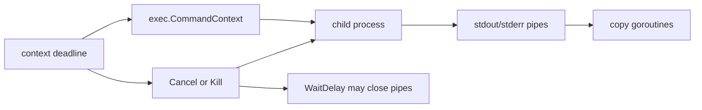

# os/exec and Subprocess Lifecycle

`os/exec` is not a shell wrapper.

It is a structured process-launching API with explicit ownership rules around:

- command lookup,
- environment,
- pipes,
- cancellation,
- exit status,
- goroutines created to shuttle I/O.

## Why this package matters

Subprocess bugs in Go usually come from lifecycle mistakes:

- command lookup surprises,
- context cancellation that does not mean what the caller assumed,
- child processes that keep pipes open,
- `Wait` blocked on copy goroutines,
- accidental shell expectations around quoting or glob expansion.

## Example scenario

The `examples/processsupervisor` package launches a subprocess with `exec.CommandContext`, captures stdout and stderr, and verifies that timeout-driven cancellation stops a long-running helper process.



## Production sketch

```go
cmd := exec.CommandContext(ctx, "/usr/bin/convert", "in.png", "out.webp")
cmd.Dir = workDir
cmd.Env = append(os.Environ(), "MAGICK_TMPDIR="+tmpDir)
cmd.WaitDelay = 2 * time.Second

var stdout bytes.Buffer
var stderr bytes.Buffer
cmd.Stdout = &stdout
cmd.Stderr = &stderr

if err := cmd.Run(); err != nil {
	return err
}
```

This is not just process launch. It is a whole lifecycle contract:

- where the process starts,
- what environment it sees,
- where output goes,
- what happens when the context ends,
- how long `Wait` is allowed to linger on pipes.

## Mental model

`os/exec` has three layers:

| Layer | Main concern |
| --- | --- |
| `Command` / `LookPath` | executable resolution and argv construction |
| `Start` / `Run` / `Wait` | process lifecycle |
| stdio fields and pipes | I/O movement and goroutine ownership |

Two especially important facts:

1. `Command` does not invoke a shell.
2. When stdio is not an `*os.File`, the package often starts extra goroutines to copy data through pipes.

## Simplified internal sketch

```go
type Cmd struct {
	Path      string
	Args      []string
	Stdout    io.Writer
	Stderr    io.Writer
	ctx       context.Context
	Cancel    func() error
	WaitDelay time.Duration
}

func CommandContext(ctx context.Context, name string, arg ...string) *Cmd {
	cmd := Command(name, arg...)
	cmd.ctx = ctx
	cmd.Cancel = cmd.Process.Kill
	return cmd
}

func (c *Cmd) Start() error {
	startProcess(...)
	startCopyGoroutinesIfNeeded(...)
	startContextWatcherIfNeeded(...)
}
```

The core ideas are:

- launch is explicit,
- copying is explicit,
- cancellation is explicit.

## `CommandContext` is only the beginning

`CommandContext` sets a default `Cancel` that kills the process when the context ends.

That is useful, but not always the whole story.

If the process spawns children or leaves stdio pipes open, `Wait` can still take longer than expected. That is why `WaitDelay` exists: it bounds the time spent waiting for a child to exit or for pipe-copy goroutines to unblock.

## `WaitDelay` matters more than most people realize

If `WaitDelay` is zero, `Wait` can block until pipes finally close, even after the child process has exited.

With a nonzero `WaitDelay`, the package can:

- kill the process if it ignored cancellation,
- close pipes to unblock copy goroutines,
- return `ErrWaitDelay` when it had to force the issue.

That field is often the difference between a tidy subprocess wrapper and a shutdown hang.

## Lookup security and `ErrDot`

Since Go 1.19, `Command` and `LookPath` will not resolve executables from the current directory through implicit or explicit relative `PATH` entries. If that would have happened, the package returns `ErrDot`.

That is a security feature, not an annoyance to work around casually.

If you want the current directory, say `./tool`, not `tool`.

## Runtime source walk

Useful entry points:

- [`os/exec/exec.go` `Cmd`](https://github.com/golang/go/blob/go1.26.0/src/os/exec/exec.go#L148)
- [`os/exec/exec.go` `CommandContext`](https://github.com/golang/go/blob/go1.26.0/src/os/exec/exec.go#L484)
- [`os/exec/exec.go` `Start`](https://github.com/golang/go/blob/go1.26.0/src/os/exec/exec.go#L641)
- [`os/exec/exec.go` `Wait`](https://github.com/golang/go/blob/go1.26.0/src/os/exec/exec.go#L922)

Details worth noticing:

- non-file stdio endpoints create pipes and copy goroutines,
- cancellation is watched in a dedicated goroutine,
- `WaitDelay` can kill the child and forcibly close pipes,
- `Output` and `CombinedOutput` build on the same lifecycle machinery.

## Failure patterns

### Expecting shell behavior from `Command`

```go
exec.Command("shout", "*.log", "|", "wc")
```

No shell expansion, no pipelines, no redirection. That is intentional.

### Forgetting to call `Wait` after `Start`

Starting a process without waiting for it leaks resources and state.

### Assuming context cancellation means graceful shutdown

The default `Cancel` from `CommandContext` is `Kill`, not a polite signal or domain-specific shutdown handshake.

### Ignoring pipe-copy goroutines

If stdout or stderr are bridged through pipes, `Wait` also depends on those copy goroutines finishing.

### Silencing `ErrDot` without understanding why it happened

That usually means command lookup policy is underspecified.

## Production consequences

- Treat subprocesses as owned resources with explicit startup and shutdown policy.
- Use `WaitDelay` when hung pipes or stubborn children would hurt service shutdown.
- Make command lookup explicit and secure.
- Capture stderr intentionally; it is often the best debugging signal you will get from a failed child.

## Example and tests

- Example: `examples/processsupervisor`
- The tests verify output capture and context-driven termination of a long-running helper process.

## Official reading

- [Package docs for `os/exec`](https://pkg.go.dev/os/exec)
- [Path security in Go](https://go.dev/blog/path-security)

## Practical takeaway

`os/exec` is safest when you think of it as process lifecycle management, not as “run a command.” Once you account for lookup, pipes, cancellation, and waiting, the package becomes predictable.
