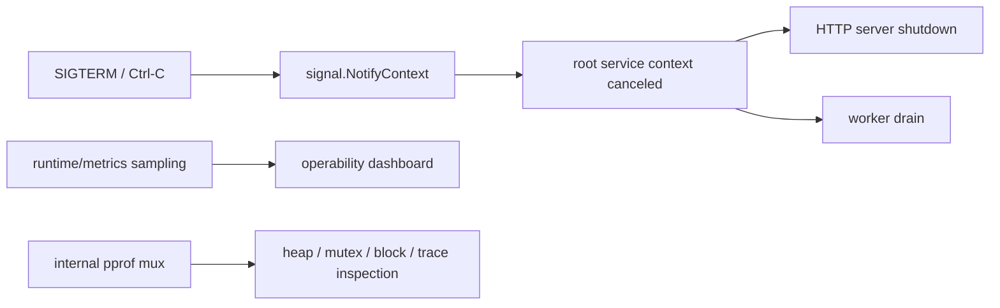

# Process Signals and Runtime Observability

Production Go services do not end at the last goroutine you wrote.

They also need:

- process shutdown boundaries,
- signal-aware cancellation,
- cheap runtime metrics,
- safe profiling hooks.

That is where `os/signal`, `runtime/metrics`, and `net/http/pprof` come in.

## Why these packages matter

If a service cannot:

- shut down predictably on `SIGTERM`,
- expose runtime pressure before users feel it,
- provide profiles when latency or memory goes bad,

then concurrency correctness in the application layer is only half the job.

## Example scenario



## Production sketch

```go
rootCtx, stop := signal.NotifyContext(context.Background(), os.Interrupt, syscall.SIGTERM)
defer stop()

go func() {
	internalMux := http.NewServeMux()
	internalMux.HandleFunc("/debug/pprof/", pprof.Index)
	internalMux.HandleFunc("/debug/pprof/cmdline", pprof.Cmdline)
	internalMux.HandleFunc("/debug/pprof/profile", pprof.Profile)
	internalMux.HandleFunc("/debug/pprof/symbol", pprof.Symbol)
	internalMux.HandleFunc("/debug/pprof/trace", pprof.Trace)

	_ = http.ListenAndServe("127.0.0.1:6060", internalMux)
}()

samples := []metrics.Sample{
	{Name: "/sched/goroutines:goroutines"},
	{Name: "/sync/mutex/wait/total:seconds"},
	{Name: "/memory/classes/heap/objects:bytes"},
}
metrics.Read(samples)
```

The theme is simple: shutdown and observability belong in the service skeleton, not as afterthoughts inside random handlers.

## Mental model

These packages serve different layers:

| Package | Main job |
| --- | --- |
| `os/signal` | translate process signals into Go-visible events |
| `signal.NotifyContext` | project signal arrival into cancellation flow |
| `runtime/metrics` | expose stable runtime counters and histograms |
| `net/http/pprof` | expose detailed runtime profiles over HTTP |

Together they let one process say:

- “it is time to stop,”
- “here is what the runtime is experiencing,”
- “here is the evidence for where time or memory is going.”

## Simplified internal sketch

```go
ctx, stop := signal.NotifyContext(parent, os.Interrupt, syscall.SIGTERM)
defer stop()

samples := []metrics.Sample{
	{Name: "/sched/goroutines:goroutines"},
	{Name: "/sched/latencies:seconds"},
}
metrics.Read(samples)

internalMux := http.NewServeMux()
internalMux.Handle("/debug/pprof/", http.HandlerFunc(pprof.Index))
```

The important point is that these packages are bridges:

- signals become context cancellation,
- runtime counters become sampled telemetry,
- internal runtime state becomes inspectable profiles.

## Signals: process lifetime, not business logic

`signal.NotifyContext` is usually the best entry point for graceful shutdown.

It lets you keep the rest of the program context-driven instead of sprinkling signal channels everywhere.

Two details matter:

1. You should still call the returned `stop()` function to release resources and restore default handling when appropriate.
2. Not all signals behave the same. `SIGKILL` and `SIGSTOP` cannot be caught, and `SIGPIPE` has special behavior that differs between stdout/stderr and ordinary sockets.

## `runtime/metrics`: stable runtime telemetry

`runtime/metrics` is the stable surface for runtime counters and histograms.

The metric set can evolve, but the package gives you discovery via `metrics.All()` and stable key semantics for supported metrics. This makes it a better foundation for runtime telemetry than scraping unstable internals.

Especially useful keys include:

- `/sched/goroutines:goroutines`
- `/sched/latencies:seconds`
- `/sync/mutex/wait/total:seconds`
- `/gc/heap/goal:bytes`
- `/memory/classes/heap/objects:bytes`

Use metrics when you want cheap ongoing visibility. Use profiles when you need investigation depth.

## `net/http/pprof`: deep inspection, not public API

`net/http/pprof` is the standard way to expose:

- heap profiles,
- CPU profiles,
- goroutine dumps,
- mutex and block profiles,
- execution traces.

As of Go 1.22, the handlers require `GET`. That matters if you have old tooling or custom wrappers.

This package should usually live on:

- a loopback-only listener,
- an internal-only port,
- or a protected admin path behind authentication and network controls.

It should not be casually mounted on the public application mux.

## Runtime source and package walk

Useful starting points:

- [`os/signal` package docs](https://pkg.go.dev/os/signal)
- [`signal.go` source](https://github.com/golang/go/blob/go1.26.0/src/os/signal/signal.go)
- [`runtime/metrics` package docs](https://pkg.go.dev/runtime/metrics)
- [`sample.go` source](https://github.com/golang/go/blob/go1.26.0/src/runtime/metrics/sample.go)
- [`net/http/pprof` package docs](https://pkg.go.dev/net/http/pprof)
- [`pprof.go` source](https://github.com/golang/go/blob/go1.26.0/src/net/http/pprof/pprof.go)

The package docs are particularly important here because OS behavior and supported metric keys matter as much as the local implementation.

## Failure patterns

### Forgetting to call the `stop` function from `NotifyContext`

```go
ctx, stop := signal.NotifyContext(parent, os.Interrupt, syscall.SIGTERM)
_ = stop // bug: leaves signal forwarding resources attached longer than needed
```

### Treating signals as portable business events

Signal behavior varies by platform and by signal type. Keep them at the process-control layer.

### Hard-coding runtime metrics without discovery discipline

Blindly assuming every runtime version exposes the same keys is brittle. Use `metrics.All()` when building generic tooling.

### Exposing pprof on the public listener

That is an operational and security bug, not just a style issue.

### Using pprof as always-on application telemetry

Profiles are for investigation, not for cheap every-request measurement. For ongoing signals, start with normal metrics.

## Production consequences

- `signal.NotifyContext` usually gives the cleanest bridge from OS shutdown to Go shutdown.
- Runtime metrics should feed dashboards and alerting because they expose goroutine pressure, scheduler delay, lock waiting, and GC shape.
- `pprof` should be easy to turn to during incidents but hard to reach from the public internet.
- Graceful shutdown design should be exercised in tests, not assumed because a signal handler exists.

## Where this connects to the rest of the site

- Use [Graceful Shutdown](/patterns/graceful-shutdown) for the application-side drain pattern.
- Use [Tracing and Contention Observability](/testing/tracing-and-profiling) for block, mutex, and trace workflows after metrics tell you something is wrong.
- Use [Large-Scale Go Systems](/production/large-scale-go-systems) for service-level operating rules.

## Practical takeaway

Signals define when a Go process should stop. Runtime metrics and profiles explain what that process is doing while it is alive. Good production engineering needs both.
