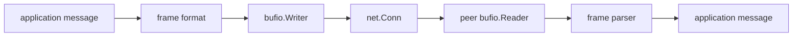

# Protocol Design with net.Conn and bufio

Once you leave HTTP, gRPC, and SQL, you eventually end up designing a protocol boundary of your own.

In Go, that usually means `net.Conn`, `io.Reader`, `io.Writer`, and `bufio`.

The dangerous mistake is to treat those APIs like message primitives. They are stream primitives.

## Mental model



The protocol layer must define:

- message boundaries,
- maximum frame size,
- read/write ownership,
- flush policy,
- deadlines,
- shutdown behavior.

`bufio` helps with amortized reads and writes. It does not invent those rules for you.

## Example scenario

This track adds [`examples/tcpprotocol`](https://github.com/jaeyoung0509/golang-handbook/tree/develop/examples/tcpprotocol), a length-prefixed protocol over `net.Conn`.

The tests prove four things that matter in real systems:

- `Write` may accept only part of a frame,
- `Read` may return data in fragments,
- oversized frames must be rejected early,
- deadlines must fail the exchange promptly instead of parking forever.

## Production sketch

```go
func readFrame(r *bufio.Reader, max int) ([]byte, error) {
	header := make([]byte, 4)
	if _, err := io.ReadFull(r, header); err != nil {
		return nil, err
	}

	size := int(binary.BigEndian.Uint32(header))
	if size > max {
		return nil, ErrFrameTooLarge
	}

	payload := make([]byte, size)
	if _, err := io.ReadFull(r, payload); err != nil {
		return nil, err
	}
	return payload, nil
}

func writeFrame(w *bufio.Writer, payload []byte) error {
	var header [4]byte
	binary.BigEndian.PutUint32(header[:], uint32(len(payload)))
	if _, err := w.Write(header[:]); err != nil {
		return err
	}
	if _, err := w.Write(payload); err != nil {
		return err
	}
	return w.Flush()
}
```

Three rules are doing the real work:

1. `io.ReadFull` turns stream reads into complete-frame reads.
2. a maximum frame size prevents one peer from allocating your entire heap.
3. `Flush` is part of the write contract, not a cosmetic final step.

## Ownership rules that keep protocols sane

### One owner for reads, one owner for writes

Do not let arbitrary goroutines call `Read` on the same connection.

Do not let many goroutines write raw bytes to the same buffered writer without serialization.

The cleaner shape is:

- one goroutine owns reads and dispatches messages,
- one goroutine or one critical section owns writes,
- higher-level code communicates through channels or queues, not through shared direct socket writes.

### Deadlines belong at the transport edge

If the protocol has budgets, set them on the connection before the exchange:

```go
_ = conn.SetDeadline(time.Now().Add(200 * time.Millisecond))
```

Do not rely on a parent context alone unless a higher-level wrapper explicitly translates context cancellation into connection deadlines or close behavior.

### Frame validation is admission control

Length prefixes, delimiter rules, version fields, and maximum payload sizes are part of your overload policy.

If you accept arbitrary frame sizes because “the other side is trusted,” you are one debugging session away from regretting it.

## `bufio` is helpful, not magical

`bufio.Reader` and `bufio.Writer` mainly buy you fewer syscalls and simpler parsing helpers such as:

- `ReadByte`
- `ReadSlice`
- `ReadString`
- `Peek`
- `Scanner` in limited cases

But `bufio` also introduces state:

- data may sit in a write buffer until `Flush`,
- data may already be buffered on read even when the underlying connection is idle,
- sharing the same buffered writer across goroutines without coordination is a data-corruption risk.

## Runtime and stdlib source pointers

These are the most useful entry points:

- [`net/net.go` `Conn`](https://github.com/golang/go/blob/go1.26.0/src/net/net.go#L126)
- [`bufio/bufio.go` `Reader`](https://github.com/golang/go/blob/go1.26.0/src/bufio/bufio.go#L32)
- [`bufio/bufio.go` `Writer`](https://github.com/golang/go/blob/go1.26.0/src/bufio/bufio.go#L576)
- [`io/io.go` `ReadFull`](https://github.com/golang/go/blob/go1.26.0/src/io/io.go#L346)

The key lesson is that the standard library gives you good stream primitives, not a free protocol. Message semantics are your responsibility.

## Failure patterns

### Assuming one `Read` equals one application message

```go
buf := make([]byte, 4096)
n, _ := conn.Read(buf)
handleMessage(buf[:n]) // bad: may be only part of one frame
```

### Forgetting `Flush`

```go
writer.Write(payload)
return nil // bad: peer may never see the bytes
```

### Writing unbounded frames

```go
size := binary.BigEndian.Uint32(header)
payload := make([]byte, size) // bad: no maximum bound
```

### Sharing a buffered writer casually

Multiple goroutines can interleave framed writes and corrupt the stream if they write concurrently.

## How to observe and test it

- Use `net.Pipe` for deterministic protocol tests.
- Add deadline tests so one stalled peer cannot park the other forever.
- Test fragmented inputs and short writes explicitly. If your tests only use `bytes.Buffer`, they often prove too little.
- Log frame sizes and protocol error counts separately from business-level failures.

## Production consequence

Most “random socket bugs” in custom Go protocols turn out to be protocol-boundary bugs:

- missing framing,
- missing limits,
- missing flush,
- missing deadline,
- or missing ownership of who is allowed to read and write.

## Practical takeaway

Use `net.Conn` for transport, `bufio` for efficient buffering, and your own explicit framing for message boundaries.

Continue with [HTTP/2, ALPN, and Stream Multiplexing](/stdlib/http2-alpn-stream-multiplexing) if you want to see how the standard library solves a much more advanced protocol stack on top of the same transport fundamentals.
