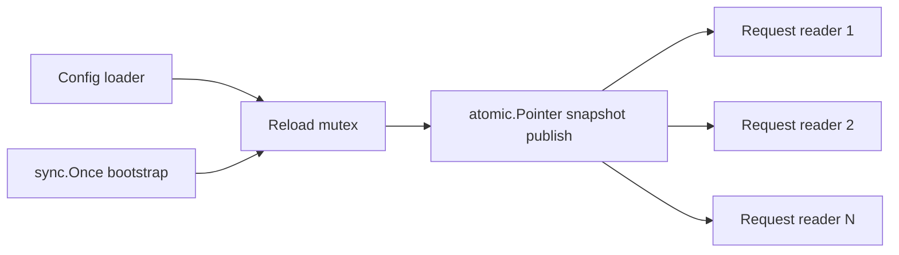

# sync and atomic Primitives

Go is not a channels-only language.

Large production codebases often need explicit shared-state coordination, and the standard library gives several tools for that job. The important part is not memorizing APIs. It is understanding which primitive protects which kind of invariant.

## Why this package family matters

The moment your code has:

- read-mostly shared state,
- one-time initialization,
- a task group that must drain cleanly,
- a condition that many goroutines wait on,
- a hot counter or pointer snapshot,

you are already making synchronization design choices.

Pretending everything should be a channel usually makes those choices less explicit, not safer.

## Example scenario

The `examples/configsnapshot` package models a read-mostly feature-config store. One goroutine refreshes a full snapshot, while many goroutines read it concurrently.



This is a good fit for:

- `sync.Once` for bootstrap,
- a small mutex around slow reload work,
- `atomic.Pointer` for cheap, read-mostly snapshot access.

## Production sketch

```go
type Store struct {
	bootstrapOnce sync.Once
	reloadMu      sync.Mutex
	current       atomic.Pointer[Snapshot]
}

func (s *Store) Bootstrap(ctx context.Context) error {
	var err error
	s.bootstrapOnce.Do(func() {
		err = s.Reload(ctx)
	})
	return err
}

func (s *Store) Reload(ctx context.Context) error {
	s.reloadMu.Lock()
	defer s.reloadMu.Unlock()

	next, err := loadSnapshot(ctx)
	if err != nil {
		return err
	}
	s.current.Store(&next)
	return nil
}
```

The key is that each primitive owns one narrow concern. None of them is being asked to protect the whole feature by itself.

## Mental model

Use the narrowest primitive that matches the invariant:

| Primitive | Best fit |
| --- | --- |
| `RWMutex` | one shared object with coherent multi-field invariants and read-heavy access |
| `WaitGroup` | one owner waiting for a bounded set of tasks to finish |
| `Once` | exactly-once initialization |
| `sync.Map` | specialized concurrent map with write-once or disjoint-key patterns |
| `sync.Cond` | wait/signal around a condition guarded by a lock |
| `sync/atomic` | one small piece of independently valid state such as a flag, counter, or pointer |

If you need to protect many related fields with compound invariants, atomics are usually too small and `sync.Map` is usually too weakly typed. A mutex often wins on clarity.

## Simplified internal sketch

```go
type Once struct {
	done atomic.Bool
	mu   sync.Mutex
}

type WaitGroup struct {
	state atomic.Uint64 // counter + waiter count
	sema  uint32
}

type RWMutex struct {
	w           Mutex
	writerSem   uint32
	readerSem   uint32
	readerCount atomic.Int32
	readerWait  atomic.Int32
}

type Map struct {
	internal concurrentHashTrie
}
```

The common pattern is:

- atomics for the hot path,
- a mutex or semaphore when full coordination is required,
- explicit “must not be copied after first use” semantics.

## What the major primitives are really doing

### `RWMutex`

`RWMutex` is not “free read concurrency.”

It works best when:

- reads are much more frequent than writes,
- read critical sections are short,
- you truly need one coherent protected object.

It is a bad fit when writes are common or when callers start trying to upgrade from `RLock` to `Lock`. Go's implementation blocks new readers once a writer is pending so the writer can eventually make progress.

### `WaitGroup`

`WaitGroup` is a counting semaphore, not a general lifecycle manager.

In Go 1.26 the docs explicitly recommend preferring `WaitGroup.Go` over hand-written `Add`/`Done` pairs where possible. The misuse cases are still the same:

- `Add` racing with `Wait`,
- reusing the same `WaitGroup` before the previous wait completes,
- leaking tasks that never call `Done`.

### `Once`

`Once` is for initialization that must happen exactly once.

It is not a retry wrapper. If the function fails or panics, `Once` still considers the call consumed.

That makes it excellent for immutable bootstrap and a poor fit for “try until healthy.”

### `sync.Map`

`sync.Map` is specialized. The package docs say this directly.

As of Go 1.26, the implementation uses `internal/sync.HashTrieMap`, not a plain map plus one lock. It is optimized for cases like:

- write once, read many,
- disjoint key sets written concurrently.

It is not a good default replacement for `map[K]V` plus a mutex when your logic depends on type safety or compound invariants.

### `sync.Cond`

`Cond` is not a queue. It is not a mailbox.

It is a rendezvous around a condition guarded by a lock. `Wait` must always be done in a loop because wakeup does not mean the condition is still true by the time the waiter reacquires the lock.

### `sync/atomic`

Atomic operations in Go are sequentially consistent. That is a strong guarantee.

It does not mean they are a good fit for every shared-state problem. Atomics are ideal when one value is independently meaningful:

- a readiness flag,
- a request counter,
- a pointer to an immutable snapshot.

They become hard to reason about when several fields must change together.

## Runtime source walk

Useful entry points in the Go 1.26 source:

- [`sync/once.go`](https://github.com/golang/go/blob/go1.26.0/src/sync/once.go)
- [`sync/waitgroup.go`](https://github.com/golang/go/blob/go1.26.0/src/sync/waitgroup.go)
- [`sync/rwmutex.go`](https://github.com/golang/go/blob/go1.26.0/src/sync/rwmutex.go)
- [`sync/cond.go`](https://github.com/golang/go/blob/go1.26.0/src/sync/cond.go)
- [`sync/map.go`](https://github.com/golang/go/blob/go1.26.0/src/sync/map.go)
- [`sync/atomic/type.go`](https://github.com/golang/go/blob/go1.26.0/src/sync/atomic/type.go)

Details worth noticing:

- `Once` keeps `done` first for hot-path layout and uses a mutex on the slow path so other callers wait for initialization to finish.
- `WaitGroup` packs task count and waiter count into one atomic word and releases waiters with a runtime semaphore.
- `RWMutex` tracks reader count atomically and uses runtime semaphores to block readers or writers when the fast path fails.
- `Cond.Wait` adds the waiter to a runtime notify list, unlocks, sleeps, then re-locks.
- `sync.Map.Range` is explicitly not a consistent snapshot.

## Failure patterns

### Using `RWMutex` for write-heavy state

```go
rw.RLock()
defer rw.RUnlock()
```

If writes are frequent, an `RWMutex` can be slower and harder to reason about than a plain mutex.

### Calling `Add` after `Wait` has already begun

```go
go func() {
	wg.Add(1) // misuse
	defer wg.Done()
	work()
}()
wg.Wait()
```

This is exactly the misuse `WaitGroup` is designed to reject.

### Treating `Once` as retryable initialization

```go
once.Do(func() {
	err = connect()
})
```

If `connect()` fails once, future callers will not retry through the same `Once`.

### Using `sync.Map` as a drop-in typed domain store

`sync.Map` gives you concurrency safety for individual operations. It does not make your domain invariants easier to maintain.

### Waiting on `Cond` without a loop

```go
cond.L.Lock()
cond.Wait()
useSharedState() // bug: condition may no longer hold
cond.L.Unlock()
```

The lock guards the condition. The signal only tells you to check again.

### Using atomics for compound invariants

```go
atomic.StoreInt64(&state.balance, nextBalance)
atomic.StoreInt64(&state.version, nextVersion)
```

If readers need both fields to change together, separate atomics do not give you a coherent multi-field transaction.

## Production consequences

- Prefer a plain mutex until you can clearly explain why another primitive is a better fit.
- Use `atomic.Pointer` for read-mostly immutable snapshots. It is often the cleanest high-throughput option.
- Keep `sync.Map` for the narrow cases it is optimized for, not as a default style.
- Treat `WaitGroup` as a local joining tool, not as a long-lived service controller.
- If a condition is central to correctness, keep the lock and `Cond` near the state owner.

## Example and tests

- Example: `examples/configsnapshot`
- The tests verify one-time bootstrap, atomic publication of whole snapshots, and failure paths that keep the last known-good snapshot active.

## Official reading

- [Package docs for `sync`](https://pkg.go.dev/sync)
- [Package docs for `sync/atomic`](https://pkg.go.dev/sync/atomic)
- [Go memory model](https://go.dev/ref/mem)

## Practical takeaway

The strongest Go codebases are not “channel-pure.” They pick the smallest synchronization primitive that matches the real invariant and then stop there.
