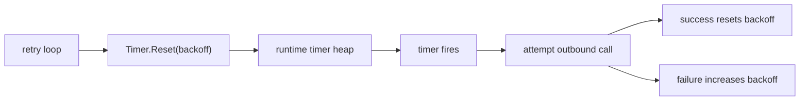

# time, Timers, and Tickers

Time bugs are concurrency bugs with better disguises.

Retries, deadlines, shutdown, backoff, request budgets, and idle cleanup all rely on getting time semantics right.

## Why this package matters

`time` is not only formatting and sleeping.

It defines:

- how deadlines are measured,
- how timers wake work back up,
- how periodic jobs are scheduled,
- how wall time and monotonic time interact.

If you get this wrong, cancellation becomes noisy, retry loops drift, and shutdown logic becomes flaky.

## Example scenario



## Production sketch

```go
timer := time.NewTimer(0)
defer timer.Stop()

backoff := 100 * time.Millisecond

for {
	select {
	case <-ctx.Done():
		return ctx.Err()
	case <-timer.C:
		if err := syncOnce(ctx); err != nil {
			backoff = min(backoff*2, 2*time.Second)
		} else {
			backoff = 100 * time.Millisecond
		}
		timer.Reset(backoff)
	}
}
```

This is the shape to prefer when the loop owns the timer lifecycle and needs explicit reset behavior.

## Mental model

Three parts matter most:

1. `time.Time` carries wall-clock data and may also carry a monotonic reading.
2. `Timer` schedules one future event.
3. `Ticker` schedules repeated events.

The subtle part is that wall-clock time is for telling time, while monotonic time is for measuring elapsed time.

That is why `time.Since(start)` is safer than subtracting timestamps from different serialized processes.

## Simplified internal sketch

```go
type Time struct {
	wall uint64
	ext  int64
	loc  *Location
}

type Timer struct {
	C <-chan time.Time
}

func After(d time.Duration) <-chan time.Time {
	return NewTimer(d).C
}

func retryLoop(ctx context.Context, timer *time.Timer) error {
	for {
		select {
		case <-ctx.Done():
			return ctx.Err()
		case <-timer.C:
			// do work, then timer.Reset(nextDelay)
		}
	}
}
```

The runtime owns the low-level timer machinery. The `time` package wraps it in API shapes that fit regular Go code.

## Source walk

The Go 1.26 source makes several important details explicit:

- `Time` packs wall-clock and optional monotonic data into `wall` and `ext`.
- `NewTimer` and `AfterFunc` both delegate to runtime timer creation.
- As of Go 1.23, timer channels have synchronous semantics and the GC can recover unreferenced timers.
- `Ticker` is a repeating timer and still needs explicit `Stop` when the owner is done.

Good entry points:

- [`time.go` `Time`](https://github.com/golang/go/blob/go1.26.0/src/time/time.go#L140)
- [`sleep.go` `Timer`](https://github.com/golang/go/blob/go1.26.0/src/time/sleep.go#L89)
- [`sleep.go` `NewTimer`](https://github.com/golang/go/blob/go1.26.0/src/time/sleep.go#L143)
- [`sleep.go` `After`](https://github.com/golang/go/blob/go1.26.0/src/time/sleep.go#L202)
- [`sleep.go` `AfterFunc`](https://github.com/golang/go/blob/go1.26.0/src/time/sleep.go#L210)
- [`tick.go` `Ticker`](https://github.com/golang/go/blob/go1.26.0/src/time/tick.go#L16)

## What changed in modern Go

The most important timer semantic update in recent Go versions is Go 1.23:

- unreferenced timers can be garbage collected,
- timer channels behave synchronously,
- stale timer values after `Stop` or `Reset` are no longer the default hazard they used to be.

That means some older folklore about always draining timer channels after `Stop` needs version-aware interpretation.

## Failure patterns

### Using `time.After` inside a hot loop without ownership

```go
for {
	select {
	case <-ctx.Done():
		return
	case <-time.After(100 * time.Millisecond):
		poll()
	}
}
```

This is concise, but it creates a fresh timer every iteration. A reusable `Timer` is usually a better fit for hot loops or adaptive backoff.

### Forgetting to stop a ticker

```go
ticker := time.NewTicker(5 * time.Second)
go func() {
	for range ticker.C {
		refresh()
	}
}()
```

If nothing owns shutdown for that ticker, the goroutine and periodic wakeups can outlive the real feature lifetime.

### Comparing `time.Time` values with `==`

`==` compares more than the instant. Location and monotonic metadata matter too. Use `Equal` when you mean “same instant.”

### Assuming serialized times keep monotonic data

`MarshalJSON`, `Unix`, `Parse`, and similar operations do not preserve the monotonic reading. That is why elapsed-time math should usually stay within one process.

### Resetting timers without clear ownership

If several goroutines stop, drain, or reset the same timer, the real problem is ownership, not API syntax.

## Production consequences

- Prefer monotonic-time APIs such as `Since`, `Until`, and context deadlines for elapsed-time reasoning.
- Use one owned `Timer` for adaptive retry loops and dynamic backoff.
- Use `Ticker` only when you truly want fixed cadence rather than “wait after work completes.”
- Revisit old timer folklore with the Go version in mind.

## How to test and observe it

- Use `testing/synctest` for timeout logic when you want deterministic virtual time.
- Write table tests around backoff progression instead of relying on real sleeps.
- Verify ticker shutdown in leak tests.
- Inspect traces if you suspect timer storms or bursty wakeups.

## Official reading

- [Package docs for `time`](https://pkg.go.dev/time)
- [Go 1.26 `time` source](https://github.com/golang/go/blob/go1.26.0/src/time)
- [Go 1.23 release notes](https://go.dev/doc/go1.23)

## Practical takeaway

A precise model of time is what keeps retries, deadlines, and periodic work from turning correct concurrency code into flaky production behavior.
