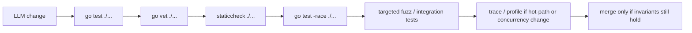

# AI-Assisted Go Safety

Go gives you two strong defaults that many dynamic-language workflows do not:

- a real compiler,
- a real static type system.

That is a big advantage for AI-assisted coding.

It is not enough by itself.

The dangerous class of Go bugs is not “this does not compile.” It is “this compiles, type-checks, and still fails under load, at shutdown, or on the wrong input.”

## Quick model



## What the compiler and type system do prove

Go's compiler and type checker are excellent at catching:

- syntax errors,
- type mismatches,
- wrong method sets,
- invalid assignments,
- many interface-conformance mistakes,
- a large class of broken refactors.

That is exactly why Go is a good language for AI-assisted work. It shrinks the space of nonsense quickly.

## What still compiles and still breaks

A successful build does **not** prove:

- that a response body is closed,
- that a context is canceled,
- that a goroutine terminates,
- that a channel protocol cannot deadlock,
- that a retry loop is bounded,
- that a map is not raced under real traffic,
- that an offset or ack happens after the real side effect,
- that a timeout reflects the correct budget boundary,
- that a nil value is impossible in the path that matters,
- that the business invariant is still true.

That is the exact gap where LLM-generated Go can look clean and still be wrong.

## Tiny examples of “compiles fine, still bad”

### Response body leak

```go
resp, err := client.Do(req)
if err != nil {
	return err
}
return decode(resp.Body) // bad: body never closed
```

### Background work with no cancellation

```go
go func() {
	for msg := range jobs {
		process(msg)
	}
}()
```

This compiles and may pass a happy-path test while leaking work on shutdown.

### Business ordering bug

```go
sess.MarkMessage(msg, "")
err := writeToDB(msg) // bad: offset moved before the real side effect
```

The compiler cannot help here. This is protocol correctness.

## Common AI/LLM failure patterns in Go

### Happy-path only code

The agent writes code that works when everything returns quickly and never fails. Shutdown, timeout, and retry boundaries are missing.

### Missing ownership cleanup

The code opens:

- response bodies,
- timers,
- contexts,
- streams,
- goroutines,

but does not define who closes, cancels, or joins them.

### Overuse of `context.Background()`

LLMs often default to `context.Background()` because it compiles easily. In request paths, this usually means a lost budget and a lost cancellation boundary.

### Silent error swallowing

```go
_ = something.Close()
_ = producer.Send(msg)
```

Sometimes ignoring an error is correct. LLMs tend to do it without explaining why.

### Shared state with no explicit owner

The code compiles because maps, slices, and structs are valid values. It fails later because no goroutine, mutex, or protocol actually owns mutation.

### Tests that prove too little

The agent writes:

- one success-path unit test,
- one short `time.Sleep`,
- no race test,
- no timeout path,
- no leak path.

That is not enough for concurrent Go.

## The verification stack

Use these layers together. Each catches a different class of failure.

| Tool | What it is good at | What it does not prove |
| --- | --- | --- |
| `go test ./...` | compile + unit/regression coverage | races, weak invariants, unexecuted paths |
| `go vet ./...` | suspicious constructs the compiler misses | full correctness |
| `staticcheck ./...` | broader static bug and performance checks | runtime-only failures |
| `go test -race ./...` | unsynchronized shared-memory access | deadlocks, leaks, protocol bugs |
| fuzzing | edge cases and crash-causing inputs | external dependency semantics |
| integration tests | real dependency contracts | all scheduler/load behaviors |
| traces/profiles | contention, scheduler, blocking, GC behavior | logical correctness on their own |
| `govulncheck ./...` | known vulnerable dependency usage | logic bugs and operational bugs |

## Recommended command ladder

Start with the fast checks and escalate when the change touches concurrency, I/O, or wire formats.

```bash
go test ./...
go vet ./...
staticcheck ./...
go test -race ./...
go test ./... -run=Fuzz
go test ./... -fuzz=Fuzz -fuzztime=5s
govulncheck ./...
```

In practice:

1. Always run `go test ./...`.
2. Run `go vet ./...` on every nontrivial change.
3. Run `staticcheck ./...` for a wider static pass.
4. Run `go test -race ./...` for any concurrency or shared-state change.
5. Add targeted fuzzing for parsers, codecs, handlers, and unsafe input boundaries.
6. Add integration tests when the bug only appears with real network, SQL, Kafka, Redis, or subprocess semantics.

## How to make the compiler catch more

You cannot make the compiler prove business correctness, but you can design code so more bad changes fail earlier.

### Prefer stronger types over `map[string]any`

Typed structs and typed enums let refactors fail loudly.

### Make illegal states harder to represent

Use constructors that validate required fields and return errors early.

### Keep one owner per mutable state machine

If a value mutates, define whether the owner is:

- one goroutine,
- one mutex,
- one channel protocol.

Never leave ownership implicit.

### Push budgets to the boundary

Pass `context.Context` from callers. Avoid burying `context.Background()` in leaf functions.

### Keep side effects behind narrow seams

The narrower the interface boundary, the easier it is for tests to prove the important ordering.

## What an AI-safe code review should ask

When reviewing agent-generated Go, ask:

1. What owns this goroutine, stream, timer, or body?
2. What is the timeout budget, and is it on the right edge?
3. What happens if the caller leaves first?
4. What test proves the failure path terminates?
5. What tool in the verification stack would catch the most likely regression here?

If the review cannot answer those questions, the code is not ready.

## Where each tool comes from

- `go vet` is official and reports suspicious constructs the compiler misses.
- `-race` is the built-in runtime race detector.
- Go fuzzing is official and is designed to find crash-causing or vulnerable inputs.
- `govulncheck` is the official Go vulnerability checker.
- `staticcheck` is not part of the Go toolchain, but it is a high-signal static analysis layer that fits well beside `go vet`.

## Where this connects to the rest of the site

- Read [Race Detector](/testing/race-detector) for shared-memory bugs.
- Read [Deterministic Tests with synctest](/testing/synctest) for time-heavy code.
- Read [Leak, Shutdown, and Timeout Testing](/testing/leaks-and-shutdowns) for lifecycle proof.
- Read [Tracing and Contention Observability](/testing/tracing-and-profiling) when the code is correct but runtime behavior still looks wrong.

## Official reading

- [Data Race Detector](https://go.dev/doc/articles/race_detector)
- [Tutorial: Getting started with fuzzing](https://go.dev/doc/tutorial/fuzz)
- [`go vet`](https://pkg.go.dev/cmd/vet)
- [`govulncheck`](https://pkg.go.dev/golang.org/x/vuln/cmd/govulncheck)
- [Staticcheck docs](https://staticcheck.dev/docs/)

## Practical takeaway

AI-assisted Go is safest when you use the compiler as the first gate, not the only gate.

The real win is a layered workflow that catches:

- type errors early,
- suspicious constructs statically,
- races dynamically,
- weird inputs with fuzzing,
- real dependency behavior with integration tests,
- runtime pathologies with traces and profiles.
