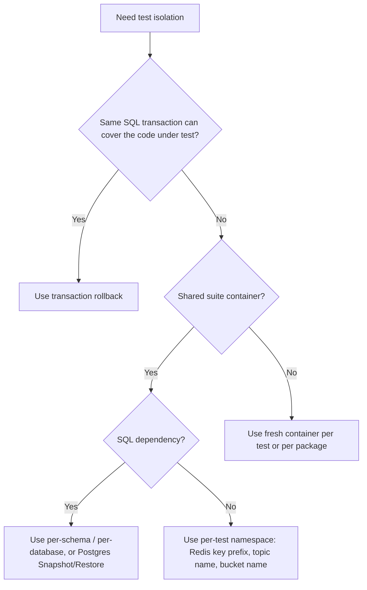

# Integration Testing with Testcontainers

Real services rarely fail because a pure function returned the wrong number.

They fail because:

- Postgres state leaked from a previous test,
- Redis keys from one case polluted the next one,
- a dependency was not actually ready when the test started,
- teardown used the wrong ownership boundary,
- the setup for "user + partner + payment method + order" became an unreadable script.

This page is about making those tests reliable.

## Mental model

Integration tests are not "bigger unit tests". They are dependency-boundary tests with explicit lifecycle ownership.

The core rules are:

1. acquire resources with a bounded context,
2. register cleanup at the acquisition site,
3. isolate state by namespace, schema, snapshot, or fresh container,
4. keep fixture setup typed and domain-shaped,
5. never rely on `sleep` for readiness.

## Isolation decision tree



## When `testcontainers-go` is the right tool

Use `testcontainers-go` when the behavior you care about depends on the real dependency:

- SQL schema, indexes, constraints, locks, and transaction semantics,
- Redis TTL, script behavior, or protocol behavior,
- startup ordering and network reachability,
- containerized services with real wire contracts.

Do **not** default to containers for everything.

| Test style | Good for | Not enough for |
| --- | --- | --- |
| in-memory fake | pure domain rules, validation, branching logic | SQL isolation levels, Redis expiration, network failure, migration correctness |
| transaction rollback | fast SQL-heavy service tests inside one DB | code that opens independent connections outside the test transaction |
| shared container + namespace reset | large suites where startup cost matters | tests that mutate truly global dependency state |
| fresh container per test | strongest isolation, easiest reasoning | very large suites with slow startup |

## Lifecycle ownership

Use `testing.T` as the owner of test resources.

- Use `t.Context()` for the active lifetime of the test.
- Use `t.Cleanup` for teardown.
- Register cleanup immediately after acquisition, not later in the test body.
- Keep cleanup idempotent and bounded.

`testing.T.Context()` was added in Go 1.24. It is canceled **just before** `Cleanup` functions run. That means cleanup code that needs a live context should create a new bounded background context instead of reusing `t.Context()`.

## Container startup pattern

This is the baseline pattern for container-backed tests.

```go
func startPostgres(t *testing.T) *postgres.PostgresContainer {
	t.Helper()

	ctx, cancel := context.WithTimeout(t.Context(), 2*time.Minute)
	t.Cleanup(cancel)

	ctr, err := postgres.Run(
		ctx,
		"postgres:16-alpine",
		postgres.WithDatabase("app_test"),
		postgres.WithUsername("app"),
		postgres.WithPassword("app"),
		postgres.BasicWaitStrategies(),
		testcontainers.WithLogger(log.TestLogger(t)),
	)
	require.NoError(t, err)

	testcontainers.CleanupContainer(t, ctr)
	return ctr
}
```

Why this shape works:

- startup has a real timeout,
- container logs are attached to the test,
- cleanup is owned by `t`,
- readiness is delegated to wait strategies instead of sleeps.

## Teardown rule: cleanup owns the boundary

The right cleanup boundary is usually not "delete rows one by one".

Prefer:

- transaction rollback,
- per-test schema or database drop,
- Postgres `Snapshot` / `Restore`,
- Redis key-prefix cleanup,
- fresh container termination.

Avoid manual ad-hoc deletion unless that delete order is the thing you are actually testing.

## Postgres strategies

### 1. Transaction rollback when the app can share a transaction

This is the fastest option, but only works when the code under test can execute on the same connection or transaction boundary.

```go
func withTx(t *testing.T, db *sql.DB) *sql.Tx {
	t.Helper()

	tx, err := db.BeginTx(t.Context(), nil)
	require.NoError(t, err)

	t.Cleanup(func() {
		_ = tx.Rollback()
	})

	return tx
}
```

If your handler or service opens its own connection pool and commits independently, rollback in the test transaction will not isolate that work.

### 2. Shared Postgres container with `Snapshot` / `Restore`

This is a strong default for a big suite that wants one container, migrations only once, and clean state for each test.

```go
type SuitePostgres struct {
	Container *postgres.PostgresContainer
	DSN       string
}

func newSuitePostgres(t *testing.T) *SuitePostgres {
	t.Helper()

	ctx, cancel := context.WithTimeout(t.Context(), 2*time.Minute)
	t.Cleanup(cancel)

	ctr, err := postgres.Run(
		ctx,
		"postgres:16-alpine",
		postgres.WithDatabase("app_test"),
		postgres.WithUsername("app"),
		postgres.WithPassword("app"),
		postgres.BasicWaitStrategies(),
		postgres.WithSQLDriver("pgx"),
	)
	require.NoError(t, err)
	testcontainers.CleanupContainer(t, ctr)

	dsn, err := ctr.ConnectionString(ctx)
	require.NoError(t, err)

	runMigrations(t, dsn)

	snapshotCtx, snapshotCancel := context.WithTimeout(context.Background(), 15*time.Second)
	defer snapshotCancel()
	require.NoError(t, ctr.Snapshot(snapshotCtx))

	return &SuitePostgres{
		Container: ctr,
		DSN:       dsn,
	}
}

func (s *SuitePostgres) Reset(t *testing.T) {
	t.Helper()

	restoreCtx, cancel := context.WithTimeout(context.Background(), 15*time.Second)
	defer cancel()

	require.NoError(t, s.Container.Restore(restoreCtx))
}
```

Important details:

- do not use the `"postgres"` system database as the container database name when you plan to use snapshots,
- run migrations once before the snapshot,
- if `Restore` mutates shared global state, do not combine it with `t.Parallel()` on the same database.

### 3. Per-schema or per-database isolation

This is often the best compromise when tests need parallelism and a shared container.

- create a schema per test,
- pass that schema into the application or session,
- drop the schema in `Cleanup`,
- avoid cross-test `TRUNCATE` on a shared schema.

This is easier to parallelize than whole-database restore.

## Redis strategies

Redis cleanup is usually about namespace ownership, not whole-instance reset.

### Good default: per-test key prefix

```go
func newRedisPrefix(t *testing.T) string {
	t.Helper()
	return "it:" + strings.NewReplacer("/", ":", " ", "_").Replace(t.Name()) + ":" + xid.New().String()
}

func cleanupRedisPrefix(t *testing.T, rdb *redis.Client, prefix string) {
	t.Helper()

	t.Cleanup(func() {
		ctx, cancel := context.WithTimeout(context.Background(), 5*time.Second)
		defer cancel()

		var cursor uint64
		for {
			keys, next, err := rdb.Scan(ctx, cursor, prefix+":*", 100).Result()
			require.NoError(t, err)

			if len(keys) > 0 {
				require.NoError(t, rdb.Del(ctx, keys...).Err())
			}

			if next == 0 {
				return
			}
			cursor = next
		}
	})
}
```

Use this when:

- the suite shares one Redis container,
- tests can isolate by key naming,
- you want `t.Parallel()` without whole-instance flushing.

### When `FLUSHDB` is acceptable

`FLUSHDB` is only acceptable if the Redis instance is exclusively owned by one test or one serialized suite.

If multiple tests or packages can touch the same Redis instance, `FLUSHDB` is a race disguised as cleanup.

### In-memory alternatives

Use in-memory substitutes only when the logic under test does not depend on:

- expiration behavior,
- Lua/script semantics,
- network round-trips,
- Redis protocol differences,
- concurrent access patterns on a real server.

They are good for domain logic. They are not proof of production Redis behavior.

## Fixture builders for prerequisite domain state

Tests with many prerequisites usually need better fixture design, not bigger setup scripts.

Bad tests say:

- "create user",
- "create partner",
- "create card",
- "create cart",
- "create order",

in every test body.

Good tests hide that behind a typed builder and return typed handles.

```go
type CheckoutFixture struct {
	UserID          string
	PartnerID       string
	PaymentMethodID string
	OrderID         string
}

type CheckoutBuilder struct {
	users    UserRepository
	partners PartnerRepository
	payments PaymentMethodRepository
	orders   OrderRepository
}

func (b CheckoutBuilder) Seed(ctx context.Context, t *testing.T) CheckoutFixture {
	t.Helper()

	userID := mustCreateUser(ctx, t, b.users)
	partnerID := mustCreatePartner(ctx, t, b.partners)
	paymentMethodID := mustAttachPaymentMethod(ctx, t, b.payments, userID)
	orderID := mustCreateDraftOrder(ctx, t, b.orders, userID, partnerID)

	return CheckoutFixture{
		UserID:          userID,
		PartnerID:       partnerID,
		PaymentMethodID: paymentMethodID,
		OrderID:         orderID,
	}
}
```

This is better because:

- the dependency graph is readable,
- the test body starts at the business behavior being verified,
- fixture state has names and types,
- cleanup stays at the storage boundary instead of ad-hoc row deletion.

## Multi-process or multi-step orchestration

If a workflow requires several actors first, model the setup around business invariants:

- identity exists,
- partner is active,
- payment method is attached,
- inventory exists,
- ledger or outbox is seeded if the test depends on it.

Do **not** force every test to restate the whole graph manually.

Use small seed helpers:

- `SeedUser`
- `SeedPartner`
- `SeedCheckoutFixture`
- `SeedSettledInvoice`

Return structs, not `map[string]string`.

## Failure patterns

### Sleeping for readiness

```go
time.Sleep(3 * time.Second) // bad
```

This proves nothing about actual readiness and slows the suite down.

Use module wait strategies and bounded startup contexts instead.

### Using `t.Context()` inside cleanup

```go
t.Cleanup(func() {
	_ = ctr.Terminate(t.Context()) // bad: t.Context() is already canceled here
})
```

If custom cleanup needs a context, create a new bounded background context inside the cleanup function.

### Global database plus `TRUNCATE` everywhere

```go
t.Cleanup(func() {
	_, _ = db.Exec("TRUNCATE users, payments, orders")
})
```

This becomes brittle fast:

- foreign-key order matters,
- parallel tests interfere,
- new tables silently escape cleanup.

Prefer schema/database reset or snapshots.

### Opaque "setup everything" helpers

```go
ids := setupEverything(t)
paymentID := ids["payment"]
```

This hides the domain graph and makes test failures harder to debug.

Prefer typed fixtures.

## Practical checklist

- Use `t.Context()` for live test work, not cleanup-time shutdown.
- Register cleanup immediately after acquiring the resource.
- Bound startup and teardown with timeouts.
- Prefer readiness strategies over sleeps.
- Prefer boundary-level reset over row-by-row deletion.
- Use per-test schema, namespace, or snapshot before sharing a container.
- Treat `t.Parallel()` as an isolation contract, not a free speed button.
- Keep fixture builders typed and domain-shaped.
- Use in-memory fakes only where real dependency semantics are irrelevant.

## Official reading

- [`testing.T.Cleanup` and `testing.T.Context`](https://pkg.go.dev/testing)
- [testcontainers-go: common functional options](https://golang.testcontainers.org/features/common_functional_options/)
- [testcontainers-go Postgres module](https://golang.testcontainers.org/modules/postgres/)
- [testcontainers-go Redis module](https://golang.testcontainers.org/modules/redis/)

## Practical takeaway

Good integration tests are mostly about ownership and isolation.

If the test owns:

- startup,
- readiness,
- namespace,
- teardown,
- fixture graph,

then the suite stays fast enough, deterministic enough, and readable enough to trust.
